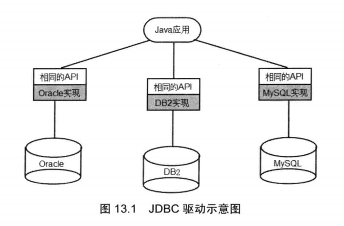
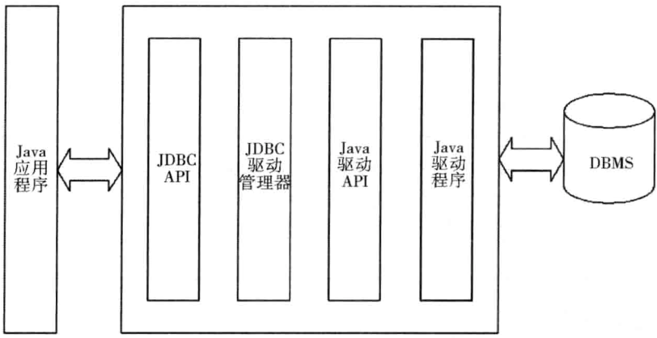
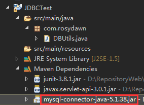

## JDBC编程详解

### JDBC概述

JDBC全称为Java Database Connectivity，即Java数据库连接，是Java连接数据库API。主要功能如下：

- 连接到数据库；
- 执行SQL语句操作数据库；
- 获得执行SQL语句的结果。

JDBC可以实现跨平台的运行。JDBC提供了一套操作数据库的API接口，各数据库厂商针对JDBC的接口都有自己的实现类（即对应的数据库驱动）



数据库驱动程序是JDBC程序与数据库之间的转换层。运行的结构如下图所示。



### JDBC常用API

Java 8支持JDBC 4.2标准。Java实现JDBC编程主要用到以下类和接口。

- java.sql.**DriverManager**：该类是管理JDBC驱动的服务类。编程时主要通过该类的以下方法获得到数据库连接的Connection对象：
  - public static Connection getConnection(String url) throws SQLException：尝试根据数据库的URL来建立到该数据的连接；
  - public static Connection getConnection(String url, String user, String password) throws SQLException：尝试根据数据库的URL、用户名和密码来建立到该数据的连接；
  - public static Connection getConnection(String url, java.util.Properties info) throws SQLException：同上。只是将用户名和密码以tag/value对的形式封装在了java.util.Properties类型的info对象（至少要包含user和password属性对）里。

    上面三个重载方法的url参数的形式一般为："jdbc:mysql://127.0.0.1:3306/databasename"。依次为数据库驱动协议名（不同的数据库不同，但常见的也就那几个），主机的IP地址和端口，数据库名。

- java.sql.**Connection**：该接口对象代表一个数据库连接。每个Connection对象代表一个物理连接会话。访问数据之前必须获得Connection连接对象。常用方法如下：
  - **Statement createStatement() throws SQLException**：该方法返回一个用来向数据库发送SQL语句的Statement对象；
  - Statement createStatement(int resultSetType, int resultSetConcurrency) throws SQLException：同 createStatement()。只是该方法允许覆盖默认的结果集类型和默认的并发类型；
  - Statement createStatement(int resultSetType, int resultSetConcurrency, int resultSetHoldability) throws SQLException：同 createStatement()。只是该方法允许覆盖默认的结果集类型、默认的并发类型和默认的可保持性；
  - **PreparedStatement prepareStatement(String sql) throws SQLException**：该方法返回一个存储了预编译的SQL语句的PreparedStatement对象，该对象用来向数据库发送给定的参数化SQL语句；
  - PreparedStatement prepareStatement(String sql, int autoGeneratedKeys) throws SQLException：同prepareStatement(String sql) 。 autoGeneratedKeys参数可以为Statement.RETURN\_GENERATED\_KEYS或Statement.NO\_GENERATED\_KEYS，用来标明返回的PreparedStatement对象是否可以检索自动生成的键；
  - PreparedStatement prepareStatement(String sql, int columnIndexes[])  throws SQLException：同prepareStatement(String sql) 。只是根据给定的数组来生成可以访问自动生成的键的PreparedStatement对象。该数组参数含有目标表中自动生成的键的列索引；
  - PreparedStatement prepareStatement(String sql, String columnNames[]) throws SQLException：与上面的类似。只是该方法中数组元素目标表中自动生成的键的列名。
  - **CallableStatement prepareCall(String sql) throws SQLException**：该方法返回一个CallableStatement对象，该对象用于调用数据库的存储过程；
  - CallableStatement prepareCall(String sql, int resultSetType, int resultSetConcurrency) throws SQLException：同上。只是该方法可以通过参数来覆盖默认的结果集类型和默认的并发类型；
  - CallableStatement prepareCall(String sql, int resultSetType, int resultSetConcurrency, int resultSetHoldability) throws SQLException：同上，只是该方法可以通过参数来覆盖默认的结果集类型、默认的并发型和默认的可保持性。
  - PreparedStatement和CallableStatement是Statement的子类。只有获得了Statement及其子类的对象后才可以执行SQL语句。Connection接口还有以下几个常用的控制事务方法：
  - Savepoint setSavepoint() throws SQLException：在当前事务中创建并返回一个未命名的Savepoint保存点对象；
  - Savepoint setSavepoint(String name) throws SQLException：在当前事务中创建并返回一个指定名称的Savepoint保存点对象；
  - void setTransactionIsolation(int level) throws SQLException：尝试改变该Connection中事务的隔离级别。可以指定为Connection接口中定义的几个常量值（Connection.TRANSACTION_READ_UNCOMMITTED，Connection.TRANSACTION_READ_COMMITTED，Connection.TRANSACTION_REPEATABLE_READ或Connection.TRANSACTION_SERIALIZABLE）；
  - void rollback() throws SQLException：回滚事务。放弃当前事务中的更改并释放当前持有的数据库锁。该方法只能用在自动提交禁用的模式下；
  - void rollback(Savepoint savepoint) throws SQLException：同上回滚事务到之前的一个保存点；
  - void setAutoCommit(boolean autoCommit) throws SQLException：设置是否开启自动提交模式。自动提交模式下每一条SQL语句都会作为单独事务来执行和提交。非自动提交模式下SQL语句被组合成一个事务，通过commit方法和rollback方法来终止一个事务。新建的Connection对象默认是自动提交的；
  - void commit() throws SQLException：永久性地改变自上次提交或回滚操作之后的操作，并释放当前Connection对象持有的任何数据库锁。该方法只能用在自动提交禁用的模式下；
  - void close() throws SQLException：立即释放该Connection对象的数据库和JDBC资源，而不是等待他们自动关闭。**强烈建议在调用该方法之前显式提交或回退事务**。

  Java 7还为Connection接口提供了以下几个方法：

  - void setSchema(String schema) throws SQLException：设置该Connection对象访问数据库的Schema；
  - String getSchema() throws SQLException：获取该Connection对象访问数据库的Schema；
  - void setNetworkTimeout(Executor executor, int milliseconds) throws SQLException：设置该Connection连接数据库的超时时间；
  - void setNetworkTimeout(Executor executor, int milliseconds) throws SQLException：获取该Connection连接数据库的超时时间。

- java.sql.**Statement**：代表执行SQL语句的工具接口。该接口对象可用于执行DDL、DML语句和查询语句。常用方法如下：
  - ResultSet **executeQuery(String sql)** throws SQLException：执行指定的**查询语句**，返回ResultSet结果集对象；

  - int **executeUpdate(String sql)** throws SQLException：执行INSERT、UPDATE和DELETE语句，或者DDL语句。注意：该方法不能被PreparedStatement和CallableStatement的对象调用。返回执行DML语句后受影响的行数，没有受影响行数时返回0；

  - boolean **execute(String sql)** throws SQLException：该方法可执行任何SQL语句。该方法用于执行返回多种结果的SQL语句。如果执行SQL后的第一个结果为ResultSet，则该方法返回true；如果执行SQL语句后返回的结果为受影响的行数或没有结果则该方法返回false。必须通过调用getResultSet方法或getUpdateCount方法来查询执行的结果，调用etMoreResults方法来后去后续结果。注意：该方法不能被PreparedStatement和CallableStatement的对象调用；

  - public void closeOnCompletion() throws SQLException：Java 7新增。该方法用来指定该Statement在其所有结果集关闭后自动关闭。如果没有结果集，那么该方法没有任何效果；

  - public boolean isCloseOnCompletion() throws SQLException：Java 7新增。该方法用来判断该Statement在其所有结果集关闭后自动关闭；

    Java 8还为Statement新增了几个重载的executeLargeUpdate()默认方法。当数据表行数超过Integer.MAX_VALUE时可使用这些方法。此外，Statement还有一些支持批处理的方法，如addBatch(String sql) 方法（把多条sql语句放到一个批处理中）和executeBatch()方法（向数据库发送一批sql语句执行）。

- java.sql.**PreparedStatement**：预编译的Statement对象。PreparedStatement是Statement的子接口，其对象允许数据预编译SQL语句（这些SQL语句通常带有参数），以后只改变SQL语句的参数即可，避免了数据库每次都要编译SQL语句，因此性能较好，在大量重复执行某一类型的SQL语句（仅参数不同）优势明显。PreparedStatement执行SQL语句时，无须再次再传入SQL语句，只需要为预编译的SQL语句传入参数即可。PreparedStatement相比Statement添加了以下方法：

  - void setXxx(int parameterIndex, Xxx x)  throws SQLException：指定预编译SQL语句中指定位置处的值。其中第一个参数parameterIndex为预编译的SQL语句中的占位符索引，Xxx可以代表各种数据库数据类型；

  PreparedStatement同样含有execute()、executeQuery()、executeUpdate()方法，只是这些方法不含参数，因为PreparedStatement已经预编译了SQL语句，只需要为这些方法传入参数即可。Java 8还为PreparedStatement添加了不带参数的executeLargeUpdate()方法，用于数据项超过Integer.MAX_VALUE数值的表中。

- java.sql.**ResultSet**：该接口代表结果集对象。该接口对象包含访问查询结果的方法。

  - void beforeFirst() throws SQLException：将ResultSet的记录指针定位到首行之前，这是ResultSet结果集记录指针的初始状态——记录指针的起始位置位于第一行之前；
  - boolean isBeforeFirst() throws SQLException：判断ResultSet的记录指针是否位于第一行之前；
  - boolean first() throws SQLException：将ResultSet的记录指针定位到第一行。如果移动后的记录指针指向一条有效记录，那么该方法返回true；
  - boolean isFirst() throws SQLException：判断ResultSet的记录指针是否位于第一行；
  - boolean last() throws SQLException：将ResultSet的记录指针定位到最后一行。如果移动后的记录指针指向一条有效记录，那么该方法返回true；
  - boolean isLast() throws SQLException：判断ResultSet的记录指针是否位于最后一行；
  - void afterLast() throws SQLException：将ResultSet的记录指针定位到最后一行之后；
  - boolean isAfterLast() throws SQLException：判断ResultSet的记录指针是否位于最后一行之后；
  - boolean next() throws SQLException：将ResultSet的记录指针定位到下一行。如果移动后的记录指针指向一条有效记录，那么该方法返回true；
  - boolean previous() throws SQLException：将ResultSet的记录指针定位到前一行。如果移动后的记录指针指向一条有效记录，那么该方法返回true；
  - void afterLast() throws SQLException：将ResultSet的记录指针定位到最后一行之后；
  - boolean absolute( int row ) throws SQLException：将ResultSet的记录指针定位到指定行。如果移动后的记录指针指向一条有效记录，那么该方法返回true；
  - void close() throws SQLException：释放ResultSet对象；
  - void deleteRow() throws SQLException：从当前ResultSet对象和底层数据库中删除当前行。不能再插入的行里调用该方法（因为可能还没有提交生效）；
  - void updateRow() throws SQLException：使用当前行的新值来更新底层数据中的当前行。不能再插入的行里调用该方法（因为可能还没有提交生效）；
  - void insertRow() throws SQLException：将插入行中的数据插入该ResultSet对象和底层数据库中。

  ResultSet还含有一系列updateXxx(int/String, Xxx)方法来更新当前ResultSet对象和底层数据库、一系列getXxx(int, Xxx)方法来获取当前行的值，还有一系列getXxx(String, Xxx, int)方法来获取指定列中指定行的值。

### JDBC编程步骤

1. 需要在Maven工程中的pom.xml文件添加mysql-connector-java的jar包的依赖：

   ```xml
   <dependency>
   	<groupId>mysql</groupId>
   	<artifactId>mysql-connector-java</artifactId>
   	<version>5.1.38</version>
   </dependency>
   ```

   结果如下图所示。

   

2. 加载驱动程序：

   ```java
   Class.forName（driverClass）
   ```

   - 加载Mysql驱动：

     ```java
     Class.forName("com.mysql.jdbc.Driver")
     ```

   - 加载Oracle驱动：

     ```java
     Class.forName("oracle.jdbc.driver.OracleDriver")
     ```

3. 获得数据库连接:

   - 使用DriverManager.getConnection方法根据数据库的URL获取到数据库的Connection连接对象。不同数据库的URL写法不同，具体参考所用数据库的参考手册。

     获取MySQL数据库的连接：

     ```java
     Connection connection = DriverManager.getConnection("jdbc:mysql://127.0.0.1:3306/databasename", USER, PASSWORD);
     ```

     其中jdbc:mysql表示jdbc连接mysql，127.0.0.1:3306为服务器地址和端口（这里是本地主机），databasename为数据库名称，USER和PASSWORD分别为数据库的用户名和密码。

     获取Oracle数据库的连接：

     ```java
     Connection connection = DriverManager.getConnection("jdbc:oracle:thin:@127.0.0.1:3306:databasename", USER, PASSWORD);
     ```

   - URL：

     ```java
     jdbc:mysql://localhost:3306/test?key=value&key=value
     ```

     - 省略写法：

       ```java
       jdbc:mysql:///test
       ```

     - URL中常用的参数：

       ```java
       useUnicode=true&characterEncoding=UTF-8（注意：这里的字符集应该与客户端保持一致）
       ```

4. 通过到数据库的Connection连接对象创建Statement对象：

   ```java
   // 1. 创建基本的Statement对象
   // Statement stmt = connection.createStatement();
   // 2. 根据传入的SQL语句创建预编译的Statement对象
   PreparedStatement pStatement = connection.prepareStatement(sqlString);
   // 3. 根据传入的SQL语句创建CallableStatement对象
   // CallableStatement cStatement = connection.prepareCall(sqlString);
   ```

5. 通过相应的Statement对象来执行SQL语句。

   - execute()：可以执行任何SQL语句，但比较麻烦；


-    executeUpdate()：用于执行DML、DDL语句，执行DML语句返回受SQL语句影响的行数，执行DDL语句放回0；
   - executeQuery()：只能执行查询语句，执行后返回代表查询结果的ResultSet对象。

   使用PreparedStatement的执行效率比Statement的执行效率高。当SQL语句要使用参数时，PreparedStatement无须拼接SQL字符串。使用PreparedStatement还可以用于防止SQL注入。

6. 操作结果集。

   如果执行的SQL语句是查询语句，执行结果将返回一个ResultSet对象，该对象里保存了SQL语句查询的结果。程序可以通过操作ResultSet对象来取出查询结果。ResultSet对象主要提供了如下两类方法：

   - next()、previous()、first()、last()、beforeFirst()、afterLast()、absolute()等移动记录指针的方法；
   - getXxx()：获取记录指针指向行、特定列的值。该方法既可以列索引作为参数，也可使用列名作为参数。

7. 回收数据库资源。通过ResultSet、Statement和Connection的close()方法关闭这些资源。


#### Statement使用executeQuery方法实例

```java
public class QueryTest {
	public static void main(String[] args) throws Exception	{
		// 1. 使用反射加载驱动
		Class.forName("com.mysql.jdbc.Driver");
      	try(
			// 2. 使用DriverManager获取数据库连接,
			// 其中返回的Connection就代表了Java程序和数据库的连接
			// 不同数据库的URL写法需要查驱动文档知道，用户名、密码由DBA分配
			Connection conn = DriverManager.getConnection(
				"jdbc:mysql://127.0.0.1:3306/select_test"
				, "root" , "32147");
			// 3. 使用Connection来创建一个Statment对象
			Statement stmt = conn.createStatement();
			// 4. 执行查询的SQL语句
			ResultSet rs = stmt.executeQuery("select s.* , teacher_name"
				+ " from student_table s , teacher_table t"
				+ " where t.teacher_id = s.java_teacher")) {	
          	// 5. 操作结果集
			while(rs.next()) {
				System.out.println(rs.getInt(1) + "\t"
					+ rs.getString(2) + "\t"
					+ rs.getString(3) + "\t"
					+ rs.getString(4));
			}
		}
	}
}
```

#### Statement使用executeUpdate方法实例

```java
public class DMLTest {
	private static final String DRIVER = "com.mysql.jdbc.Driver";
	private static final String URL = "jdbc:mysql://127.0.0.1:3306/jdbctest";
	private static final String NAME = "root";
	private static final String PASSWORD = "rosydawn";
  
	public int insertData(String sql) throws Exception {
		// 加载驱动
		Class.forName(DRIVER);
		try(
			// 获取数据库连接
			Connection conn = DriverManager.getConnection(URL, NAME, PASSWORD);
			// 使用Connection来创建一个Statment对象
			Statement stmt = conn.createStatement()) {
			// 执行DML,返回受影响的记录条数
			return stmt.executeUpdate(sql);
		}
	}
  
	public static void main(String[] args) throws Exception {
		DMLTest dmlTest = new DMLTest();
		int result = dmlTest.insertData("insert into jdbc_test(jdbc_name,jdbc_desc)"
			+ "select s.student_name , t.teacher_name "
			+ "from student_table s , teacher_table t "
			+ "where s.java_teacher = t.teacher_id;");
		System.out.println("--系统中共有" + result + "条记录受影响--");
	}
}
```

execute方法的返回值为boolean值。如果SQL语句的执行结果为ResultSet对象，则该该方法返回true。这时应该使用getResultSet方法来获取结果集对象；如果SQL语句的执行结果为受影响的行数或没有结果，则该方法返回false。这是应该使用getUpdateCount方法返回受影响的行数。

#### Statement使用execute方法实例。

```java
public class ExecuteTest {
	private static final String DRIVER = "com.mysql.jdbc.Driver";
	private static final String URL = "jdbc:mysql://127.0.0.1:3306/jdbctest";
	private static final String NAME = "root";
	private static final String PASSWORD = "rosydawn";
  
	public void executeSql(String sql)throws Exception {
		// 加载驱动
		Class.forName(DRIVER);
		try(
			try(
			// 获取数据库连接
			Connection conn = DriverManager.getConnection(URL, NAME, PASSWORD);
			// 使用Connection来创建一个Statment对象
			Statement stmt = conn.createStatement();
			// 执行SQL,返回boolean值表示是否包含ResultSet
			boolean hasResultSet = stmt.execute(sql);
			// 如果执行后有ResultSet结果集
			if (hasResultSet) {
				try(
					// 获取结果集
					ResultSet rs = stmt.getResultSet()) {
					// ResultSetMetaData是用于分析结果集的元数据接口
					ResultSetMetaData rsmd = rs.getMetaData();
					int columnCount = rsmd.getColumnCount();
					// 迭代输出ResultSet对象
					while (rs.next()) {
						// 依次输出每列的值,从编号为1的列开始，没有第0列
						for (int i = 0 ; i < columnCount ; i++ ) {
							System.out.print(rs.getString(i + 1) + "\t");
						}
						System.out.print("\n");
					}
				}
			}
			else {
				System.out.println("该SQL语句影响的记录有"
					+ stmt.getUpdateCount() + "条");
			}
		}
	}
	public static void main(String[] args) throws Exception	{
		ExecuteTest et = new ExecuteTest();
		et.initParam("mysql.ini");
		System.out.println("------执行删除表的DDL语句-----");
		et.executeSql("drop table if exists my_test");
		System.out.println("------执行建表的DDL语句-----");
		et.executeSql("create table my_test"
			+ "(test_id int auto_increment primary key, "
			+ "test_name varchar(255))");
		System.out.println("------执行插入数据的DML语句-----");
		et.executeSql("insert into my_test(test_name) "
			+ "select student_name from student_table");
		System.out.println("------执行查询数据的查询语句-----");
		et.executeSql("select * from my_test");
	}
}
```

PreparedStatement比使用Statement有以下好处：

- PreparedStatement可执行带占位符的预编译SQL语句，性能更好；
- PreparedStatement无须拼接SQL语句，编写更加简单；
- PreparedStatement可以防止SQL注入，安全性更好。

> 注意：占位符只能替代普通值，不能用来替代表明、列名等数据库对象，也不能代替关键字。

#### PreparedStatement实例

```java
public class PreparedStatementTest {
	private static final String DRIVER = "com.mysql.jdbc.Driver";
	private static final String URL = "jdbc:mysql://127.0.0.1:3306/jdbctest";
	private static final String NAME = "root";
	private static final String PASSWORD = "rosydawn";
  
	public void insertUseStatement()throws Exception {
		long start = System.currentTimeMillis();
		try(
			// 获取数据库连接
			Connection conn = DriverManager.getConnection(URL, NAME, PASSWORD);
			// 使用Connection来创建一个Statment对象
			Statement stmt = conn.createStatement()) {
			// 需要使用100条SQL语句来插入100条记录
			for (int i = 0; i < 100 ; i++ ) {
				stmt.executeUpdate("insert into student_table values("
					+ " null ,'姓名" + i + "' , 1)");
			}
			System.out.println("使用Statement费时:"	+ (System.currentTimeMillis() - start));
		}
	}
  
	public void insertUsePrepare()throws Exception {
		long start = System.currentTimeMillis();
		try(
			// 获取数据库连接
			Connection conn = DriverManager.getConnection(URL, NAME, PASSWORD);
			// 使用Connection来创建一个PreparedStatement对象
			PreparedStatement pstmt = conn.prepareStatement(
				"insert into student_table values(null,?,1)")) {
			// 100次为PreparedStatement的参数设值，就可以插入100条记录
			for (int i = 0; i < 100 ; i++ ) {
				pstmt.setString(1 , "姓名" + i);
				pstmt.executeUpdate();
			}
			System.out.println("使用PreparedStatement费时:"	+ (System.currentTimeMillis() - start));
		}
	}
  
	public static void main(String[] args) throws Exception	{
		PreparedStatementTest pt = new PreparedStatementTest();
      	// 加载驱动
		Class.forName(DRIVER);
		pt.insertUseStatement();
		pt.insertUsePrepare();
	}
}
```

### 管理结果集


