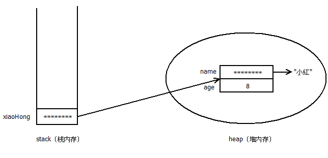
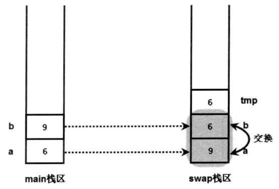
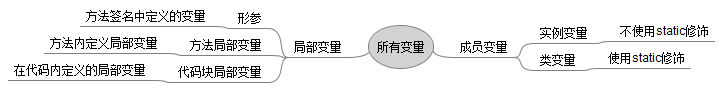

## Java面向对象（上）

### 面向对象概述

面向对象（Object Oriented）的基本思想就是在软件系统中模拟现实世界中客观存在的事物（即对象）及其之间的关系，并且在软件系统的构造时尽可能运用人类的思维方式。

面向对象思想使用**对象**来代表现实世界中某个具体的事物，使用对象之间关系来模拟事物之间的关系，并将具有相同特征的事物抽象为一个类的概念。比如，学生是某一类人的总称，而小明、小华、小红和小美是具体的某个学生**对象**，他们都具有学生的某些特征（如每天到学校上学、听老师讲课），他们都属于学生这个**类**，但彼此的共同特征又有些不同（比如可能学校不同、学习内容不同）。

面向对象思想的一些基本概念有抽象、封装、继承和多态：

1. 抽象。**抽象**（abstract）就是将客观的事物抽象成各种对象的组合，将一个复杂的系统分解成多个简单的部件进行处理。抽象时忽略掉那些与当前目标无关的因素，以便更充分地注意到那些与当前目标有关的因素。抽象并不打算了解全部问题，而是选择其中有用的部分。抽象包括两个方面：过程抽象（编程中使用**方法**来模拟某个过程）和数据抽象（编程中使用某种类型的变量或值来模拟现实数据）；
2. 继承。**继承**（extend，叫扩展更恰当，习惯上称为继承）是描述两个类之间的关系。**继承**允许一个类继承某些已有类的行为和状态，然后在持有已有类行为和状态的基础上进行扩展和修改。被继承或扩展的类叫父类（或基类），继承或扩展了的类叫做父类的子类（或派生类）。继承有单继承和多继承两种：单继承只允许从一个类继承，即只能有一个直接父类，但可以有多个间接父类；而多继承允许有多个直接父类。在Java中，除Object类（它是所有Java类的父类）以外，其它类都有父类。Java语言中只支持单继承，但可以通过实现接口来弥补单继承的不足。继承大大提高了代码的可重用性；
3. 封装。**封装** （Encapsulation）是将对象的状态和行为隐藏在对象内部，不允许外部对象直接访问封装对象的内部信息，外部对象必须通过封装对象的类提供方法来间接访问封装对象的内部信息。良好的封装可以隐藏实现细节、限制外部的不合理访问、便于修改和维护；
4. 多态。**多态**（polymorphism）是指允许同一个父类的不同子类的对象对同一消息做出不同的响应。Java中实现多态主要是方法的重载和方法的覆盖。利用动物这个类中定义发出叫声的功能，而动物的子类对象如猫和狗都可以发出叫声，但猫会“喵喵喵”，狗会“汪汪汪”。多态增强了代码的可替换性、可拓展性和灵活性。

### 类和对象

作为面向对象的一门语言，类和对象是Java中重要内容。**类**是某一类对象的抽象，是一种类别概念；而**对象**是某一**类**事物的具体个体。如小明这个对象，属于是学生这个类，也可以说小明是学生这个类的一个**实例**。

#### 类的定义

Java中类定义的语法如下（初学者暂时先掌握下面基本的格式）：

```java
[修饰符] class ClassName {
  零到多个构造器定义...
  零到多个成员变量...
  零到多个方法...
}
```

**修饰符**：可以是public、protected、private”三者之一（或省略）加上staic（可省略）、final（可省略），此外还有transient和volatile。初学者先不用了解**后面两个**修饰符，前面的几个修饰符后续会逐渐介绍；

**类名**：Java语法要求类名只要是合法的标识符即可，但是编程规范建议一般类名采用**大驼峰命名法**（即采用多个连续的有意义的单词，每个单词首字母大写，单词之间没有任何分隔符）；

**类成员**：类名后的一对花括号（也叫大括号）之间的部分称为类体，类体中包含了类成员。上面的语法格式中的列出了常见的三种类成员：构造器、成员变量和方法。各类成员的顺序没有要求。如果一个类中没有任何类成员，那么它就是一个没有实际意义的空类；

**成员变量**用于定义该类或该类的实例所包含的状态数据，**方法**则定义了该类或该类实例行为或功能，而**构造器**用于创建该类的实例。没有构造器的类也就无法创建实例，所以，如果程序员没有为一个类定义构造器，则系统会创建一个默认的构造器，如果程序员定义了构造器，系统就不会提供默认的构造器。

**定义成员变量的语法格式**如下：

```java
[修饰符] 类型 成员变量名 [= 默认值]; 
```

其中：

- 修饰符：可以是public、protected、private”三者之一（或省略）加上staic（可省略）、final（可省略）。此外还有native和synchronized。初学者可以先不用了解后面两个；
- 类型：可以是任何基本数据类型和引用类型（通过类名、接口名来指定）；
- 成员变量名：Java语法要求成员变量只要是合法的标识符即可，但是编程规范建议成员变量名采用**小驼峰命名法**（即采用多个连续的有意义的单词，第一个单词首字母小写，其余单词首字母大写，单词之间没有任何分隔符）。编程规范建议**采用描述状态数据的英文名词**；
- 默认值：可以选择是否为一个成员变量添加具体默认值。

**定义方法的语法格式**如下：

```java
[修饰符] 返回值类型 方法名(形参列表) {
	零到多个可执行语句...
}
```

其中：

- 修饰符：可以是public、protected、private”三者之一（或省略）加上staic（可省略）、final（可省略）；
- 返回值类型：如果该方法执行完毕后需要得到一个返回值（通过return语句返回），那么就可以为该方法的返回值指定一个类型。返回值类型可以是任何Java允许的数据类型，包括基本数据类型和引用类型。如果该方法执行完毕后不需要返回任何数据，那么该方法的返回值类型应该指定为void；
- 方法名：Java语法要求方法名只要是合法的标识符即可，但是编程规范建议成员变量名采用**小驼峰命名法**（即采用多个连续的有意义的单词，第一个单词首字母小写，其余单词首字母大写，单词之间没有任何分隔符）。编程规范建议**以描述某种行为或功能的英文动词开头**；
- 形参列表：定义了该方法执行需要的参数。有零到多个形如“（形参）类型 形参名”形式的形参组成，多个形参之间使用英文逗号分隔。一旦指定了为一个方法指定了形参类表，就必须在调用该方法时传入具体的参数值，谁调用该方法谁负责传入实际参数值；
- 方法体：圆括号后面的一对花括号之间的部分是方法体，方法体内包含了实现具体的行为或功能的语句。

**构造器**可以看成是一种特殊的方法，专门用来创建类对象。定义构造器的语法格式与方法相似：

```java
[修饰符] 构造器名(形参列表) {
	零到多个初始化该类对象的语句...
}
```

其中：

- 修饰符：可以是public、protected、private”三者之一（或省略）；
- 构造器名：必须为当前类名；
- 形参列表：定义了该构造器执行需要的参数。格式与方法的形参列表相同。


构造器的定义中不能添加返回值类型，也不能添加void（这并不是说构造器没有返回值，构造器默认会返回当前类的对象，返回值的类型是当前类的类型）。如果在构造器定义时添加了返回值类型，那么Java会把该构造器当成是方法来处理，就失去了创建对象的作用。Java的规定构造器定义时不带返回值类型是为了与普通方法区别开来。

一个简单的类定义实例：

```java
public class Student {
  // 定义一个成员变量并指定默认值
  private String name = "No Name";
  
  // 定义一个有参数的构造器
  public Student(String name) {
    this.name = name;
  }
  
  // 定义一个无参数有返回值的方法
  public String getName() {
    return this.name;
  }
  
  // 定义一个有参数无返回值的方法
  public void setName(String name) {
    this.name = name;
  }
}
```

#### 创建和使用对象

定义了类之后，就可以通过在new关键字后调用该类的构造器（有参构造器需要传入实际的参数）来创建该类的实例了。比如：

```java
// 使用类名来定义两个Student类类型的变量
Student xiaoMing, xiaoHong;
// 通过无参的默认构造器来创建一个类对象，然后将其赋值给一个变量
xiaoMing = new Student();
// 通过向有参构造器传入实参来创建一个类对象，然后将其赋值给一个变量
xiaoHong = new Student("小红");

// 也可以通过如下方式（声明变量、创建对象和赋值全部通过一条语句完成）来创建对象并赋值
// Student xiaoHong = new Student("小红");
```

有了类对象之后就可以通过类对象访问对象的实例变量、调用该对象的实例方法了：

```java
// 根据类对象来访问该对象的实例变量并为其赋值
xiaoMing.name = "李明";
// 调用类对象的实例方法来访问或操作该对象的实例变量
// 将在控制台输出小红的名字
System.out.println(xiaoHong.getName());
// 更改小红的名字，然后输出
xiaoHong.setName("王红");
System.out.println(xiaoHong.name);
```

上面三段代码可以放在一个类中执行：

```java
public class Student {
  // 定义一个成员变量并指定默认值
  private String name = "No Name";
  private int age = "0";
  
  // 定义一个有参数的构造器
  public Student(String name, int age) {
    this.name = name;
    this.age = age;
  }
  
  // 定义无参数有返回值的方法
  public String getName() {
    return this.name;
  }
  
  public int getAge() {
    return this.age;
  }
  
  // 定义有参数无返回值的方法
  public void setName(String name) {
    this.name = name;
  }
  
  public void setAge(int age) {
    this.age = age;
  }
  
  public static void main(Sting[] args) {
    // 使用类名来定义两个属于该类类型的变量
	Student xiaoMing, xiaoHong;
	// 通过无参的默认构造器来创建一个类对象，然后将其赋值给一个变量
	xiaoMing = new Student();
	// 通过向有参构造器传入实参来创建一个类对象，然后将其赋值给一个变量
	xiaoHong = new Student("小红", 8);
	// 也可以通过如下方式来创建对象并赋值
	// Student xiaoHong = new Student("小红", 8);
    
    // 根据类对象来访问该对象的实例变量并为其赋值
	xiaoMing.name = "李明";
    xiaoMing.age = 9;
	// 调用类对象的实例方法来访问或操作该对象的实例变量
	// 将在控制台输出小红的名字
	System.out.println("学生姓名：" + xiaoHong.getName());
	// 更改小明的年龄，然后输出
	xiaoMing.setAge(7);
	System.out.println("学生年龄：" + String.valueOf(xiaoHong.age));
  }
}
```

> **注意**：上面的Student类必须定义在一个名为Student.java文件中，Java规定一个.java文件中只能定义一个public修饰的类（或接口），且.java的文件名必须与该类的类名相同。

#### static关键字

static关键用于修饰方法、成员变量、内部类和内部接口等，表示这些成员属于类本身，而不属于该类的单个实例。因此，static修饰的方法、成员变量也称为类变量（也称静态变量）、类方法（也称静态方法）。

不使用static修饰的普通方法、普通成员变量则属于该类的单个实例，而不是该类。通常把不使用static修饰的方法、成员变量称为实例变量（也称非静态变量）、实例方法（也称非静态方法）。

**类成员只能访问该类的类成员，不能访问实例成员，实例成员也只能访问该类的实例成员，不能访问类成员**。**访问类成员的语法格式为“类名.类成员”**（或“对象名.实例成员”，这种方式底层还是使用类名作为调用者的。不过不推荐使用这种方式，易混淆），**访问实例成员的语法格式为“对象名.实例成员”**。

#### 引用和指针

Java需要为变量开辟内存来存储该变量，比如上面的Student类变量xiaoHong在内存中的存储情况如下图所示：



实际上Student类变量xiaoHong在内存中只是封装了一个指向Student类对象的引用，存放在栈内存中，而被引用的Student类对象存储在堆内存中，该Student类对象中不同类型的数据存储存储形式也不相同（String类对象是引用类型，故name变量也是一个指向“小红”字符串的引用，基本类型变量age则直接存储为int型8）。

当创建了一个类对象之后，必须通过该对象的引用才能访问该对象，同理，数组也需要通过指向其实际存储位置的引用变量来访问。使用类引用变量访问成员时，实际上是访问该引用变量所指对象的成员。

如果堆内存中的对象没有任何引用指向它，那么就无法访问该对象，这个对象就变成了垃圾，Java垃圾回收机制会在合适的时候释放该对象所占的内存。

Java中的引用变量类似于C/C++中的指针，只是Java将指针封装了起来，从而避免了指针的烦琐操作，这是Java相对于C/C++易学的主要地方之一。

#### this引用

Java通过使用**this关键字指向调用this所在方法的对象**。this作为对象的默认引用有以下两种情况：

- 在方法中引用调用该方法的对象；
- 在构造器中引用构造器正在初始化的对象。

this最大的作用就是在类的一个方法中，访问该类中另一个方法或实例变量。如

```java
public class Dog {
	// 定义一个jump()方法
	public void jump() {
		System.out.println("正在执行jump方法");
	}
	// 定义一个run()方法，run()方法需要借助jump()方法
	public void run() {
		// 使用this引用调用run()方法的对象
		this.jump();
		System.out.println("正在执行run方法");
	}
}
```

this可以引用任何对象。当this出现在某个方法中时，它所代表的对象是不确定的，但该被引用的对象的类型是确定的，this只能引用当前类的对象。只有当方法被调用时，该方法中this所引用的对象才会确定下来。谁调用this所在的方法，this就代表谁。

Java允许对象的一个成员调用另一个成员时省略this，但实际上这个this是存在的（毕竟不能缺少调用者）。上面的run()方法可以修改成如下所示：

```java
public void run() {
      	// Java允许对象的一个成员调用另一个成员时省略this
      	jump();
		System.out.println("正在执行run方法");
}
```

**static修饰的方法中不能使用this**。因为this是指向实例对象的，而static修饰的方法属于类。例如，下面的代码将编译出误：

```java
public class StaticAccessNonStatic {
	public void info() {
		System.out.println("简单的info方法");
	}
	public static void main(String[] args) {
		// 因为main()方法是静态方法，而info()是非静态方法，
		// 调用main()方法的是该类本身，而不是该类的实例，
		// 因此省略的this无法指向有效的对象
		info();
	}
}
```

此外，this也可以在构造器作为当前正在被初始化对象的默认引用。

```java
public class ThisInConstructor {
	// 定义一个名为foo的成员变量
	public int foo;
	public ThisInConstructor() {
		// 在构造器里定义一个名为foo的局部变量
		int foo = 0;
		// 使用this代表该构造器正在初始化的对象
		// 下面的代码将会把该构造器正在初始化的对象的foo成员变量设为6，而不是上面的局部变量foo
		this.foo = 6;
	}
	public static void main(String[] args) {
		// 所有使用ThisInConstructor创建的对象的foo成员变量
		// 都将被设为6，所以下面代码将输出6
		System.out.println(new ThisInConstructor().foo);
	}
}
```

this作为对象的默认引用时，可以将this当成普通引用变量使用，甚至可以将this作为返回值。如下面的代码所示：

```java
public class ReturnThis {
	public int num;
	public ReturnThis increase() {
		num++;
		// return this返回调用该方法的对象
		return this;
	}
    	
  	public ReturnThis decrease() {
     	num--;
		// return this返回调用该方法的对象
		return this;
  	}
  
  	public void showNumber() {
      System.out.println("rt的num成员变量值是:" + rt.num);
  	}
  
	public static void main(String[] args) {
		ReturnThis rt = new ReturnThis();
		// 可以连续调用同一个方法
		rt.increase()
			.decrease()
			.showNumber();
	}
}
```

可以连续调用将this作为返回值的方法，从而使代码更加简洁。

### 方法详解

#### 方法的参数传递

Java中的**方法不能独立存在，必须定义在类里，必须通过类或类的对象来调用**。如果被调用方法含有形参，则必须在调用该方法时传入实际的参数（称为实参）。Java里方法参数的传递是按值传递的，所谓**值传递，就是将实参的副本传入方法，而原有实参没有变化**。

使用**基本类型进行参数传递时，直接传入基本类型实参的值（副本）**：

```java
public class PrimitiveTransferTest {
	public static void swap(int a , int b) {
		// 下面三行代码实现a、b变量的值交换。
		// 定义一个临时变量来保存a变量的值
		int tmp = a;
		// 把b的值赋给a
		a = b;
		// 把临时变量tmp的值赋给a
		b = tmp;
		System.out.println("交换结束后：\nswap方法里，变量a的值是"
			+ a + "，变量b的值是" + b);
	}
  
	public static void main(String[] args) {
		int a = 6;
		int b = 9;
		swap(a , b);
		System.out.println("在main方法里，变量a的值是"
			+ a + "，变量b的值是" + b);
	}
}
```

运行结果如下：

```shell
交换结束后：
swap方法里，变量a的值是9，变量b的值是6
main方法里，变量a的值是9，变量b的值是6
```

在上面代码的main()方法中调用swap()方法时，main()方法还未结束，因此，系统会分别为这两个方法开辟两块栈区，用于保存main()方法和swap()方法的局部变量a、b。main()方法中的a、b变量作为实参传入swap()方法，实际上是在swap()方法的栈区又产生了两个变量a、b，并将main()方法栈区中a、b变量的值分别赋值给swap()方法栈区的a、b参数（传入的是副本），即对a、b形参进行了初始化。此时，系统存在两个a变量、两个b变量，只是存在于不同的方法栈区而已。



上图中main()方法栈区中a、b的值并未有任何改变，改变的只有swap()方法栈区中的a、b值。

接下来看**引用类型的参数传递**。**引用类型的参数传递也是按值传递，只是传入的是引用变量的地址副本**（是一个指向被引用对象的地址），**而不是对象本身**。

```java
class DataWrap {
	int a;
	int b;
}

public class ReferenceTransferTest {
	public static void swap(DataWrap dw) {
		// 下面三行代码实现dw的a、b两个成员变量的值交换。
		// 定义一个临时变量来保存dw对象的a成员变量的值
		int tmp = dw.a;
		// 把dw对象的b成员变量值赋给a成员变量
		dw.a = dw.b;
		// 把临时变量tmp的值赋给dw对象的b成员变量
		dw.b = tmp;
		System.out.println("交换结束后：\nswap方法里，变量a的值是"
			+ dw.a + ",变量b的值是" + dw.b);
		// 把dw直接赋为null，让它不再指向任何有效地址。
		dw = null;
	}
	public static void main(String[] args) {
		DataWrap dw = new DataWrap();
		dw.a = 6;
		dw.b = 9;
		swap(dw);
		System.out.println("变量a的值是"
			+ dw.a + "，变量b的值是" + dw.b);
	}
}
```

运行结果如下：

```shell
交换结束后：
swap方法里，变量a的值是9，变量b的值是6
main方法里，变量a的值是6，变量b的值是9
```

我们发现运行结果中，变量a、b的值发生了改变。


这是因为在main()方法中虽然传给swap()方法的是dw引用变量的副本（指向DataWrap类对象的引用的副本），但是副本和原引用指向的是同一个对象，操作的是同一个对象的成员变量，所以结果发生了改变。

#### 形参个数可变的方法

从JDK 1.5开始，Java允许使用形参个数可变的方法。格式为**在形参列表中最后一个形参的类型后面加三个英文句号（...），则该形参就可以接受多个该类型参数值，传入的多个参数值被当成数组**。例如：

```java
public class Varargs {
	// 定义了形参个数可变的方法
	public static void test(int a , String... books) {
		// books被当成数组处理
		for (String tmp : books) {
			System.out.println(tmp);
		}
		// 输出整数变量a的值
		System.out.println(a);
	}
	public static void main(String[] args) {
		// 调用test方法
		test(5 , "Head First Java" , "Head First Android");
	}
}
```

运行结果如下：

```shell
Head First Java
Head First Android
5
```

形参个数可变的参数本质上是一个数组参数，效果相同。如下面两段代码效果相同：

```java
// 形参个数可变
public static void test(int a , String... books)
```

```java
// 使用数组
public static void test(int a , String[] books)
```

以上两种方法的区别在于**形参个数可变的方法定义在调用方法时更加简洁**，如下面两段代码所示：

```java
test(5 , "Head First Java" , "Head First Android");
```

```java
test(5 , new String[] {"Head First Java" , "Head First Android"});
```

但是**个数可变的形参必须位于参数列表的最后，而且一个方法中只能有一个长度可变的形参**。而**数组形式的参数可以位于形参列表的任意位置，且可以有多个数组形式的参数**。

#### 方法递归

**在一个方法内调用它自身，被称为方法递归**。方法递归隐含了一种循环。已知一个数列：f(0)=1，f(1)=4，f(n+2)=2\*f(n+1)+f(n)。求f(10)。求解代码如下：

```java
public class Recursive {
	public static int fn(int n) {
		if (n == 0) {
			return 1;
		}
		else if (n == 1) {
			return 4;
		}
		else {
			// 方法中调用它自身，就是方法递归
			return 2 * fn(n - 1) + fn(n - 2);
		}
	}
  
	public static void main(String[] args) {
		// 输出fn(10)的结果
		System.out.println(fn(10));
	}
}
```

上面代码中主要通过

```java
return 2 * fn(n - 1) + fn(n - 2);
```

来实现方法不断调用自身。这种不断调用自身的过程是可以在某个时刻终止的，否则就是一个死循环。因此，**定义递归方法时必须要向已知的方向递归，以保证递归可以终止**。

#### 方法重载

在Java中，如果**一个类中含有两个或两个以上的同名方法，但这些方法的形参不同，那么这就是方法重载（Overload）**。**方法重载不要求重载方法的返回值和修饰符相同**。**根据所调用方法形参的不同来确定调用哪一个重载方法**。比如：

```java
public class Overload {
	// 下面定义了两个test()方法，但方法的形参列表不同
	// 系统可以区分这两个方法，这种被称为方法重载
	public void test() {
		System.out.println("无参数");
	}
  
	public void test(String msg) {
		System.out.println("重载的test方法: " + msg);
	}
  
	public static void main(String[] args) {
		Overload ol = new Overload();
		// 调用test()时没有传入参数，因此系统调用上面没有参数的test()方法。
		ol.test();
		// 调用test()时传入了一个字符串参数，
		// 因此系统调用上面带一个字符串参数的test()方法。
		ol.test("hello");
	}
}
```

运行结果如下;

```shell
无参数
重载的test方法:hello
```

**重载的意义在于增加了同一种行为或功能的灵活性，可以使同一种功能在不同的条件下获得不同的执行效果**。不过并**不建议重载形参个数可变的方法，因为这样没有太大的意义，而且可读性也差**。

#### 成员变量和局部变量




##### 成员变量

成员变量指的是在类里定义的变量，包括**类变量**（使用static修饰，**属于类所有，不属于该类的实例**）和**实例变量**（没有static修饰，属于类的实例）。**类变量在类的*准备阶段*（参考[类的加载部分]()）开始初始化（并分配内存）**，直到系统完全销毁该类。而**实例变量从创建类对象时开始初始化**，直到该实例消失。**如果成员变量在定义时显式被指定了一个值，那么系统会在该成员变量初始化时将该值赋值给该成员变量，如果定义时没有为其显式指定值，那么会执行默认初始化**（成员变量的默认初始化规则与数组元素默认初始化规则相同，参考数据[类型和类型转换]()中各种数据类型的默认值）。

**一个类的类变量和实例变量存储在堆内存中的不同区域（因为两者的生命周期不同且分属不同的目标，类变量在类加载后创建对象之前已经存在于内存中了，即使某个对象（也包括该对象的实例变量）消失了类变量可能还没有消失，分开存储便于管理）**。

值得注意的是，**Java允许通过实例来调用类变量（实例.类变量），由于实例并不持有这个类变量，实际上访问的还是该实例所属类的类变量，如果一个实例调用并修改类变量之后，就会导致该类的其他实例访问该类变量时得到的也是修改之后的值**。如下面代码所示：

```java
class Person {
	// 定义一个实例变量
	public String name;
	// 定义一个类变量
	public static int eyeNum;
}

public class PersonTest {
	public static void main(String[] args) {
		// 第一次主动使用Person类，该类自动初始化，则eyeNum变量开始起作用，输出0
		System.out.println("Person的eyeNum类变量值:" + Person.eyeNum);
		// 创建Person对象
		Person p = new Person();
		// 通过Person对象的引用p来访问Person对象name实例变量
		// 并通过实例访问eyeNum类变量
		System.out.println("p变量的name变量值是：" + p.name + "，p对象的eyeNum变量值是：" + p.eyeNum);
		// 直接为name实例变量赋值
		p.name = "孙悟空";
		// 通过p访问eyeNum类变量，依然是访问Person的eyeNum类变量
		p.eyeNum = 2;
		// 再次通过Person对象来访问name实例变量和eyeNum类变量
		System.out.println("p变量的name变量值是：" + p.name + "，p对象的eyeNum变量值是：" + p.eyeNum);
		// 前面通过p修改了Person的eyeNum，此处的Person.eyeNum将输出2
		System.out.println("Person的eyeNum类变量值:" + Person.eyeNum);
		Person p2 = new Person();
		// p2访问的eyeNum类变量依然引用Person类的，因此依然输出2
		System.out.println("p2对象的eyeNum类变量值:" + p2.eyeNum);
	}
}
```

##### 局部变量

局部变量根据定义形式可以分成如下三种：

- 形参：在定义方法签名时定义的变量。形参的作用域在整个方法中有效；
- 方法局部变量：在方法体内定义的局部变量。它的作用域从定义它地方开始，到方法结束时失效；
- 代码块局部变量：在代码块中定义的局部变量。这种局部变量的作用域从定义它地方开始，到代码块结束时失效。


与成员变量不同，局部变量除了形参以外，必须显示初始化。也就是说必须为方法局部变量和代码块局部变量指定初始值才能访问他们。在通过类（或对象）调用类方法（或实例方法）时，系统会在该被调用方法的栈区中为其形参分配内存，并将实参赋值给形参来完成其初始化。这意味着局部变量声明后，如果还没有为其指定一个值，那么系统不会为其分配内存，直到为局部变量显式赋值时，系统才会在其所在方法的栈内存中（与成员变量不同）为其分配内存，并为其执行初始化。

此外，Java允许局部变量名和成员变量名相同。如果局部变量名和成员变量名相同，则局部变量在其作用域中会覆盖成员变量，如果在这种情况下要访问被覆盖的成员变量，可以使用this（用于调用实例变量）或类名（用于调用类变量）来调用成员变量。如下面的代码所示：

```java
public class VariableOverrideTest {
	// 定义一个name实例变量
	private String name = "Java程序员";
	// 定义一个price类变量
	private static double price = 11000.0;
  
	// 主方法，程序的入口
	public static void main(String[] args) {
		// 类方法里的局部变量，局部变量覆盖成员变量
		int price = 6000.0;
		// 直接访问price变量，将输出price局部变量的值：60000.0
		System.out.println(price);
		// 使用类名作为price变量的限定，
		// 将输出price类变量的值：11000.0
		System.out.println(VariableOverrideTest.price);
		// 运行info方法
		new VariableOverrideTest().info();
	}
  
	public void info() {
		// 实例方法里的局部变量，局部变量覆盖成员变量
		String name = "PHP";
		// 直接访问name变量，将输出name局部变量的值："PHP"
		System.out.println(name);
		// 使用this来作为name变量的限定，
		// 将输出name实例变量的值："Java程序员"
		System.out.println(this.name);
	}
}
```

栈内存中的变量无须系统垃圾回收机制回收，往往随方法或代码块的结束而结束。由于局部变量只保存基本类型的值或对象的引用，因此局部变量所占的内存区域通常比较小。

#### 变量的使用规则

如果优先使用成员变量而不是局部变量，由于成员变量的生命周期比局部变量长，作用域也比局部变量广，就会加大内存的开销，降低程序的内聚性（程序中各模块之间私有数据隔离程度越高越好）。所以，尽量将一个变量定义成局部变量（除非定义为局部变量比定义为成员变量更占内存），同时使局部变量的作用范围尽可能的小。**能使用代码块局部变量的地方就不要使用方法局部变量**。

在以下几种情况下考虑使用成员变量：

- 如果需要定义的变量是用于**描述某个类或对象的固有信息的**（如人的身高、体重）就应该定义为成员变量。如果这种固有信息对于所有实例都一样（如正常人的眼睛数量）就应该定义为类变量；如果这种固有信息对于每个实例可能都不相同（如人的身高、体重）就应该定义为实例变量；
- 如果某个信息需要在某个类的多个方法之间共享，则这个信息应该使用成员变量来保存。

### 封装

封装是面向对象的三大特征（另外两个是继承和多态）之一。现实世界中一个实体往往将自己内部信息以藏起来，通过自己本身特定的方式来与外界交流（比如，手机就是一种人们用来远距离沟通的工具）。**封装就是将对象的状态信息隐藏在该对象内部，外部程序无法直接访问该对象的内部信息，只能通过该对象提供的对外方法来间接访问和操作该对象的内部状态信息**。

封装时应考虑将对象的成员变量和实现细节隐藏起来而不允许外部直接访问，同时将方法暴露出来控制外部的进行安全合理的访问。良好的封装可以限制外部的不合理访问、可进行数据检查，保障对象的完整性、便于修改提供可维护性。

#### 访问控制符

Java提供了三个访问控制符：private、protected和public，分别代表了三个访问级别。另外还有一个不加任何访问控制符的访问级别，Java一共有四种访问级别，按访问的级别从小到大依次为：

private ---> *default* ---> protected ---> public

详细介绍如下：

- private(当前类访问权限)：如果类里的一个成员（包括成员变量、方法和构造器等）使用private访问控制符来修饰，则这个成员只能在当前类的内部被访问。很显然，这个访问控制符用于修饰成员变量最合适，使用它来修饰成员变量就可以把成员变量隐藏在该类的内部；
- default(包（package）访问权限)：如果类里的一个成员（包括成员变量、方法和构造器等）或者一个外部类不使用任何访问控制修饰，就称它为包访问权限的，default访问控制符修饰的成员或外部类可以被相同包下的其他类访问；
- protected（子类访问权限）：如果一个成员（包括成员变量、方法和构造器等）使用protected访问控制符修饰，那么这个成员既可以被同一个包中的其他类访问，也可以被不同包中的**子类**访问。在通常情况下，如果使用protected来修饰一个方法，通常是希望其子类来重写这个方法；
- public（公共访问权限）：这是一个最宽松的访问控制级别，如果一个成员（包括成员变量、方法和构造器等）或者一个外部类使用public访问控制符修饰，那么这个成员或外部类就可以被所有类访问，不管访问类和被访问类是否处于同一个包中，是否具有父子继承关系。

总结如下表所示：

|       | private | *default* | protected | public |
| ----- | :-----: | :-------: | :-------: | :----: |
| 同一个类中 |    √    |     √     |     √     |   √    |
| 同一个包中 |         |     √     |     √     |   √    |
| 子类中   |         |           |     √     |   √    |
| 全局范围内 |         |           |           |   √    |

通常：

- **局部变量仅在其所在方法体和代码块中有效，不可能被其他类访问，所以局部变量不能使用任何访问控制符修饰**；
- 外部类没有处于任何类的内部，也没有处于其他外部类的内部或其他外部类的子类的内部，故外部类只能使用public或default修饰。

> 注意：如果一个Java源文件中没有public修饰的类，那么该Java源文件的文件名可以是任何合法的文件名。但是如果一个Java源文件中有一个public修饰的类，那么该Java源文件必须与该类同名。

访问控制符的使用原则：

- 类里的绝大多数成员变量都应该考虑使用private修饰，只有一些static修饰的、类似全局变量的成员变量才考虑使用public修饰。除此之外，有些方法如果只是用于辅助其他方法来实现某些功能，这些方法称为工具方法，工具方法也应该使用private修饰；
- 如果某个类主要用作其他类的父类，那么该类里包含的大多数方法可能希望子类进行重写，而不想被外部直接调用，则应该使用protected修饰这些方法；
- 希望暴露出来给其他类调用的方法应该使用public修饰。因此，类的构造器应该使用public修饰，从而使其他类可以通过new关键字来创建该类的实例（单例模式和工厂模式除外）。

#### 包以及导包语句

Java允许使用包（package）将类组织起来，以方便组织代码，并将自己的代码与别人提供的代码库分开管理。 标准的Java 类库分别在多个包中， 如java.lang、java.util 和java.net，所有标准的 java 包都处于java 和 javax 包层次中。 使用包的主要原因是确保类名的唯一性，且为了保证包名的绝对唯一，Oracle 公司建议将公司的因特网域名以逆序的形式作为包名，如com.baidu.*。

如果希望将一个类放在指定的包下，应在该类的源文件的**第一个非注释行**使用以下格式为该类指定其所在的包名：

```java
package packagename;
```

如果一个类定义没有指定其所属的包，那么该类位于默认包下，但实际开发中一般不会这么做。一个类的全限定类名（即类的全名）因该包含其所在的包名以及类名，比如：java.lang.String。

应该在编译Java源文件时指定生成.class文件的位置。比如，如果有这样一个指定了包名的类：

```java
package rosydawn;
public class MyClass {
  public static void main(String[] args) {
    System.out.println("Hello world!");
  }
}
```

使用如下编译命令编译Java源文件：

```shell
javac -d . HelloWorld.java
```

javac命令的“-d”选项用于指定生成.class文件的位置，“.”表示当前目录。执行上面的编译命令后发现，当前目录下并没有HelloWorld.class文件，HelloWorld.class文件存放在了当前目录下的rosydawn目录下。其实，**Java规定：位于包中的类，在文件系统中也必须有与包层级相同的目录结构。Java的包机制避免了同一个目录下的同名类的源文件发生冲突**。如果编译时不使用-d选项，编译器会在不管类的包声明的情况下在当前目录下生成.class文件。**如果.class文件没有相应的包文件结构，将会导致同名类的.class文件冲突**。所以，建议手动**编译时使用-d选项以使编译生成的.class文件也有相应的包文件结构**，即使想在当前目录下生成.class文件也应该通过“javac -d .”指定为当前目录。

虚拟机在装载带包名的类时，会先搜索CLASSPATH环境变量指定的目录，然后在这些目录中按照包层次对应的目录结构去查找.class文件。同一个包中的类不用位于同一个目录下，只要让CLASSPATH环境变量里包含这两个类的.class文件所在的目录即可。尽管如此，也因该将Java源文件放在与包名一直的目录结构中（可以解决源文件的名称冲突）。

另外，为了避免混乱，应该将源文件和.class文件分开存放，但两者都应该有相同的包层次的目录结构。


一个类可以使用所属包中的所有类，以及其他包中的public修饰的类。我们可以采用以下两种方式访问另一个包中public修饰的类：

- 在类名之前添加完整的包名以区分不同包下的同名类（如java.sql.Date和java.util.Date）。如：

  ```java
  java.util.Date today = new java.util.Date();
  ```

- 更简单的方式是使用import语句。

  导入一个包下的多个类：

  ```java
  import java.io.BufferedReader, IOException;
  ```

  导入一个包下的所有类：

  ```java
  import java.util.*;
  ```

  > 注意：“*”只能用来匹配任何类，而不能用来匹配包名。

  导入多个包中的多个类：

  ```java
  import java.io.BufferedReader;
  import java.io.IOException;
  import java.util.Enumeration;
  import java.util.Locale;
  ```

  > 注意：
  >
  > - 编程规法建议每条import语句导入一个类。这样便于其他人知道哪个类来自哪个包。
  > - Java 默认自动导入java.lang包下的所有类，如String、System等，这些类可不通过import语句导入而直接使用。

  JDK 1.5以后增加了一种静态导入语法：通过使用import static关键字可以导入某个类的某个或全部的静态成员。

  导入某个类的单个静态成员：

  ```java
  import static package.subpackage...ClassName.fieldName|methodName;
  ```

  导入某个类全部的静态成员：

  ````java
  import static package.subpackage...ClassName.*;
  ````

  > 注意：import语句和import static语句必须位于package语句之后，类定义之前。而import语句和import static语句之间没有顺序要求。

  Java常用的包如下：

  - java.lang：包含了Java语言的核心类（如Math、String、System和Thread类等），默认自动导入该包；
  - java.util：包含了Java的大量工具类/接口和集合框架类/接口（如Arrays、Map、List、Set）；
  - java.net：包含了一些Java网络编程相关的类/接口；
  - java.io：包含了一些Java输入/输出相关操作的类/接口；
  - java.text：包含了一些Java格式化相关的类；
  - java.sql：包含了Java进行JDBC数据库编程相关的类/接口；
  - java.awt：包含了抽象窗口工具集（Abstract Window Tookits）的相关类/接口；
  - java.swing：包含了Swing图形用户界面编程相关类/接口。


### 构造器详解

#### 构造器语法

构造器（或构造方法）是一个特殊的方法，在创建类对象时执行初始化相关的操作，是创建类对象的根本途径，所以，每个类都必须包含一个或多个构造器。

如果程序员没有为一个类提供构造器，则系统默认会为该类提供一个无参数、执行体为空的默认构造器，系统通过调用无参构造器来执行对象变量的默认初始化（如前面所述）。

构造器语法规法如下：

```java
访问权限修饰符 类名(形参列表) {
	零到多条初始化语句;
}
```

有以下几点需要说明：

-  构造器的名称与其类名相同；
-  构造器的访问权限修饰符一般为public（方便创建类对象），也可以是private（[单例模式]()和[工厂模式]()）。很少使用protected和default；
-  构造器声明中没有返回值类型，也不能使用void。注意，**声明中没有返回值类型不代表没有返回值**。构造器调用结束后**默认返回其初始化完成的对象**。没有在声明中添加返回值类型是为了与一般方法区分开来，表明了构造器的特殊性；
-  构造器的执行体一般为通过传入的实参为当前类的成员变量指定初始值，从而完成对象的初始化。如前所述，在构造器中可以通过this调用当前类的成员变量（而且this还可以省略，可是通过this调用类成员实际上底层依然使用类名来调用类成员。不过不建议这么做，而是建议直接使用类名调用类成员）；

一个构造器实例如下：

```java
public class ConstructorTest {
	public String name;
	public int count;
	// 提供自定义的构造器，该构造器包含两个参数
	public ConstructorTest(String name , int count) {
		// 构造器里的this代表它进行初始化的对象
		// 下面两行代码将传入的2个参数赋给this代表对象的name和count实例变量
		this.name = name;
		this.count = count;
	}
	public static void main(String[] args) {
		// 使用自定义的构造器来创建对象
		// 系统将会对该对象执行自定义的初始化
		ConstructorTest tc = new ConstructorTest("I love Java!" , 90);
		// 输出ConstructorTest对象的name和count两个实例变量
		System.out.println(tc.name);
		System.out.println(tc.count);
	}
}
```

输出结果如下：

```shell
I love Java!
90
```

> 注意： 构造器作为特殊的方法，既可以使用this调用非静态成员，也可以作被static方法通过new关键字调用。

#### 构造器的重载

如果不想执行默认的初始化，也可以重载构造器来提供多种初始化操作。构造器的重载规则与方法的重载相同。需要额外注意的是，一个构造器可以通过this调用其他重载的构造器，从而复用一些初始化操作（代码重用是面向对象编程的原则之一）。如果重载的构造器中需要执行某些相同的初始化操作，可以考虑将这些共用的初始化操作封装在某一个构造器中，然后在其他构造器中通过this调用该构造器。如下面的例子所示：

```java
public class Person {
	private String name = "";
	private int age = 0;
	private String gender = "female";

	// 无参构造器可用来执行默认初始化
	// 但是重载情况下如果没有定义无参构造器则不能使用它
	public Person() {
	}

	// 一个参数的构造器
	public Person(String name) {
		this.name = name;
	}

	// 两个参数的构造器
	public Person(String name, int age) {
		// 通过this调用其他重载构造器必须放在当前构造器执行体的第一行
		// 系统根据this后面的形参列表来调用对应的构造器
		this(name);
		this.age = age;
	}

	// 三个参数的构造器
	public Person(String name, int age, String gender) {
		// 通过this调用其他重载构造器必须放在当前构造器执行体的第一行
		// 系统根据this后面的形参列表来调用对应的构造器
		this(name, age);
		this.gender = gender;
	}
	
	@Override
	public String toString() {
		return "Person[name = " + name + 
				", age = " + String.valueOf(age) + 
				", gender = " + gender + "]";
	}
	
	public static void main(String[] args) {
		Person p1 = new Person();
		Person p2 = new Person("张三");
		Person p3 = new Person("李四", 20);
		Person p4 = new Person("王二", 18, "male");
		
		System.out.println(p1 + "\n" + p2 + "\n" + p3 + "\n" + p4);		
	}
}
```

输出结果如下：

```shell
Person[name = , age = 0, gender = female]
Person[name = 张三, age = 0, gender = female]
Person[name = 李四, age = 20, gender = female]
Person[name = 王二, age = 18, gender = male]
```

> 注意：
>
> - 系统可以根据this后的形参列表判断出调用哪一个构造器；
> - 通过this调用另一个构造器仅可用在其他重载构造器中，而且this调用语句必须放在所有初始化语句的开头；
> - 如果仅提供一个自定义构造器，那么默认的无参构造器将不可使用。除非进行多个构造器的重载**且定义了无参数构造器**，才可以使用无参构造器。

### 继承

#### 继承概述

如前面所述，**继承是实现代码复用的重要手段。Java的继承通过extends关键字实现**，语法如下：

```java
修饰符 class SubClass extends SuperClass {
	// 类定义部分
}
```

**通过继承，子类就拥有父类的全部属性与方法，所以，子类也是一种特殊的父**类。关于继承，注意以下几点：

- **Java只允许单继承**。即父类可以拥有多个子类，但是子类只能继承一个父类；
- **Java中所有类都是通过直接或者间接地继承了java.lang.Object类得到的。换言之Object类是Java中所有类的父类**。

#### 重写父类实例方法

一般情况下，子类总是在父类的基础上，额外增加新的成员。但有些时候，子类需要重写父类的**实例**方法。如代表动物的Animal类定义了一个代表移动的move()方法，但是不同的动物有不同的移动方式（狗是跑、鸟是飞等），因此，其子类需要重写Animal类的move()方法。如：

```java
public class Animal {
	protected void move() {
		System.out.println("我挪动了位置");
	}
}
```

```java
public class Dog extends Animal{
	@Override
	public void move() {
		System.out.println("我跑了一会");
	}
	
}
```

```java
public class Bird extends Animal {
	@Override
	public void move() {
		System.out.println("我飞了一会");
	}
	
}
```

输出结果如下：

```shell
我挪动了位置
我跑了一会
我飞了一会
```

上面这种子类包含了与父类同名（也同形参）的**实例成员**的现象称为重写（override），也称为覆盖（重写的实例**方法**一般使用@Override注解修饰（@Override注解只用于重写实例方法，不能用于重写的实例变量），关于注解请参考后面的[注解介绍]()）。方法的重写遵循“**两同两小一大**”的原则：

- 两同：即重写前后的方法名、形参列表要相同；
- 两小：即重写后的子类方法的返回值类型和抛出异常的类型要小于被重写的父类方法；
- 一大：即重写后的子类方法的返回权限应该比被重写的父类方法更大或相等；

注意：**被重写的方法必须同是实例方法**，不能一个是类方法（类成员不能被重写，子类继承父类后，父类的类成员会被隐藏），而另一个是实例方法。另外，如前所述，父类中想被子类重写的实例方法应使用protected修饰，这样该方法就只能被子类访问，保证了良好的封装性。

**父类中private修饰的私有成员对其子类是完全隐藏的，子类无法直接访问父类中的私有成员，只能通过调用从父类继承的方法来调用或改变父类的私有成员**。所以，即使子类中定义了一个与父类中私有成员（成员变量或方法）声明相同（修饰符可以不同）的成员，也不是重写，而是一个新的定义；

**只能重写父类的实例方法，从而实现多态**。**而父类的其他成员（静态变量、静态方法、共实例变量）只能被子类的同名成员覆盖，不能被重写**。

子类对象无法直接访问父类中被覆盖了的成员（方法或成员变量）。所以，如果子类中定义的实例成员与父类中的实例成员同名，那么子类对象直接访问该同名的成员（成员变量或方法）时访问的是属于它自己的成员，而不是父类中被重写的成员。

然而，在**子类的方法中**可以通过**super.父类实例成员**的方式来调用父类中被覆盖的实例成员（即父类的非私有成员），在**子类的静态方法中**可以通过**父类类名.父类类方法**的方式来访问父类中被覆盖的类成员。看下面的例子：

```java
class BaseClass {
	private String testPrivateMember = "我是父类的私有变量";

	protected void testInstanceMethod() {
		System.out.println("我是父类的实例方法");
	}

	protected static void testStaticMethod() {
		System.out.println("我是父类的类方法");
	}
}

public class SubClass extends BaseClass {

	private String testPrivateMember = "我是子类的私有变量";

	// 不能重写父类的类方法，所以不能为与父类中类方法同名的子类类方法添加@Override注解
	// 子类中定义的与父类同名的类方法属于子类本身，与父类中同名的类方法无关
	// @Override
	public static void testStaticMethod() {
		System.out.println("我是子类的类方法");
		// 可以在子类中任何静态方法体中调用父类类成员
		BaseClass.testStaticMethod();
	}

	@Override
	public void testInstanceMethod() {
		// 可以在子类的实例方法中通过super关键字来调用父类中的被覆盖的方法
		super.testInstanceMethod();
		System.out.println("我是子类的实例方法");
		// 无法调用父类的私有成员
		// System.out.println(super.testPrivateMember);
		// 即使子类的私有变量与父类的私有成员同名，也是访问子类自己的私有成员
		System.out.println(testPrivateMember);
		
	}

	public static void main(String[] args) {
		SubClass subClass = new SubClass();
		subClass.testInstanceMethod();
		
		// 可以在子类中任何静态方法体中调用父类类成员
		BaseClass.testStaticMethod();
		SubClass.testStaticMethod();
	}
}
```

输出结果如下：

```shell
我是父类的实例方法
我是子类的实例方法
我是子类的私有变量
我是父类的类方法
我是子类的类方法
我是父类的类方法
```

如果在某个方法中访问名为a的成员变量，但是没有显式指定a的调用者，那么系统会依次从该方法中、当前类中、当前类的直接父类中...一直找到Object类，直到找到名为a的变量，没有找到就报错。

#### 调用父类构造器

子类不会获得父类的构造器，但是可以通过super关键字在子类的构造器中调用父类的构造器，与前面在一个构造器中通过this调用另一个重载构造器相似的是，这个super调用语句也必须位于子类构造器执行体中的第一行。如下面的代码所示。

```java
class Base {
	public double size;
	public String name;

	public Base(double size, String name) {
		this.size = size;
		this.name = name;
	}
}

public class Sub extends Base {
	private String color;

	public Sub(double size , String name , String color) {
		// 通过super调用来调用父类构造器的初始化过程
		super(size , name);
		this.color = color;
	}

	public static void main(String[] args) {
		Sub s = new Sub(5.6, "测试对象", "红色");
		// 输出Sub对象的三个实例变量
		System.out.println(s.size + "--" + s.name + "--" + s.color);
	}
}
```

输出结果如下：

```shell
5.6--测试对象--红色
```

不管是否使用super执行父类构造器的初始化代码，子类构造器总会调用父类构造器一次。子类调用父类构造器分为以下三种情况：

- 子类通过super显式调用父类构造器； 
- 子类通过this显式调用重载的构造器，被调用的重载构造器再按其自身情况（三种调用父类构造器情况之一）调用父类构造器； 
- 子类既没有使用super，也没有使用this，系统在执行子类构造器之前会隐式调用父类的无参数构造器。执行父类构造器时，会按照继承关系从下往上一直追朔到Object类的构造器，再依次从上往下执行父类的构造器，形成一个闭环流程。

### 多态

#### 多态概述

对象的多态性是指在父类的实例方法被子类继承之后，可以表现出不同行为。例如：Shape类的draw()方法，Rectangle类和Triangle类都是Shape类的子类，其子类的draw()方法却不一样。

#### 多态的产生

Java引用变量有两个类型：编译时类型和运行时类型。编译时类型由声明该变量时使用的类型决定，运行时类型由实际赋给该变量的对象决定。如果编译时类型和运行时类型不同，就会出现多态。

```java
class BaseClass {
	public String book = "编程书籍";

	public void base() {
		System.out.println("我是父类的普通方法");
	}

	protected void test() {
		System.out.println("我是父类中被覆盖的方法");
	}
}

public class SubClass extends BaseClass {
	// 重新定义一个book实例变量隐藏父类的book实例变量
	public String book = "Head First Java";

	// 重写父类中的实例方法
	public void test() {
		System.out.println("我覆盖了父类的方法");
	}

	public void sub() {
		System.out.println("我是子类的普通方法");
	}

	public static void main(String[] args) {
		// 下面编译时类型和运行时类型完全一样，因此不存在多态
		BaseClass bc = new BaseClass();
		// 输出“编程书籍”
		System.out.println(bc.book);
		// 下面两次调用将执行BaseClass的方法
		bc.base();
		bc.test();
		// 下面编译时类型和运行时类型完全一样，因此不存在多态
		SubClass sc = new SubClass();
		// 输出"Head First Java"
		System.out.println(sc.book);
		// 下面调用将执行从父类继承到的base()方法
		sc.base();
		// 下面调用将执行从当前类的test()方法
		sc.test();
		// 下面编译时类型和运行时类型不一样，多态发生
		BaseClass ploymophicBc = new SubClass();
		// 输出“编程书籍”，访问的是父类对象的实例变量。说明实例成员没有多态性
		System.out.println(ploymophicBc.book);
		// 下面调用将执行从父类继承到的base()方法
		ploymophicBc.base();
		// 下面调用将执行从子类中重写的test()方法，出现了多态
		ploymophicBc.test();
		// 因为ploymophicBc的编译类型是BaseClass，
		// BaseClass类没有提供sub方法,所以下面代码编译时会出现错误。
		// ploymophicBc.sub();
	}
}
```

输出结果如下：

```shell
编程书籍
我是父类的普通方法
我是父类中被覆盖的方法
Head First Java
我是父类的普通方法
我覆盖了父类的方法
编程书籍
我是父类的普通方法
我覆盖了父类的方法
```

> 注意：与方法不同，**对象的实例变量不具备多态性**。当通过引用该变量访问访问其实例成员（实例成员或实例方法）时，系统总是试图访问它编译时所定义的实例成员，而不是它运行时所定义的实例成员。

#### instanceof与引用变量的强制类型转换

强制类型转换需要强制转换运算符，用法为：(type)variable。这种用法可以将variable变量转换为type型变量。关于强制类型转换需要注意以下几点：

- 基本类型之间的转换只能在基本类型之间进行。即整数型、字符型和浮点型之间可以相互转换，但是数值型不能和布尔型相互转换；
- 引用类型的转换只能在具有继承（或实现）关系两个类型之间进行。如果两个类型之间没有继承关系就会编译出错。如果将一个父类实例转换给一个子类变量，那么该父类实例实际上必须是一个子类实例才行（即编译时父类类型，运行时子类类型），否则将会抛出ClassCastException异常。

为了避免发生ClassCastException异常，可以在进行强制类型转换之前先判断两者是否具有父子关系，通过instanceof运算符可以实现这点。instanceof语法为：“对象a instanceof 类B”，如果对象a的编译类型为类（或接口）B相同，或者对象a是类（或接口）B的子类（或实现类）的对象，那么该表达式结果就为true，对象a就可以强制转换为B类型的变量。否则该表达式结果就为false，进行强制转换时就会编译出错。

如下面代码所示。

```java
public class InstanceofTest {
	public static void main(String[] args) {
		// 声明hello时使用Object类，则hello的编译类型是Object，
		// Object是所有类的父类, 但hello变量的实际类型是String
		Object hello = "Hello";
		// String与Object类存在继承关系，故下面语句返回true
		System.out.println("字符串是否是Object类的实例："
			+ (hello instanceof Object));
      	// hello变量实际上是String类型，故下面语句返回true
		System.out.println("字符串是否是String类的实例："
			+ (hello instanceof String)); 
		// String实现了Comparable接口，所以返回true
		System.out.println("字符串是否是Comparable接口的实例："
			+ (hello instanceof Comparable));
		String a = "Hello";
		// String类与Math类没有继承关系，所以下面代码编译无法通过
  		// System.out.println("字符串是否是Math类的实例：" + (a instanceof Math));
	}
}
```

### 继承与组合

继承在带来了高度扩展性的同时也破坏了封装。为了保证父类良好的封装而不被子类随意改变，设计父类时应该遵循如下规则：

- 尽量把所有父类成员变量设置成private修饰，不要让子类直接访问父类成员变量；
- 不要让子类随意访问、修改父类的方法。辅助类工具方法应该设置成private修饰，让子类无法对其访问。如果父类中的方法需要被外部类调用，则可以将其设置成public修饰，如果不想让子类重写，可以添加final修饰。如果希望子类重写父类的方法，又不希望该方法被其他类自由访问，可以使用protected修饰； 
- 尽量不要在父类构造器中调用将要被子类重写的方法。

因该在以下必要的情况下派生子类：

- 子类需要额外增加成员，而不仅仅是成员的变化；
- 子类需要增加自己独有的行为（包括增加新的方法或重写父类的方法）。

除了继承以外，组合也可以实现复用。具体做法是这样的，通过将一个类当成另一个类的内部成分而包含在其中，从而允许外部的类可以直接调用内部类的public方法。

继承表达的是一种“是（is a）”关系，而组合表达的是一种“有（has a）”关系。所以，继承和组合的选择要以实际的开发需求而定。

### 初始化块

#### 初始化块概述

初始化块也是Java的类成员（还有成员变量、方法和构造器）。一个类里可以有多个初始化块，相同类型的初始化块总是先执行前面的，再执行后面的。初始化块语法如下：

```java
[修饰符] {
  // 多条可执行语句
  ...
}
```

初始化块只能使用static修饰。使用static修饰的初始化成员静态初始化块，没有static修饰的初始化块称为普通初始化块。初始化块里开始使用任何可执行语句。

初始化只在创建Java对象时隐式执行，而且在执行构造器之前执行。其实，普通初始化、声明实例变量指定默认值都可以看作对象的初始化代码，他们的执行顺序与源程序中的排列顺序相同。

#### 初始化和构造器

如果多个重载构造器中都含有一段相同的初始化代码且无须接收参数，那么出于代码的复用性的考虑，可以将这段代码提取成初始化块中。实际上初始化块在编译时还是会被添加到构造器中的，且在构造器中所有代码之前执行。

与构造器类似，创建Java对象时系统不仅会执行当前类的普通初始化块和构造器，还会按继承实现层级从下往上追朔到java.lang.Object类，从Object类的初始化、普通构造器开始，按照继承实现层级从上往下依次执行到当前类的普通初始化块、构造器。

#### 静态初始化块

静态初始化块是类相关的，在类初始化阶段执行，而不是创建对象时执行，所以静态初始化块总是先于普通初始化块执行。

同样，系统在执行类初始化时不仅会执行当前类的静态初始化块，还会从java.lang.Object类开始，按照继承实现层级从上往下依次执行到当前类的静态初始化块。

静态初始化块和声明静态成员变量时指定默认值都是类的初始化代码，他们的执行顺序与他们在源程序中的排列顺序相同。