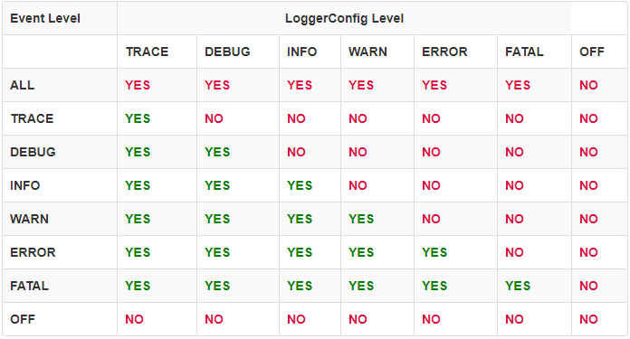

 实践证明，日志打印是在开发中非常重要的功能模块。一旦将日志打印的语句写入代码中，日志的输出就不需要人工干预，还可以将日志持久化存储到本地文件中、数据库中、远程主机上，便于后续研究代码的执行逻辑。适用于 Java 日志打印框架有很多，比如 SLF4J、Logback、Log4j 等，这里介绍一下应用最广的 Log4j。

## 为什么使用 Log4j 2？

Log4j 1.x 从 1999 年发布至今得到了非常广泛的应用，但经过这些年的发展它有些慢了。而且，由于需要与旧版的 JDK 兼容而变得难以维护，所以 Log4j 1.x 在 2015 年 8 月变为了 [End of Life](https://blogs.apache.org/foundation/entry/apache_logging_services_project_announces)。

SLF4J/Logback 也在框架上做出了许多必要的改进，但为什么还去操心 [Log4j 2 ](http://logging.apache.org/log4j/2.x/index.html) 呢？理由如下：

1. Log4j 2 是一个可以被用作日志审计的框架。 Log4j 1.x 和 Logback 在重新配置后会丢失事件，而 Log4j 2 不会。在 Logback 中，Appenders（输出源）中的异常对应用来说是不可见的，Log4j 2 中的 Appenders 可以配置为允许异常对应用可见；
2. Log4j 2 包含基于 [LMAX Disruptor library](https://lmax-exchange.github.io/disruptor/) 的下一代异步 Loggers。在多线程场景下，异步 Loggers 拥有 10 倍于 Log4j 1.x 和 Logback 的生产力和低延迟量级；
3. Log4j 2 对于独立应用来说是 [garbage free](http://logging.apache.org/log4j/2.x/manual/garbagefree.html) 的，对于稳定输出日志 web 应用来说产生的垃圾也是很少的。这就减轻了垃圾回收器的压力从而在响应时间上有更好的性能；
4. Log4j 2 的[插件系统](http://logging.apache.org/log4j/2.x/manual/plugins.html)使得通过添加新的 [Appenders](http://logging.apache.org/log4j/2.x/manual/appenders.html)、 [Filters](http://logging.apache.org/log4j/2.x/manual/filters.html)、 [Layouts](http://logging.apache.org/log4j/2.x/manual/layouts.html)、 [Lookups](http://logging.apache.org/log4j/2.x/manual/lookups.html) 和 Pattern Converters 来扩展该框架变得非常容易，Log4j 本身不需要任何改变；
5. 由于插件系统的配置更加简单，配置项已不需要指定类名；
6. 可以通过代码或配置文件进行配置[自定义的日志级别](http://logging.apache.org/log4j/2.x/manual/customloglevels.html)；
7. 支持 [Lambda 表达式](http://logging.apache.org/log4j/2.x/manual/api.html#LambdaSupport)，基于 Java 8 的代码可以使用 Lambda 表达式简洁的创建日志的 Message；
8. 支持 [Message 对象](http://logging.apache.org/log4j/2.x/manual/messages.html) 。 我们可以自由地创建有趣、复杂的 Message 类型，编写自定义的 [Layouts](http://logging.apache.org/log4j/2.x/manual/layouts.html)、 [Filters](http://logging.apache.org/log4j/2.x/manual/filters.html) 和 [Lookups](http://logging.apache.org/log4j/2.x/manual/lookups.html) 来操作这些 Message 类型；
9. Log4j 1.x 支持在 Appenders 上使用 Filters，Logback 也添加了 TurboFilters 来在事件还未被 Logger 处理之前先过滤事件，Log4j 2 支持在事件被 Logger 处理之前配置 Filters 来处理事件，就像事件通过 Logger 处理或在 Appenders 上处理一样；
10. 多数 Logback Appenders 不支持使用 Layout 而仅支持固定格式的数据。 多数 Log4j 2 Appenders 可以使用 Layout 来输出任意期望格式的数据；
11. Log4j 1.x 中的 Layouts 以及 Logback 返回的是一个字符串，这导致了一些编码问题。而 Log4j 2 的 Layouts 总返回一个字节数组，这意味着该字节数组可以应用在任何 Appender 上，不仅仅是写入 OutputStream 中；
12. [Syslog Appender](http://logging.apache.org/log4j/2.x/manual/appenders.html#SyslogAppender) 支持 TCP 和 UDP 协议，也支持 BSD syslog 和  [RFC 5424](http://tools.ietf.org/html/rfc5424) 格式；
13. Log4j 2 应用了 Java 5 的并发支持和最低限度的加锁。Log4j 1.x 有一些死锁问题，这些问题多数在 Logback 得到了修复，但 Logback 类依然需要相当高级别的同步。

## Log4j 2 架构详解

Log4j 2 的架构图如下：


LogManager 通过 `getLogger(final Class<?> clazz)` 静态方法将定位到合适的 LoggerContext，然后从中得到一个 Logger 对象，要创建 Logger 需要关联一个 LoggerConfig，该 LoggerConfig 对象在 Configuration 中关联着传送 LogEvents 的 Appenders。 

### Logger Hierarchy

 Log4j 1.x 中的 Logger 层级由各 Loggers 之间的关系来维护，而 Log4j 2 中的 Logger 层级由 LoggerConfig 对象负责维护。Logger 和 LoggerConfig 都是命名的实体。Logger 的名称是大小写敏感的，遵循以下层级命名规则：

> 如果 LoggerConfig A 的名称后跟一个点号作为后代  LoggerConfig A.\*.B 的名称前缀（\*表示任意中间前缀），那么 LoggerConfig  A 是 LoggerConfig A.\*.B 的 ancestor（An ancestor is a parent or  the parent of an antecedent）；如果名称 A 和 B 之间没有其他内容，那么 LoggerConfig  A 是 LoggerConfig A.B 的 parent。

类似的， `java` 包是 `java.util` 包的 parent，是 `java.util.Vector` 类的 ancestor。这种命名模式对大多数开发者来说都是熟悉的。下表显示了这种层级关系。

| LoggerConfig | ROOT     | com      | com.foo    | com.foo.Bar |
| ------------ | -------- | -------- | ---------- | ----------- |
| Root         | X        | Child    | descendant | descendant  |
| com          | Parent   | X        | Child      | descendant  |
| com.foo      | Ancestor | Parent   | X          | Child       |
| com.foo.Bar  | Ancestor | Ancestor | Parent     | X           |

root LoggerConfig 位于 LoggerConfig 层级的最顶级，它存在于在每个层级中。直接链接到 root LoggerConfig 的 Logger 可以这样获得：

```java
Logger logger = LogManager.getLogger(LogManager.ROOT_LOGGER_NAME);
```

也可以更简单些：

```
Logger logger = LogManager.getRootLogger();
```

其他 Logger 可以通过调用 `LogManager.getLogger(final String name)` 静态方法并传入期望的 Logger 名来获取。更多获取 Logger 的内容请参考 [Log4j 2 API](https://logging.apache.org/log4j/2.x/log4j-api/api.html) 。

### LoggerContext

[LoggerContext](http://logging.apache.org/log4j/2.x/log4j-core/apidocs/org/apache/logging/log4j/core/LoggerContext.html) 充当着日志系统的锚点。不同情况下一个应用可以有多个有效的 LoggerContext。

### Configuration

每个 LoggerContext  都有一个有效的 [Configuration](http://logging.apache.org/log4j/2.x/log4j-core/apidocs/org/apache/logging/log4j/core/config/Configuration.html)，该 Configuration 包含了所有的 Appenders、上下文范围的 Filters，以及 LoggerConfig， 并包含了 StrSubstitutor 的引用。在重新配置时会存在两个 Configuration。一旦所有的 Logger 重定向到新的 Configuration，旧的 Configuration 就会被停止和禁用。

### Logger

Logger  本身执行无指向的动作，它仅含有一个与 LoggerConfig 关联的名称，继承了 AbstractLogger 并实现了其必需的方法，当配置被修改了，Loggers 可能转而关联不同的 LoggerConfig 从而会改变其自身的行为。如果调用 `LogManager.getLogger` 方法时使用相同的名称参数，则总会返回同一个 Logger 对象。例如：

```
Logger x = LogManager.getLogger("wombat");
Logger y = LogManager.getLogger("wombat");
```

`x` 和`y` 参照的实际上是同一个 Logger 对象。通过将 Logger 命名为其所在类的全限定名可以使输出的日志更具可辨识性，这是目前最好的做法。这不是强制的，开发者可以为 Logger 起任意的期望名称。既然一般习惯使用所在类的全限定名命名 Logger，所以 `LogManager.getLogger()` 方法默认创建使用所在类全限定名命名的 Logger。

### LoggerConfig

当 Logger 在配置文件中声明时，就创建了 [LoggerConfig](http://logging.apache.org/log4j/2.x/log4j-core/apidocs/org/apache/logging/log4j/core/config/LoggerConfig.html) 对象。LoggerConfig 包含一些 Filter，这些 Filter 用于过滤传递给任意 Appender 的 LogEvent。它还包含了一些 Appender 的引用，这些 Appender 用来处理事件。

### Log Levels

LoggerConfig 会被分配一个日志[级别](https://logging.apache.org/log4j/2.x/log4j-api/apidocs/org/apache/logging/log4j/Level.html)。内建的日志级别有 TRACE、 DEBUG、INFO、WARN、ERROR 和 FATAL。Log4j 2 也支持[自定义日志级别](https://logging.apache.org/log4j/2.x/manual/customloglevels.html)，另一种更细粒度化的机制是使用 [Markers](https://logging.apache.org/log4j/2.x/log4j-api/api.html#Markers) 来替代。

Log4j 1.x 和 Logback 都有一个日志级别继承的概念。Log4j 2 中，Logger 和 LoggerConfig 是两个不同的对象，所以这个概念也有所不同。每个 Logger 引用着一个合适的 LoggerConfig，该 LoggerConfig 又可以反过来继承该 Logger 的 parent LoggerConfig 的日志级别。

下面列出几张表演示了日志级别的继承逻辑。注意，如果 root LoggerConfig 没有配置，则它会被分配一个默认的日志级别（默认为 ERROR）。

在下面的示例中，只有 `root` Logger 通过与其名称匹配的 LoggerConfig 配置一个日志级别，所有其他 Logger 将引用 root LoggerConfig，并使用其日志级别。

| Logger Name | Assigned LoggerConfig | LoggerConfig Level | Logger Level |
| ----------- | --------------------- | ------------------ | ------------ |
| root        | root                  | DEBUG              | DEBUG        |
| X           | root                  | DEBUG              | DEBUG        |
| X.Y         | root                  | DEBUG              | DEBUG        |
| X.Y.Z       | root                  | DEBUG              | DEBUG        |

在下面的示例中，所有 Logger 都配置了与各自名称匹配的 LoggerConfig 并从中获取日志级别。

| Logger Name | Assigned LoggerConfig | LoggerConfig Level | Level |
| ----------- | --------------------- | ------------------ | ----- |
| root        | root                  | DEBUG              | DEBUG |
| X           | X                     | ERROR              | ERROR |
| X.Y         | X.Y                   | INFO               | INFO  |
| X.Y.Z       | X.Y.Z                 | WARN               | WARN  |

在下面的示例中，名为 `root`、`X` 和 `X.Y.Z` 的 Logger 都配置了各自的 LoggerConfig，但名为 `X.Y` 的 Logger 并没有配置名称匹配的 LoggerConfig，它将使用名为 `X` 的 LoggerConfig 。因为 `X` LoggerConfig 的名称是 `X.Y` Logger 的名称开头的最长匹配，如果还有名为 `W.X.Y` 的 LoggerConfig，`X.Y` Logger 将会使用 `W.X.Y` LoggerConfig。

| Logger Name | Assigned LoggerConfig | LoggerConfig Level | Level |
| ----------- | --------------------- | ------------------ | ----- |
| root        | root                  | DEBUG              | DEBUG |
| X           | X                     | ERROR              | ERROR |
| X.Y         | X                     | ERROR              | ERROR |
| X.Y.Z       | X.Y.Z                 | WARN               | WARN  |

在下面的示例中，`root` 和 `X` Logger 都配置了与各自名称匹配的 LoggerConfig，`X.Y` 和 `X.Y.Z` Logger 没有匹配 LoggerConfig，所以从分配给它们的 `X` LoggerConfig  中获取其日志级别。

| Logger Name | Assigned LoggerConfig | LoggerConfig Level | level |
| ----------- | --------------------- | ------------------ | ----- |
| root        | root                  | DEBUG              | DEBUG |
| X           | X                     | ERROR              | ERROR |
| X.Y         | X                     | ERROR              | ERROR |
| X.Y.Z       | X                     | ERROR              | ERROR |

在下面的示例中，`root`，`X` 和 `X.Y` Logger 都配置了与其各自名称匹配的 LoggerConfig，但 `X.YZ` Logger 没有配置 LoggerConfig，所以从分配给它的 `X` LoggerConfig 中获取其日志级别。由此可见，**如果一个 Logger 没有配置 LoggerConfig，那么它将会继承使用上一级 LoggerConfig**。  

| Logger Name | Assigned LoggerConfig | LoggerConfig Level | level |
| ----------- | --------------------- | ------------------ | ----- |
| root        | root                  | DEBUG              | DEBUG |
| X           | X                     | ERROR              | ERROR |
| X.Y         | X.Y                   | INFO               | INFO  |
| X.YZ        | X                     | ERROR              | ERROR |

在下面的示例中，`X.Y` Logger 配置了与其名称匹配的 `X.Y` LoggerConfig，但 `X.Y`  LoggerConfig 没有配置日志级别，所以，`X.Y` LoggerConfig 从 `X` LoggerConfig 获取其日志级别。`X.Y.Z` Logger 没有配置与其名称匹配的 LoggerConfig，所以，`X.Y.Z` Logger 将使用 `X.Y` LoggerConfig，从而其级别也从 `X` LoggerConfig 获得。**如果一个 Logger 的 LoggerConfig 没有配置日志级别，那么该 LoggerConfig 将会继承使用上一级 LoggerConfig 的日志级别** 。  

| Logger Name | Assigned LoggerConfig | LoggerConfig Level | Level |
| ----------- | --------------------- | ------------------ | ----- |
| root        | root                  | DEBUG              | DEBUG |
| X           | X                     | ERROR              | ERROR |
| X.Y         | X.Y                   |                    | ERROR |
| X.Y.Z       | X.Y                   |                    | ERROR |

### Filter

下面的表格解释了日志级别的自动过滤规则。



除了日志级别的自动过滤， Log4j 还提供了 [Filter](http://logging.apache.org/log4j/2.x/log4j-core/apidocs/org/apache/logging/log4j/core/Filter.html) （过滤器），在控制到达 LoggerConfig 之前、在控制到达 LoggerConfig 之后但在调用任何 Appender 之前、在控制到 LoggerConfig 之后但在调用某个特定 Appender 之前，以及在每个 Appender 上都可以使用 Filter 进行日志级别的过滤。

类似于防火墙的过滤器一样，每个 Filter 都可以返回 `Accept`、`Deny` 和 `Neutral`（中立）三个值之一：

- `Accept` 表示不会调用其他 Filter，事件将进行处理；
- `Deny` 表示事件被立即忽略并将控制返回给调用者；
- `Neutral` 表示事件将传递给其他 Filter，如果没有其他 Filter，则事件将会被处理。

即使一个事件被某个 Filter 接受了也不一定会输出。当事件被某个前置 LoggerConfig Filter 接受了但被后面的 LoggerConfig 拒绝了或被所有 Appender 拒绝了就会出现这样的情况。

### Appender

[Appender](http://logging.apache.org/log4j/2.x/log4j-core/apidocs/org/apache/logging/log4j/core/Appender.html) （输出源）负责将日志事件数据写到目标位置。如果一个 Logger 匹配的同名 LoggerConfig 不存在，就会创建一个，Appender 将被添加到该 LoggerConfig，其他所有 Logger 将会收到通知并更新其 LoggerConfig 引用。

某个 Logger 所允许的每条日志打印请求都会传递给其 LoggerConfig 中的所有 Appender，也会传递给该 LoggerConfig 的 parent LoggerConfig 中的 Appender。也就是说，**Appender 会从 LoggerConfig 的继承中继承相加性**。例如，如果一个控制台 Appender 添加到 root Logger中，那么所有允许的日志打印请求将至少输出到控制台，如果一个文件 Appender 添加到一个 LoggerConfig C 中，C 和 C 的 children 允许的日志打印请求将会输出到文件和控制台。可以在声明 Logger 的配置文件中设置 `additivity="false"` 来禁用这种叠加继承。

> Appender Additivity
>
> Logger L 的一条日志打印语句将输出到 L 关联的 LoggerConfig C 中的所有 Appender 以及该 LoggerConfig 的所有 ancestor。然而，如果 LoggerConfig C 一个 ancestor P 的叠加标志设置为了 `false`，那么，L 的输出将直接指向 C 中的所有 Appender 以及 C 的 ancestor 直到 P（包括 P），不会指向到 P 的所有 ancestor 中的 Appender。Logger 的叠加标识默认为 `true`，表示叠加父级的 Appender。

下面的表格展示了一个示例：

| Logger Name     | Added Appenders | Additivity Flag | Output Targets         | Comment                                  |
| --------------- | --------------- | --------------- | ---------------------- | ---------------------------------------- |
| root            | A1              | not applicable  | A1                     | root Logger 没有 parent，所有叠加在这里不适用。        |
| x               | A-x1, A-x2      | true            | A1, A-x1, A-x2         | x 和 root 的所有 Appender。                   |
| x.y             | none            | true            | A1, A-x1, A-x2         | x 和 root 的所有 Appender。但一般不会配置一个没有 Appender 的 Logger。 |
| x.y.z           | A-xyz1          | true            | A1, A-x1, A-x2, A-xyz1 | x.y.z、x 和 root 中的所有 Appender。            |
| security        | A-sec           | false           | A-sec                  | 叠加标志设置为 `false`，所以没有父级的 Appender 叠加。     |
| security.access | none            | true            | A-sec                  | 仅 security 的 A-sec 有叠加，没有叠加 root 的 A 。   |

**日志级别的继承是指父级 LoggerConfig 的日志级别会被子级 LoggerConfig 所继承，而相加性是指子级 Logger 的日志时间会传递给父级 Logger，两者刚好相反**。

### Layout

Appender 的 [Layout](http://logging.apache.org/log4j/2.x/log4j-core/apidocs/org/apache/logging/log4j/core/Layout.html) （列印格式）用来自定义日志事件的输出格式。[PatternLayout](http://logging.apache.org/log4j/2.x/log4j-core/apidocs/org/apache/logging/log4j/core/layout/PatternLayout.html) 可以使用与 C 语言 printf 函数类似的转换模式来指定输出格式。Log4j 提供了多种不同的 [Layout](http://logging.apache.org/log4j/2.x/manual/layouts.html) 来适用于多种形式的输出，如 JSON、XML、HTML 和 Syslog (包括最新的 RFC 5424 版本)。

### StrSubstitutor 和 StrLookup

[StrSubstitutor ](http://logging.apache.org/log4j/2.x/log4j-core/apidocs/org/apache/logging/log4j/core/lookup/StrSubstitutor.html) 类和 [StrLookup](http://logging.apache.org/log4j/2.x/log4j-core/apidocs/org/apache/logging/log4j/core/lookup/StrLookup.html) 接口是从 [Apache Commons Lang](https://commons.apache.org/proper/commons-lang/) 借鉴修改而来用以处理 LogEvents 的。另外，[Interpolator](http://logging.apache.org/log4j/2.x/log4j-core/apidocs/org/apache/logging/log4j/core/lookup/Interpolator.html) 类是从 Apache Commons Configuration 借鉴修改而来从而使 StrSubstitutor 可以处理多个 StrLookups 中的变量，该类也经过修改可以支持处理 LogEvents。这些类一起让配置可以引用 System Properties、配置文件、ThreadContext Map 以及 LogEvent 的 StructuredData 中的变量。

## Log4j 2 配置详解

###  Log4j 2 的配置种类

Log4j 2 的配置可以通过以下四种方式之一来实现：

- 通过 XML、JSON、YAML 或者 properties 格式的配置文件；
- 通过创建一个 ConfigurationFactory 和 Configuration 接口的实现；
- 调用 Configuration 接口暴露的方法来在默认配置的基础上添加其他组件；
- 通过在内部 Logger 类上调用方法。

### 配置文件的加载顺序

Log4j 包含 4 种 ConfigurationFactory 的实现，分别适用于 JSON、YAML、properties 和 XML 配置文件。在 Log4j 启动时可以按照以下顺序自动加载配置文件：

1. 查找 `log4j.configurationFile` 系统属性所指定的配置文件名，如果该系统属性值存在，就尝试使用相应文件扩展名的 ConfigurationFactory 来加载指定的配置文件。通过在代码中调用  `System.setProperties("log4j.configurationFile","FILE_PATH")` 或者将 `-Dlog4jconfigurationFile=file://C:/configuration.xml` 参数传递给 JVM；
2. 如果没有找到，则 properties ConfigurationFactory 就在 classpath 中寻找 log4j2-**test**.properties 配置文件；
3. 如果没有找到，则 YAML ConfigurationFactory  就在 classpath 中寻找 log4j2-**test**.yaml 或 log4j2-**test**.yml 配置文件；
4. 如果没有找到，则 JSON ConfigurationFactory  就在 classpath 中寻找 log4j2-**test**.json 或 log4j2-**test**.jsn 配置文件；
5. 如果没有找到，则 XML ConfigurationFactory 就在 classpath 中寻找log4j2-**test**.xml 配置文件；
6. 如果没有找到**测试配置文件**，则 properties ConfigurationFactory 就在 classpath 中寻找 log4j2.properties 配置文件；
7. 如果没有找到，则 YAML ConfigurationFactory  就在 classpath 中寻找 log4j2.yaml 或 log4j2.yml 配置文件；
8. 如果没有找到，则 JSON ConfigurationFactory  就在 classpath 中寻找 log4j2.json 或 log4j2.jsn 配置文件；
9. 如果没有找到，则 XML ConfigurationFactory 就在 classpath 中寻找log4j2.xml 配置文件；
10. 如果上面的配置文件都没有找到，就使用默认的 DefaultConfiguration 配置。

### XML 配置简单示例

创建一个名为 `log4j2test` 的应用，该应用有如下两个类：

```java
package com.foo;

import org.apache.logging.log4j.Logger;
import org.apache.logging.log4j.LogManager;

public class Bar {
	private static final Logger logger = LogManager.getLogger(Bar.class);

	public boolean doIt() {
		// 打印日志
		logger.trace("entry");
		logger.error("Did it again!");
		logger.trace("exit");
		// 日志结束
		return false;
	}
}
```

```java
package com.foo;

import org.apache.logging.log4j.Logger;
import org.apache.logging.log4j.LogManager;

public class MyApp {
	private static final Logger logger = LogManager.getLogger(MyApp.class);

	public static void main(final String... args) {
		logger.trace("Entering application.");
		Bar bar = new Bar();
        if (!bar.doIt()) {
			logger.error("Didn't do it.");
		}
		logger.trace("Exiting application.");
	}
}
```

运行 MyApp 类，由于我们还没有添加配置文件，所以默认的输出结果如下：

```
ERROR StatusLogger No Log4j 2 configuration file found. Using default configuration (logging only errors to the console), or user programmatically provided configurations. Set system property 'log4j2.debug' to show Log4j 2 internal initialization logging. See https://logging.apache.org/log4j/2.x/manual/configuration.html for instructions on how to configure Log4j 2
13:11:00.569 [main] ERROR com.foo.Bar - Did it again!
13:11:00.571 [main] ERROR com.foo.MyApp - Didn't do it.
```

如果 Log4j 找不到配置文件，那么将会使用 DefaultConfiguration  类提供的默认的配置：

- 为 root Logger 添加一个 [ConsoleAppender](https://logging.apache.org/log4j/2.x/log4j-core/apidocs/org/apache/logging/log4j/core/appender/ConsoleAppender.html)；
- 为该 [ConsoleAppender](https://logging.apache.org/log4j/2.x/log4j-core/apidocs/org/apache/logging/log4j/core/appender/ConsoleAppender.html) 设置一个 pattern 为 “%d{HH:mm:ss.SSS} [%t] %-5level %logger{36} - %msg%n” 的 [PatternLayout](https://logging.apache.org/log4j/2.x/log4j-core/apidocs/org/apache/logging/log4j/core/layout/PatternLayout.html)。

默认配置的等价内容如下：

```xml
<?xml version="1.0" encoding="UTF-8"?>
<Configuration status="WARN">
  <Appenders>
    <!-- 默认打印到控制台 -->
    <Console name="Console" target="SYSTEM_OUT">
       <!-- 默认打印格式 -->
      <PatternLayout pattern="%d{HH:mm:ss.SSS} [%t] %-5level %logger{36} - %msg%n"/>
    </Console>
  </Appenders>
  <Loggers>
     <!-- 默认打印日志级别为 error -->
    <Root level="error">
      <AppenderRef ref="Console"/>
    </Root>
  </Loggers>
</Configuration>
```

如果我们新建一个名为 log4j2.xml 的文件，将其放入上面应用的 classpath 中，并将日志级别 `error` 修改为 `trace` 后重新运行 Bar 类，结果输出如下：

```
13:11:30.279 [main] TRACE com.foo.MyApp - Entering application.
13:11:30.281 [main] TRACE com.foo.Bar - entry
13:11:30.282 [main] ERROR com.foo.Bar - Did it again!
13:11:30.282 [main] TRACE com.foo.Bar - exit
13:11:30.282 [main] ERROR com.foo.MyApp - Didn't do it.
13:11:30.282 [main] TRACE com.foo.MyApp - Exiting application.
```

### 叠加性

假如你想忽略除了 `com.foo.Bar` 以外的所有 `TRACE` 日志，仅更改日志级别无法达到目的，解决办法是在配置文件中新建一个 logger 定义：

```xml
<?xml version="1.0" encoding="UTF-8"?>
<Configuration status="WARN">
	<Appenders>
		<Console name="Console" target="SYSTEM_OUT">
			<PatternLayout pattern="%d{HH:mm:ss.SSS} [%t] %-5level %logger{36} - %msg%n" />
		</Console>
	</Appenders>
	<Loggers>
		<!-- 新建一个指定名称和指定级别的 logger -->
		<Logger name="com.foo.Bar" level="TRACE" />
		<Root level="ERROR">
			<AppenderRef ref="Console" />
		</Root>
	</Loggers>
</Configuration>
```

重新运行结果如下：

```
13:12:24.917 [main] TRACE com.foo.Bar - entry
13:12:24.918 [main] ERROR com.foo.Bar - Did it again!
13:12:24.918 [main] TRACE com.foo.Bar - exit
13:12:24.918 [main] ERROR com.foo.MyApp - Didn't do it.
```

上面的配置记录了 `com.foo.Bar` 中的所有级别的日志事件，但其他所有组件的日志事件中只有 ERROR 级别的才会被记录。

如果我们为 `com.foo.Bar` 的 logger 配置了 Appender，如下所示：

```xml
<?xml version="1.0" encoding="UTF-8"?>
<Configuration status="WARN">
	<Appenders>
		<Console name="Console" target="SYSTEM_OUT">
			<PatternLayout pattern="%d{HH:mm:ss.SSS} [%t] %-5level %logger{36} - %msg%n" />
		</Console>
	</Appenders>
	<Loggers>
        <!-- 为新建 logger 指定 Appender -->
		<Logger name="com.foo.Bar" level="TRACE">
			<AppenderRef ref="Console" />
		</Logger>
		<Root level="ERROR">
			<AppenderRef ref="Console" />
		</Root>
	</Loggers>
</Configuration>
```

重新运行结果如下：

```
13:25:55.391 [main] TRACE com.foo.Bar - entry
13:25:55.391 [main] TRACE com.foo.Bar - entry
13:25:55.392 [main] ERROR com.foo.Bar - Did it again!
13:25:55.392 [main] ERROR com.foo.Bar - Did it again!
13:25:55.393 [main] TRACE com.foo.Bar - exit
13:25:55.393 [main] TRACE com.foo.Bar - exit
13:25:55.393 [main] ERROR com.foo.MyApp - Didn't do it.
```

`com.foo.Bar` 类中的 `TRACE` 级别及以上的日志竟然输出了两遍！这是由于名为 `com.foo.Bar` 的 logger 会将其打印事件传递给其 parent logger（这里为 Root ），在 Root logger 中再次执行了打印操作。而案例 2 中的没有重复打印是由于名为 `com.foo.Bar` 的 logger 没有设置 Appender，它仅负责记录的打印事件，然后将其传递给了 Root logger，所以仅 Root logger 有打印操作。这种现象称为**相加性（Additivity）**。这种特性可以用来汇整某几个 logger 的输出，可以通过设置某个 logger 的 additivity 属性为 false 来禁用该特性：

```xml
<?xml version="1.0" encoding="UTF-8"?>
<Configuration status="WARN">
	<Appenders>
		<Console name="Console" target="SYSTEM_OUT">
			<PatternLayout pattern="%d{HH:mm:ss.SSS} [%t] %-5level %logger{36} - %msg%n" />
		</Console>
	</Appenders>
	<Loggers>
		<!-- 设置新建 logger 的相加性为 false -->
		<Logger name="com.foo.Bar" level="TRACE" additivity="false">
			<AppenderRef ref="Console" />
		</Logger>
		<Root level="ERROR">
			<AppenderRef ref="Console" />
		</Root>
	</Loggers>
</Configuration>
```

重新运行就可以发现日志不会重复打印了：

```
13:46:27.869 [main] TRACE com.foo.Bar - entry
13:46:27.871 [main] ERROR com.foo.Bar - Did it again!
13:46:27.871 [main] TRACE com.foo.Bar - exit
13:46:27.871 [main] ERROR com.foo.MyApp - Didn't do it.
```

### 自动重新配置

可以通过设置 Configuration 元素的 monitorInterval 属性值（秒数）为一个非零值来让 Log4j 每隔指定的秒数来重新读取配置文件，可以用来动态应用 Log4j 配置。 如：

```xml
<?xml version="1.0" encoding="UTF-8"?>
<Configuration monitorInterval="30">
...
</Configuration>
```

> 注意，如果应用运行在生产模式的 Weblogic 上时，修改项目中的文件不会自动生效，必须关闭应用重新更新应用才可以，考虑到不能随便停止应用的需求，可以通过编程方法来进行配置 log4j ，从数据库中动态读取配置信息。

Log4j 可以将基于文件和 Socket 的 Appender 配置信息广而告之（advertise）。例如，Log4j 可以将文件 Appender 中的日志文件位置和 pattern layout 等属性包含到广告（advertisement ）中。[Chainsaw](http://logging.apache.org/chainsaw/) 以及其它外部系统可以发现这些广告，并使用其中的信息来智能地处理日志文件。

这种暴露广告以及其格式的机制依赖于 Advertiser 的实现。使用某个 Advertiser 实现的外部系统必须知道如何定位广告的配置信息。比如，某个使用数据库的 Advertiser 的实现可以将配置信息存储到数据库表中，外部系统可以读取这些数据表从而来发现文件位置和文件格式。

Log4j 提供了一种 multicastdns Advertiser 实现，通过使用 [http://jmdns.sourceforge.net](http://jmdns.sourceforge.net/) 库的 IP 多播来广告 Appenders 的配置信息。Chainsaw 可以自动发现和展示 Log4j 的这种广告。目前，Chainsaw 仅支持 FileAppender 广告。

广告一个 Appender 配置的步骤如下：

- 将 [JmDns](http://jmdns.sourceforge.net/) 库添加到类路径下；
- 设置 Configuration 元素的 advertiser 属性值为multicastdns；
- 设置相应 appender 的 advertise 属性值为 true。

如果 advertise 基于 FileAppender 的配置，则设置 advertiseURI 属性值设置为一个合适的 URI，供 Chainsaw 来访问文件。例如，通过设置一个  [Commons VFS](http://commons.apache.org/proper/commons-vfs/) sftp:// 的 URI ，文件可通过 ssh/sftp 来让 Chainsaw 访问，如果通过 Web 服务器来访问文件也可以设置一个 http:// 的 URI ，如果通过本地运行的 Chainsaw 来访问文件也可以指定一个 file:// 的URI。

下面是一个应用 advertised  Appender 的配置：

```xml
<?xml version="1.0" encoding="UTF-8"?>
<Configuration advertiser="multicastdns">
...
</Configuration>
<Appenders>
  <File name="File1" fileName="output.log" bufferedIO="false" advertiseURI="file://path/to/output.log" advertise="true">
  ...
  </File>
</Appenders>
```

### Configuration 元素详解

自 2.9 版本开始，处于安全原因，Log4j 在 XML 文件中不再处理 DTD，如果你想将配置分割到多个文件中，可以使用  [XInclude](https://logging.apache.org/log4j/2.x/manual/configuration.html#XInclude) 或 [Composite Configuration](https://logging.apache.org/log4j/2.x/manual/configuration.html#CompositeConfiguration) 。

我们一般使用 XML 格式的配置文件。如果本地要测试，可以把 log4j2-test.xml 放到 classpath，而正式环境使用log4j2.xml ，则在打包部署的时候不要打包 log4j2-test.xml 即可。

Log4j 可以使用两种 XML 格式：简明和严格。简明格式可以简化配置，元素名匹配其代表的组件，但不能通过 XML Schema 来验证。比如，可以在父级 Appenders 元素中使用名为 Console 的元素来配置一个 ConsoleAppender，简明格式的元素名和属性名都不是大小写敏感的。另外，属性既可以指定为属性，也可以指定为包含文本值且没有属性的 XML 元素。例如：

```xml
<PatternLayout pattern="%m%n"/>
```

和

```xml
<PatternLayout>
	<Pattern>%m%n</Pattern>
</PatternLayout>
```

是等价的。

根据上面的介绍就可以理解下面所示的 XML 配置结构。其中，小写字母开头的元素为简明格式。

```xml
<?xml version="1.0" encoding="UTF-8"?>;
<Configuration>
  <Properties>
    <Property name="name1">value</property>
    <Property name="name2" value="value2"/>
  </Properties>
  <filter  ... />
  <Appenders>
    <appender ... >
      <filter  ... />
    </appender>
    ...
  </Appenders>
  <Loggers>
    <Logger name="name1">
      <filter  ... />
    </Logger>
    ...
    <Root level="level">
      <AppenderRef ref="name"/>
    </Root>
  </Loggers>
</Configuration>
```

下面是一个严格格式的 log4j2.xml 配置：

```xml
<?xml version="1.0" encoding="UTF-8"?>
<Configuration status="debug" strict="true" name="XMLConfigTest"
               packages="org.apache.logging.log4j.test">
  <Properties>
    <Property name="filename">target/test.log</Property>
  </Properties>
  <Filter type="ThresholdFilter" level="trace"/>
 
  <Appenders>
    <Appender type="Console" name="STDOUT">
      <Layout type="PatternLayout" pattern="%m MDC%X%n"/>
      <Filters>
        <Filter type="MarkerFilter" marker="FLOW" onMatch="DENY" onMismatch="NEUTRAL"/>
        <Filter type="MarkerFilter" marker="EXCEPTION" onMatch="DENY" onMismatch="ACCEPT"/>
      </Filters>
    </Appender>
    <Appender type="Console" name="FLOW">
      <Layout type="PatternLayout" pattern="%C{1}.%M %m %ex%n"/><!-- class and line number -->
      <Filters>
        <Filter type="MarkerFilter" marker="FLOW" onMatch="ACCEPT" onMismatch="NEUTRAL"/>
        <Filter type="MarkerFilter" marker="EXCEPTION" onMatch="ACCEPT" onMismatch="DENY"/>
      </Filters>
    </Appender>
    <Appender type="File" name="File" fileName="${filename}">
      <Layout type="PatternLayout">
        <Pattern>%d %p %C{1.} [%t] %m%n</Pattern>
      </Layout>
    </Appender>
  </Appenders>
 
  <Loggers>
    <Logger name="org.apache.logging.log4j.test1" level="debug" additivity="false">
      <Filter type="ThreadContextMapFilter">
        <KeyValuePair key="test" value="123"/>
      </Filter>
      <AppenderRef ref="STDOUT"/>
    </Logger>
 
    <Logger name="org.apache.logging.log4j.test2" level="debug" additivity="false">
      <AppenderRef ref="File"/>
    </Logger>
 
    <Root level="trace">
      <AppenderRef ref="STDOUT"/>
    </Root>
  </Loggers>
 
</Configuration>
```

Configuration 元素可以使用以下属性：

- advertiser ：可选的 Advertiser 插件名，用来广告个别 FileAppender 或 SocketAppender 的配置。目前唯一可用 Advertiser 名为 “multicastdns ”；
- dest ：`err` （将输出到 stderr 上）或一个文件路径或一个`URL`；
- monitorInterval ：检查配置文件是否有更新的间隔秒数；
- name ：配置的名称；
- packages ：逗号分隔的用于搜索插件的包名列表。插件只会被每个类加载器加载一次，所以仅重新配置该项不会生效；
- schema ：为类加载器定位 XML Schema 位置以验证配置。仅当 strict 属性设置为 true 时该属性才有效，如果不设置该属性，则不会验证 Schema；  
- shutdownHook ：设置当 JVM 关闭时 log4j 是否也自动关闭。默认是启用的，也可以设置该属性为 disable 来禁用该关闭钩子；
- shutdownTimeout ：设置当 JVM 关闭后 Appender 和后台任务超时多少毫秒才关闭。默认为 0 ，表示每个 Appender 使用其默认的超时，不等待后台任务。这仅是个提示，而不能保证关闭进程不会花费更长的时间。将该值设置过小可能增加日志事件在还未输出到最终位置之前就丢失的风险。如果 shutdownHook 属性未设置，那么将不会使用该属性；
- status ：应该打印到控制台的**内部 Log4j 日志事件**的级别，可设置的值有 `trace`、`debug`、`info`、`warn`、`error` 和 `fatal`，Log4j 将会打印出内部初始化等事件的详细信息（在发现配置文件之后）。设置该属性为 `trace` 是查找 Log4j 故障的第一手工具。也可以通过设置  `log4j2.debug` 系统属性来输出 Log4j 内部日志，包括配置文件加载前的内部日志（从 log4j 2.9 开始）；
- strict ：使用严格的 XML 格式， JSON 格式的配置文件不支持该属性；
- verbose ：加载插件时是否显示诊断信息。

### 配置  Logger

LoggerConfig  通过 logger 元素进行配置。logger 元素可用属性如下：

- name ：必选，用于标识该 logger ；
- level ：可选，用来设置日志级别。其值可以为 TRACE、DEBUG、INFO、WARN、ERROR、ALL 或者 OFF。如果没有指定该属性，则默认为 ERROR；
- additivity ：可选的布尔值，用来设置相加性。如果没有指定该属性，则默认为 true。

LoggerConfig（包括 root LoggerConfig）可以通过属性来配置，这些属性将会添加到 ThreadContextMap 中的属性复本中。Appender、Filter、 Layout 等可以引用这些属性，就好像这些属性是 ThreadContextMap 中的属性一样。这些属性中的变量可以在解析（parse）配置或动态输出打印日志时计算（resolve）出来。

LoggerConfig 也可以通过一个或多个 AppenderRef 元素来配置，每个 Appender 的引用将会关联到特定的 LoggerConfig。如果一个 LoggerConfig 配置了多个 Appender，那么其中的每个 Appender 都会等价地处理日志事件。

每个配置都必须要有一个 root Logger，如果没有显式配置 root LoggerConfig，那么默认的 root LoggerConfig 的日志级别为 ERROR、Appender 为 Console 。root Logger 和其他 Logger 的不同主要在于以下两点：

- root Logger 没有 name 属性；
- root Logger 不支持 additivity 属性，因为它没有 parent。

### 配置 Appender

Log4j 使用 [Appender](http://logging.apache.org/log4j/2.x/log4j-core/apidocs/org/apache/logging/log4j/core/Appender.html) 将日志事件数据写到各种目标位置（目前可以为控制台、文件、多种数据库 API、远程套接字服务器、Apache Flume、JMS、远程 UNIX Syslog daemon）。

Appender 可以通过特定的 Appender 插件名或 appender 元素（带有指定 Appender 插件名的 type 属性）来配置。另外，每个 Appender 都必须要有一个 name 属性，用来指定一个去别区其他 Appender 的唯一标识，该标识的值在 Logger 中通过 AppenderRef 来引用，从而将该 Appender 配置到该 Logger 中。

Appender 在将日志数据写入目标位置之前，一般会将日志数据通过 Layout 进行格式化。Layout 也可以通过特定的 Layout 插件名或 layout 元素（带有指定 Layout 插件名的 type 属性）来配置。

每个 Appender 都必须实现 Appender 接口，多数 Appender 都扩展自 [AbstractAppender](https://logging.apache.org/log4j/2.x/log4j-core/apidocs/org/apache/logging/log4j/core/appender/AbstractAppender.html) ，该抽象类添加了 [Lifecycle](https://logging.apache.org/log4j/2.x/log4j-core/apidocs/org/apache/logging/log4j/core/LifeCycle.html) 和 [Filterable](https://logging.apache.org/log4j/2.x/log4j-core/apidocs/org/apache/logging/log4j/core/filter/Filterable.html) 支持。Lifecycle 可以对日志组件在配置加载后进行初始化和在关闭时进行清理等操作。Filterable  可以让日志组件绑定用于处理日志事件的过滤器。

代表不同目标位置的各种 Appender 也具有其功能所需的其他属性和子元素。这里选择常用的 Appender 加以介绍。

#### ConsoleAppender 

ConsoleAppender 会将输出写入 System.out（默认目标位置）或 System.err 中。必须提供一个 Layout 来格式化 LogEvent 。

| 属性名              | 类型      | 描述                                       |
| ---------------- | ------- | ---------------------------------------- |
| filter           | Filter  | 指定一个过滤器来决定是否将日志事件传递给 Appender 处理。可以指定为一个 CompositeFilter 来使用多个过滤器。 |
| layout           | Layout  | 指定格式化 LogEvent 的 Layout。如果没有指定 Layout，则默认使用 `%m%n` 格式。 |
| follow           | boolean | 在配置好之后，是否可以通过 System.setOut 或 System.setErr 来重新指定输出位置为 System.out 或 System.err。不能在 Windows 下用于 Jansi ，也不能和 `direct` 属性一起使用。 |
| direct           | boolean | 绕开 `java.lang.System.out/.err` 直接写入 `java.io.FileDescriptor`。当输出重定向到文件或其他目标时可以节约 10 倍的性能消耗。不能在 Windows 下用于 Jansi，也性不能和 `follow` 属性一起使用。在多线程应用中，输出不会遵循 `java.lang.System.setOut()/.setErr()` ，而是可能会和其他输出纠缠在一起输出到 `java.lang.System.out/.err`。该属性是 2.6.2 版本新增的，目前仅在 Linux 和 Windows 下的 Oracle JVM 环境中测试过。 |
| name             | String  | 必选的 Appender 的名称，表示区别于其他 Appender 的唯一标识。 |
| ignoreExceptions | boolean | 默认为 `true`，表示当输出事件时出现的异常将会被内部记录而忽略。 当设置为 `false` 时，则会将异常传播给调用者。当将该 Appender 包装成 [FailoverAppender](https://logging.apache.org/log4j/2.x/manual/appenders.html#FailoverAppender) 时，必须设置为 `false`。 |
| target           | String  | `SYSTEM_OUT` 或 `SYSTEM_ERR`。默认为 `SYSTEM_OUT`。 |

典型的 ConsoleAppender 配置如下：

```xml
<?xml version="1.0" encoding="UTF-8"?>
<Configuration status="warn" name="MyApp" packages="">
  <Appenders>
    <Console name="STDOUT" target="SYSTEM_OUT">
      <PatternLayout pattern="%m%n"/>
    </Console>
  </Appenders>
  <Loggers>
    <Root level="error">
      <AppenderRef ref="STDOUT"/>
    </Root>
  </Loggers>
</Configuration>
```

#### RollingFileAppender

RollingFileAppender 会将输出到 fileName 参数指定的文件中，且需要指定 [TriggeringPolicy](https://logging.apache.org/log4j/2.x/manual/appenders.html#TriggeringPolicies) 和 [RolloverStrategy](https://logging.apache.org/log4j/2.x/manual/appenders.html#RolloverStrategies)。其中 TriggeringPolicy 决定是否生成新的日志文件，RolloverStrategy 决定如何生成新的日志文件。如果没有配置 RolloverStrategy ， 则会使用 [DefaultRolloverStrategy](https://logging.apache.org/log4j/2.x/manual/appenders.html#DefaultRolloverStrategy) 。从 Log4j 2.5 开始，可以在 DefaultRolloverStrategy 中配置一个[自定义的删除动作](https://logging.apache.org/log4j/2.x/manual/appenders.html#CustomDeleteOnRollover)。从 Log4j 2.8 开始，如果没有指定文件名，则会使用 [DirectWriteRolloverStrategy](https://logging.apache.org/log4j/2.x/manual/appenders.html#DirectWriteRolloverStrategy) 来代替 DefaultRolloverStrategy 。从 Log4j 2.9 开始，可以在 DefaultRolloverStrategy 中配置一个[自定义的 POSIX 文件属性查看动作](https://logging.apache.org/log4j/2.x/manual/appenders.html#CustomPosixViewAttributeOnRollover)，如果没有定义该动作，则将会使用从 RollingFileAppender  继承的 POSIX 。

RollingFileAppender 不支持文件锁。

可用属性如下：

| 属性名              | 类型               | 描述                                       |
| ---------------- | ---------------- | ---------------------------------------- |
| append           | boolean          | 当为 true（默认）时，日志记录将会添加到文件末尾。设置为 false 时，日志记录写入文件之前会清空文件。 |
| bufferedIO       | boolean          | 当为 true（默认）时，日志记录将会写入一个缓冲区，当缓冲区满或设置了 immediateFlush ，日志记录才会写入磁盘中。 该属性不能使用文件锁。缓冲 I/O 能够显著提高性能，即使启用了immediateFlush 。 |
| bufferSize       | int              | 当 bufferedIO 为 true 时，该属性用来设置缓冲区的大小，默认为 8192 字节。 |
| createOnDemand   | boolean          | Appender 是按需（on-demand）创建文件的。仅当日志事件通过所有过滤器并到达 Appender 时，该 Appender 才会创建文件。 |
| filter           | Filter           | 指定一个过滤器来决定是否将日志事件传递给 Appender 处理。可以指定为一个 CompositeFilter 来使用多个过滤器。 |
| fileName         | String           | 设置写入日志记录的文件名。如果该文件或其父目录不存在，则会自动创建。       |
| filePattern      | String           | 归档日志文件的文件名模式（pattern）。该模式依赖于所用的 RolloverPolicy 。DefaultRolloverPolicy 可以接受兼容 [SimpleDateFormat](http://download.oracle.com/javase/7/docs/api/java/text/SimpleDateFormat.html) 的日期/时间或表示一个整数的计数器的 `%i` 。该模式也支持运行时插入值（interpolation），故任何 Lookup（比如 DateLookup）都可以包含该模式。 |
| immediateFlush   | boolean          | 当为 true（默认）时，每次写入都会跟随一次 flush 。这将保证数据写入磁盘，但会影响性能。仅当使用异步 Logger 的 Appender 时设置每次写入都进行 flush 才有用。异步的 Logger 和 Appender 会在一批次的日志事件末尾自动 flush ，即使该属性设置为 false ，这种方式也可以保证数据写入磁盘，但是更有效率。 |
| layout           | Layout           | 指定格式化 LogEvent 的 Layout 。如果没有指定 Layout ，则默认使用 `%m%n` 格式。 |
| name             | String           | 必选的 Appender 的名称，表示区别于其他 Appender 的唯一标识。 |
| policy           | TriggeringPolicy | 设置确定是否创建文件的规则（policy）。                   |
| strategy         | RolloverStrategy | 设置确定归档文件的文件名和位置的策略（strategy）。            |
| ignoreExceptions | boolean          | 默认为 `true` ，表示当输出事件时出现的异常将会被内部记录而忽略。 当设置为 `false` 时，则会将异常传播给调用者。当将该 Appender 包装成 [FailoverAppender](https://logging.apache.org/log4j/2.x/manual/appenders.html#FailoverAppender) 时，必须设置为 `false` 。 |
| filePermissions  | String           | 设置每当创建文件时所用的 POSIX 格式的文件属性权限。底层文件系统应该支持 [POSIX](https://docs.oracle.com/javase/7/docs/api/java/nio/file/attribute/PosixFileAttributeView.html) 格式的文件属性视图。比如： rw------- 或 rw-rw-rw- 等。 |
| fileOwner        | String           | 指定每次创建文件的属主。由于权限原因，可能不允许更改文件属主，这时会抛出 IOException 。仅当有效的目标用户 ID 和文件的用户 ID 相同，或目标用户 ID 具有修改文件属主的权限（如果  [_POSIX_CHOWN_RESTRICTED](http://www.gnu.org/software/libc/manual/html_node/Options-for-Files.html) 在日志文件路径下有效）时才会处理。底层文件系统应该支持 owner 文件属性视图。 |
| fileGroup        | String           | 指定每次创建文件的属组。底层文件系统应该支持 [POSIX](https://docs.oracle.com/javase/7/docs/api/java/nio/file/attribute/PosixFileAttributeView.html) 格式的文件属性视图。 |

##### 触发规则

###### 组合触发规则

`CompositeTriggeringPolicy` 组合了多个触发规则（policy），如果配置的任意规则返回 true 时，则 `CompositeTriggeringPolicy` 也返回 true 。 `CompositeTriggeringPolicy` 通过将其规则包装进 `Policies` 元素即可配置。

下面的 XML 片段定义了这样一个日志滚动规则：当 JVM 启动时、日志文件大小达到 20 MB 且当前日期不再匹配日志开始日期时就滚动日志。

```xml
<Policies>
  <OnStartupTriggeringPolicy />
  <SizeBasedTriggeringPolicy size="20 MB" />
  <TimeBasedTriggeringPolicy />
</Policies>
```

###### Cron 触发规则

`CronTriggeringPolicy` 基于 cron 表达式来滚动日志。

`CronTriggeringPolicy` 属性如下表所示。

| 属性名               | 类型      | 描述                                       |
| ----------------- | ------- | ---------------------------------------- |
| schedule          | String  | 和 Quartz 调度器一样的 cron 表达式。参考 [CronExpression](https://logging.apache.org/log4j/2.x/log4j-core/apidocs/org/apache/logging/log4j/core/util/CronExpression.html) 来查看关于该表达式的详细描述。 |
| evaluateOnStartup | boolean | 在启动时，该 cron 表达式将基于文件的上次修改时间戳来求值。         |

###### 启动触发规则

`OnStartupTriggeringPolicy` 在日志文件比当前 JVM 启动时间较早时进行日志滚动，同时遵循下面的 minSize 属性规则。

`OnStartupTriggeringPolicy` 属性如下表所示。

| 属性名     | 类型   | 描述                                       |
| ------- | ---- | ---------------------------------------- |
| minSize | long | 日志文件滚动的最小大小。大小为 0 表示不管文件大小为多大都滚动。默认值 1 将阻止对空文件进行滚动。 |

###### 基于文件大小的触发规则

`SizeBasedTriggeringPolicy` 在文件大小达到指定的大小时进行日志滚动。文件大小可以使用 KB 、MB 或 GB 等后缀，例如，20 MB。

###### 基于时间的触发规则

`TimeBasedTriggeringPolicy` 只要日期/时间模式（pattern）不再应用于当前文件时就进行日志滚动。这种规则通过 `interval` 和 `modulate` 属性来配置。

`TimeBasedTriggeringPolicy` 属性如下表所示。

| 属性名            | 类型      | 描述                                       |
| -------------- | ------- | ---------------------------------------- |
| interval       | integer | 基于日期/时间模式中的最大的时间单位多久滚动一次。例如，日期/时间模式使用小时作为最大时间单位且每次递增 4，则会每 4 小时滚动一次。默认值为 1 。 |
| modulate       | boolean | 是否调整 interval 属性值，以便下次滚动发生在 interval 边界处。例如，如果时间单位为小时，当前时间为早上 3 点，间隔为 4 小时，则第一次滚动将发生在 早上 4 点时，后续滚动将发生在 早上 8 点、中午 12 点、下午 4 点等时刻。 |
| maxRandomDelay | integer | 滚动操作随机延迟的最长秒数。默认 0 表示无延迟。该设置在有多个应用同时滚动日志的服务器上很有用，可以扩宽滚动日志的的负载时间范围，避免某一个时刻由于滚动日志造成高 I/O 压力。 |

##### 滚动策略

###### 默认滚动规则

DefaultRolloverStrategy 使用一种基于时间和固定窗口（fixed window，窗口在这里的意思大致是对数量的限制，参考TCP 中的 [Window Scale](https://en.wikipedia.org/wiki/TCP_window_scale_option) 概念）的组合策略。如果配置了时间模式，那么将会使用时间间隔来计算用于文件模式的时间。如果文件模式包含了一个整数替换符，那么在时间模式的匹配结果改变之前，该整数值将会在每次滚动时递增。以 `.gz`、`.zip`、`.bz2`、`deflate`、`pack200` 或 `xz`，则最终归档文件将以后缀对应的格式进行压缩。bzip2 、Deflate、Pack200 和 XZ 需要 [Apache Commons compress](http://commons.apache.org/proper/commons-compress/)。另外，XZ 需要 [XZ for Java](http://tukaani.org/xz/java.html)。

默认的滚动策略支持三种递增计数器。为了演示其如何工作的，这里假定 min 属性设置为 1，max 属性设置为 3，文件名为“foo.log”，文件名模式为“foo-%i.log”。

| 滚动数  | 当前目标文件  | 归档文件                            | 描述                                       |
| ---- | ------- | ------------------------------- | ---------------------------------------- |
| 0    | foo.log | -                               | 所有日志都写入初始文件。                             |
| 1    | foo.log | foo-1.log                       | 第一次滚动时，foo.log 文件重命名为 foo-1.log，创建一个新的 foo.log 文件来开始写入日志。 |
| 2    | foo.log | foo-1.log, foo-2.log            | 第二次滚动时，foo-1.log 文件重命名为 foo-2.log，foo.log 文件重命名为 foo-1.log，创建一个新的 foo.log 文件来开始写入日志。 |
| 3    | foo.log | foo-1.log, foo-2.log, foo-3.log | 第三次滚动时，foo-2.log 文件重命名为foo-3.log，foo-1.log 文件重命名为 foo-2.log，创建一个新的 foo.log 文件来开始写入日志。 |
| 4    | foo.log | foo-1.log, foo-2.log, foo-3.log | 在第四次以及后续的滚动时，foo-3.log 会被删除，foo-2.log 重命名为 foo-3.log，foo-1.log 重命名为 foo-2.log，创建一个新的 foo.log 文件来开始写入日志。 |

作为对比，fileIndex 属性设置为 `max` ，而所有其他设置和上面都一样。

| 滚动数  | 当前目标文件  | 归档文件                            | 描述                                       |
| ---- | ------- | ------------------------------- | ---------------------------------------- |
| 0    | foo.log | -                               | 所有日志都写入初始文件。                             |
| 1    | foo.log | foo-1.log                       | 第一次滚动时，foo.log 文件重命名为 foo-1.log，创建一个新的 foo.log 文件来开始写入日志。 |
| 2    | foo.log | foo-1.log, foo-2.log            | 第二次滚动时，foo.log 文件重命名为 foo-2.log，f创建一个新的 foo.log 文件来开始写入日志。 |
| 3    | foo.log | foo-1.log, foo-2.log, foo-3.log | 第二次滚动时，foo.log 文件重命名为 foo-3.log，创建一个新的 foo.log 文件来开始写入日志。 |
| 4    | foo.log | foo-1.log, foo-2.log, foo-3.log | 在第四次以及后续的滚动时，foo-1.log 会被删除，foo-2.log 重命名为 foo-1.log，foo-3.log 重命名为 foo-2.log，创建一个新的 foo.log 文件来开始写入日志。 |

自 2.8 版本开始，如果 fileIndex 属性设置为 `nomax`，则 min 和 max 属性值都将会被忽略，文件编号将每次递增 1，每次滚动都会递增到更大的值，且没有最大文件编号的限制。

DefaultRolloverStrategy 属性如下表所示。

| 属性名                       | 类型      | 描述                                       |
| ------------------------- | ------- | ---------------------------------------- |
| fileIndex                 | String  | 如果设置为 `max`（默认），则具有更大索引的文件比具有更小索引的文件更新。如果设置为 `min`，文件将重命名且计数器将遵循前面介绍的 Fixed Window 策略。 |
| min                       | integer | 计数器的最小值，默认为 1。                           |
| max                       | integer | 计数器的最大值。一旦计数器达到了最大值，最早的归档将会在每次滚动时被删除。默认值为 7。 |
| compressionLevel          | integer | 设置压缩级别，0 - 9。0 = none，1 = best speed，9 = best compression。仅应用于 ZIP 文件。 |
| tempCompressedFilePattern | String  | 压缩时归档文件的文件名模式。                           |

###### 直写滚动规则

DirectWriteRolloverStrategy 将日志事件直接写入文件模式表示的文件。该策略不进行文件重命名。如果基于大小的触发规则要在特定时间段内写入多个文件，这些文件编号将从 1 开始持续递增，直到出现基于时间的滚动。

警告：如果文件模式有一个表示压缩格式的后缀以进行文件压缩，当应用关闭时当前文件并不会进行压缩。此外，如果由于时间改变造成文件模式不在匹配当前文件了，那么当前文件在下次启动时也不会进行压缩。

DirectWriteRolloverStrategy 属性如下表所示。

| 属性名                       | 类型      | 描述                                       |
| ------------------------- | ------- | ---------------------------------------- |
| maxFiles                  | String  | 匹配文件模式期间所允许的最大文件数。超过最早文件编号的文件将会删除。如果指定了该属性值，那么必须要大于 1。如果该属性值小于 0 或 省略掉了，则将不会再限制文件编号。 |
| compressionLevel          | integer | 设置压缩级别，0 - 9。0 = none，1 = best speed，9 = best compression。仅应用于 ZIP 文件。 |
| tempCompressedFilePattern | String  | 压缩时归档文件的文件名模式。                           |

下面的 RollingFileAppender 配置同时指定了基于时间和大小的触发规则，将会一天最多创建 7 个归档文件（未配置 DefaultRolloverStrategy 时，其 max 属性默认为 7），存放在当前年月目录下，每个归档文件使用 gzip 进行压缩：

```xml
<?xml version="1.0" encoding="UTF-8"?>
<Configuration status="warn" name="MyApp" packages="">
  <Appenders>
    <RollingFile name="RollingFile" fileName="logs/app.log"
                 filePattern="logs/$${date:yyyy-MM}/app-%d{MM-dd-yyyy}-%i.log.gz">
      <PatternLayout>
        <Pattern>%d %p %c{1.} [%t] %m%n</Pattern>
      </PatternLayout>
      <Policies>
        <TimeBasedTriggeringPolicy />
        <SizeBasedTriggeringPolicy size="250 MB"/>
      </Policies>
    </RollingFile>
  </Appenders>
  <Loggers>
    <Root level="error">
      <AppenderRef ref="RollingFile"/>
    </Root>
  </Loggers>
</Configuration>
```

下面的例子演示了在删除前保留 20 个文件的重新生成策略：

```xml
<?xml version="1.0" encoding="UTF-8"?>
<Configuration status="warn" name="MyApp" packages="">
  <Appenders>
    <RollingFile name="RollingFile" fileName="logs/app.log"
                 filePattern="logs/$${date:yyyy-MM}/app-%d{MM-dd-yyyy}-%i.log.gz">
      <PatternLayout>
        <Pattern>%d %p %c{1.} [%t] %m%n</Pattern>
      </PatternLayout>
      <Policies>
        <TimeBasedTriggeringPolicy />
        <SizeBasedTriggeringPolicy size="250 MB"/>
      </Policies>
      <DefaultRolloverStrategy max="20"/>
    </RollingFile>
  </Appenders>
  <Loggers>
    <Root level="error">
      <AppenderRef ref="RollingFile"/>
    </Root>
  </Loggers>
</Configuration>
```

下面的 RollingFileAppender 配置同时指定了基于时间和大小的触发规则，将会一天最多创建 7 个归档文件，存放在当前年月目录下，每个归档文件使用 gzip 进行压缩，每 6 个小时滚动一次（小时数能被 6 整除）：

```xml
<?xml version="1.0" encoding="UTF-8"?>
<Configuration status="warn" name="MyApp" packages="">
  <Appenders>
    <RollingFile name="RollingFile" fileName="logs/app.log"
                 filePattern="logs/$${date:yyyy-MM}/app-%d{yyyy-MM-dd-HH}-%i.log.gz">
      <PatternLayout>
        <Pattern>%d %p %c{1.} [%t] %m%n</Pattern>
      </PatternLayout>
      <Policies>
        <TimeBasedTriggeringPolicy interval="6" modulate="true"/>
        <SizeBasedTriggeringPolicy size="250 MB"/>
      </Policies>
    </RollingFile>
  </Appenders>
  <Loggers>
    <Root level="error">
      <AppenderRef ref="RollingFile"/>
    </Root>
  </Loggers>
</Configuration>
```

下面的 RollingFileAppender 同时使用了基于 cron 表达式和大小的触发规则，直接将日志以编号无限制的方式写入的归档文件中。cron 触发器会每小时滚动一次，而每个日志文件的大小限制在 250 MB，超过此大小就会滚动（新文件的编号递增）：

```xml
<?xml version="1.0" encoding="UTF-8"?>
<Configuration status="warn" name="MyApp" packages="">
  <Appenders>
    <RollingFile name="RollingFile" filePattern="logs/app-%d{yyyy-MM-dd-HH}-%i.log.gz">
      <PatternLayout>
        <Pattern>%d %p %c{1.} [%t] %m%n</Pattern>
      </PatternLayout>
      <Policies>
        <CronTriggeringPolicy schedule="0 0 * * * ?"/>
        <SizeBasedTriggeringPolicy size="250 MB"/>
      </Policies>
    </RollingFile>
  </Appenders>
  <Loggers>
    <Root level="error">
      <AppenderRef ref="RollingFile"/>
    </Root>
  </Loggers>
</Configuration>
```

下面的配置和上面的基本一样，但是限制每小时里文件编号最大为 10：

```xml
<?xml version="1.0" encoding="UTF-8"?>
<Configuration status="warn" name="MyApp" packages="">
  <Appenders>
    <RollingFile name="RollingFile" filePattern="logs/app-%d{yyyy-MM-dd-HH}-%i.log.gz">
      <PatternLayout>
        <Pattern>%d %p %c{1.} [%t] %m%n</Pattern>
      </PatternLayout>
      <Policies>
        <CronTriggeringPolicy schedule="0 0 * * * ?"/>
        <SizeBasedTriggeringPolicy size="250 MB"/>
      </Policies>
      <DirectWriteRolloverStrategy maxFiles="10"/>
    </RollingFile>
  </Appenders>
  <Loggers>
    <Root level="error">
      <AppenderRef ref="RollingFile"/>
    </Root>
  </Loggers>
</Configuration>
```

###### 日志归档保留规则：滚动时删除

Log4j 2.5 引入了`删除动作`。在滚动删除旧的日志文件时，相比使用 DefaultRolloverStrategy 的 max 属性，该功能可以让用户拥有更多的删除控制。删除动作可以让用户配置若干个条件来删除相对于基准目录的文件。

注意：该功能可以删除非日志文件，使用时一定要小心。可以通过 testMode 属性来测试配置是否会错删文件。

删除属性如下表所示。

| 属性名             | 类型              | 描述                                       |
| --------------- | --------------- | ---------------------------------------- |
| basePath        | String          | 指定扫描要删除文件的基准目录。必选。                       |
| maxDepth        | int             | 指定扫描的目录的最大层级。0 值表示仅能访问基准目录（安全限制不能访问的情况除外）。Integer.MAX_VALUE 值表示可以访问所有层级。默认值为 1，表示仅扫描基准目录下的文件。 |
| followLinks     | boolean         | 设置是否跟随符号链接。默认为 false。                    |
| testMode        | boolean         | 如果设置为 true，文件不会实际删除，而是在 [status logger](https://logging.apache.org/log4j/2.x/manual/configuration.html#StatusMessages) 打印一条 INFO 级别的消息。可以使用该功能来测试是否会错删文件。默认为 false。 |
| pathSorter      | PathSorter      | 设置一个实现了 [PathSorter](https://logging.apache.org/log4j/2.x/log4j-core/apidocs/org/apache/logging/log4j/core/appender/rolling/action/PathSorter.html) 接口的插件来在选择删除文件之前排列文件。默认优先排列最近改动的文件。 |
| pathConditions  | PathCondition[] | 如果没有指定 ScriptCondition 则**必须指定**一个或多个 PathCondition 元素。如果指定了不止一个条件，则这些条件都需要在删除之前接受某个路径。这些条件可以嵌套，只有外部条件接受某个路径之后，其内部条件才会决定是否接受该路径。如果这些条件没有嵌套，则它们的执行顺序是任意的。这些条件也可以通过使用 `IfAll`, `IfAny` 和 `IfNot` 等组合条件进行 AND、OR 和 NOT 等逻辑运算。用户也可以创建自定义条件或使用内置条件：[IfFileName](https://logging.apache.org/log4j/2.x/manual/appenders.html#DeleteIfFileName) （接受匹配[正则表达式](https://docs.oracle.com/javase/7/docs/api/java/util/regex/Pattern.html)或[glob](https://docs.oracle.com/javase/7/docs/api/java/nio/file/FileSystem.html#getPathMatcher(java.lang.String))的文件路径），[IfLastModified](https://logging.apache.org/log4j/2.x/manual/appenders.html#DeleteIfLastModified)（接受比指定时段早或一样早的文件），[IfAccumulatedFileCount](https://logging.apache.org/log4j/2.x/manual/appenders.html#DeleteIfAccumulatedFileCount) （在遍历文件树时文件总数超过文件数上限后接受路径），[IfAccumulatedFileSize](https://logging.apache.org/log4j/2.x/manual/appenders.html#DeleteIfAccumulatedFileSize) （在遍历文件树时文件总大小超过上限后接受路径），IfAll（如果所有内嵌条件都接受了某个路径才会接受该路径，相当于 AND 逻辑。内嵌条件的执行顺序是任意的），IfAny（如果任意一个内嵌条件接受了某个目录就接受该目录，相当于 OR 逻辑。内嵌条件的执行顺序是任意的，IfNot（如果内嵌条件不接受某个路径就接收该路径，相当于 NOT 逻辑）。 |
| scriptCondition | ScriptCondition | 如果没有指定 PathConditions 则**必须指定**该属性。ScriptCondition 元素应该通过包含 [Script， ScriptRef 或 ScriptFile](https://logging.apache.org/log4j/2.x/manual/appenders.html#ScriptCondition) 元素来指定一个脚本。这里不做重点介绍。 |

IfFileName 条件属性如下表所示。

| 属性名              | 类型              | 描述                                       |
| ---------------- | --------------- | ---------------------------------------- |
| glob             | String          | 如果 regex 属性没有指定则必须指定该属性。使用受限的模式语言（类似于正则表达式但[语法](https://docs.oracle.com/javase/7/docs/api/java/nio/file/FileSystem.html#getPathMatcher(java.lang.String))更简单）来匹配相对路径（基于基准路径）。 |
| regex            | String          | 如果 glob 属性没有指定则必须指定该属性。使用 [Pattern](https://docs.oracle.com/javase/7/docs/api/java/util/regex/Pattern.html) 类定义的正则表达式来匹配相对路径（基于基准路径）。 |
| nestedConditions | PathCondition[] | 可选的内嵌 PathCondition 结合。                  |

IfLastModified 属性如下表所示。

| 属性名              | 类型              | 描述                                       |
| ---------------- | --------------- | ---------------------------------------- |
| age              | String          | 必须指定一个[时段](https://logging.apache.org/log4j/2.x/log4j-core/apidocs/org/apache/logging/log4j/core/appender/rolling/action/Duration.html#parseCharSequence)。该条件接受比指定时段早或一样早的文件。 |
| nestedConditions | PathCondition[] | 可选的内嵌 PathCondition 结合。                  |

IfAccumulatedFileCount  属性如下表所示。

| 属性名              | 类型              | 描述                               |
| ---------------- | --------------- | -------------------------------- |
| exceeds          | int             | 必须指定一个文件总数上限值。如果文件数超过了该上限值则删除文件。 |
| nestedConditions | PathCondition[] | 可选的内嵌 PathCondition 结合。          |

IfAccumulatedFileSize 属性如下表所示。

| 属性名              | 类型              | 描述                                       |
| ---------------- | --------------- | ---------------------------------------- |
| exceeds          | String          | 必须指定一个文件总大小上限值。如果文件累计总大小超过了该上限值则删除文件。该值可以通过 KB、MB 或 GB 等后缀来指定，例如 20MB。 |
| nestedConditions | PathCondition[] | 可选的内嵌 PathCondition 结合。                  |

下面配置中的 RollingFileAppender 使用 cron 触发规则，每天晚上触发一次。归档文件存放在当前年月目录。所有位于基准目录下匹配 `*/app-*.log.gz` 的文件，达到或超过 60 天的文件将会在滚动时删除。

```xml
<?xml version="1.0" encoding="UTF-8"?>
<Configuration status="warn" name="MyApp" packages="">
  <Properties>
    <Property name="baseDir">logs</Property>
  </Properties>
  <Appenders>
    <RollingFile name="RollingFile" fileName="${baseDir}/app.log"
          filePattern="${baseDir}/$${date:yyyy-MM}/app-%d{yyyy-MM-dd}.log.gz">
      <PatternLayout pattern="%d %p %c{1.} [%t] %m%n" />
      <CronTriggeringPolicy schedule="0 0 0 * * ?"/>
      <DefaultRolloverStrategy>
        <Delete basePath="${baseDir}" maxDepth="2">
          <IfFileName glob="*/app-*.log.gz" />
          <IfLastModified age="60d" />
        </Delete>
      </DefaultRolloverStrategy>
    </RollingFile>
  </Appenders>
  <Loggers>
    <Root level="error">
      <AppenderRef ref="RollingFile"/>
    </Root>
  </Loggers>
</Configuration>
```

下面配置中的 RollingFileAppender 使用基于时间和文件大小的触发规则，每天最多生成 100 个归档日志文件，使用 gzip 压缩，存放在当前年月目录，每小时都会滚动。每次滚动，该配资都会删除匹配 `*/app-*.log.gz` 、达到或超过 30 天的文件，但会保留最近 100 GB 的文件或最近的 10 个文件（这两个条件哪个先满足就使用哪一个条件）。

```xml
<?xml version="1.0" encoding="UTF-8"?>
<Configuration status="warn" name="MyApp" packages="">
  <Properties>
    <Property name="baseDir">logs</Property>
  </Properties>
  <Appenders>
    <RollingFile name="RollingFile" fileName="${baseDir}/app.log"
          filePattern="${baseDir}/$${date:yyyy-MM}/app-%d{yyyy-MM-dd-HH}-%i.log.gz">
      <PatternLayout pattern="%d %p %c{1.} [%t] %m%n" />
      <Policies>
        <TimeBasedTriggeringPolicy />
        <SizeBasedTriggeringPolicy size="250 MB"/>
      </Policies>
      <DefaultRolloverStrategy max="100">
        <!--
        Nested conditions: the inner condition is only evaluated on files
        for which the outer conditions are true.
        -->
        <Delete basePath="${baseDir}" maxDepth="2">
          <IfFileName glob="*/app-*.log.gz">
            <IfLastModified age="30d">
              <IfAny>
                <IfAccumulatedFileSize exceeds="100 GB" />
                <IfAccumulatedFileCount exceeds="10" />
              </IfAny>
            </IfLastModified>
          </IfFileName>
        </Delete>
      </DefaultRolloverStrategy>
    </RollingFile>
  </Appenders>
  <Loggers>
    <Root level="error">
      <AppenderRef ref="RollingFile"/>
    </Root>
  </Loggers>
</Configuration>
```

###### 日志归档文件属：滚动时自定义文件属性

Log4j 2.9 引入了一个 `PosixViewAttribute` 动作，用户可以更好地控制选择文件的属主、属组、权限等属性中的哪一个来作为滚动依据。`PosixViewAttribute` 动作让用户配置一个或多个条件来筛选相对于基准目录的文件。

| 属性名             | 类型              | 描述                                       |
| --------------- | --------------- | ---------------------------------------- |
| basePath        | String          | 必选的用于扫描文件的基本目录。                          |
| maxDepth        | int             | 指定扫描的目录的最大层级。0 值表示仅能访问基准目录（安全限制不能访问的情况除外）。Integer.MAX_VALUE 值表示可以访问所有层级。默认值为 1，表示仅扫描基准目录下的文件。 |
| followLinks     | boolean         | 设置是否跟随符号链接。默认为 false。                    |
| pathConditions  | PathCondition[] | 参考 [DeletePathCondition](https://logging.apache.org/log4j/2.x/manual/appenders.html#DeletePathCondition) 。 |
| filePermissions | String          | 设置每当创建文件时所用的 POSIX 格式的文件属性权限。底层文件系统应该支持 [POSIX](https://docs.oracle.com/javase/7/docs/api/java/nio/file/attribute/PosixFileAttributeView.html) 格式的文件属性视图。比如： rw------- 或 rw-rw-rw- 等。 |
| fileOwner       | String          | 指定每次创建文件的属主。由于权限原因，可能不允许更改文件属主，这时会抛出 IOException 。仅当有效的目标用户 ID 和文件的用户 ID 相同，或目标用户 ID 具有修改文件属主的权限（如果  [_POSIX_CHOWN_RESTRICTED](http://www.gnu.org/software/libc/manual/html_node/Options-for-Files.html) 在日志文件路径下有效）时才会处理。底层文件系统应该支持 owner 文件属性视图。 |
| fileGroup       | String          | 指定每次创建文件的属组。底层文件系统应该支持 [POSIX](https://docs.oracle.com/javase/7/docs/api/java/nio/file/attribute/PosixFileAttributeView.html) 格式的文件属性视图。 |

下面配置中的 RollingFileAppender  为当前和已滚动日志文件定义了不同的 POSIX 文件属性视图。

```xml
<?xml version="1.0" encoding="UTF-8"?>
<Configuration status="trace" name="MyApp" packages="">
  <Properties>
    <Property name="baseDir">logs</Property>
  </Properties>
  <Appenders>
    <RollingFile name="RollingFile" fileName="${baseDir}/app.log"
          		 filePattern="${baseDir}/$${date:yyyy-MM}/app-%d{yyyyMMdd}.log.gz"
                 filePermissions="rw-------">
      <PatternLayout pattern="%d %p %c{1.} [%t] %m%n" />
      <CronTriggeringPolicy schedule="0 0 0 * * ?"/>
      <DefaultRolloverStrategy stopCustomActionsOnError="true">
        <PosixViewAttribute basePath="${baseDir}/$${date:yyyy-MM}" filePermissions="r--r--r--">
        	<IfFileName glob="*.gz" />
        </PosixViewAttribute>
      </DefaultRolloverStrategy>
    </RollingFile>
  </Appenders>
 
  <Loggers>
    <Root level="error">
      <AppenderRef ref="RollingFile"/>
    </Root>
  </Loggers>
 
</Configuration>
```

#### RollingRandomAccessFileAppender

RollingRandomAccessFileAppender 基本上与 RollingFileAppender 相同，只是 RollingRandomAccessFileAppender 的缓冲是不可关闭的，它使用 `ByteBuffer + RandomAccessFile` 来代替  `BufferedOutputStream`。实际测试表名，使用 RollingRandomAccessFileAppender 比使用设置了 `bufferedIO=true` RollingFileAppender 有提高 20-200% 的性能提升。

#### JDBCAppender

JDBCAppender 可以使用标准的 JDBC 将日志事件写入关系型数据库表中。它可以通过使用 JNDI 数据源或自定义的工厂方法（都支持数据库连接池）来获取 JDBC 连接。如果配置的 JDBC 驱动支持批处理语句（batch statement），且 `bufferSize` 设置为一个正数，日志事件就可以分批处理。从 Log4j 2.8 开始，有两种配置日志事件的数据列映射：仅允许字符串和时间戳的原始 `ColumnConfig` 风格，和使用 Log4j 内置的类型转换（支持更多数据类型）的新的 `ColumnMapping` 插件。

JDBCAppender 属性如下表所示。

| 属性名              | 类型               | 描述                                       |
| ---------------- | ---------------- | ---------------------------------------- |
| name             | String           | 必选的 Appender 的名称。                        |
| ignoreExceptions | boolean          | 默认为 `true` ，表示当输出事件时出现的异常将会被内部记录而忽略。 当设置为 `false` 时，则会将异常传播给调用者。当将该 Appender 包装成 [FailoverAppender](https://logging.apache.org/log4j/2.x/manual/appenders.html#FailoverAppender) 时，必须设置为 `false` 。 |
| filter           | Filter           | 指定一个过滤器来决定是否将日志事件传递给 Appender 处理。可以指定为一个 CompositeFilter 来使用多个过滤器。 |
| bufferSize       | int              | 如果设置的整数值大于 0，Appender 将会缓冲日志事件，当缓冲区达到指定大小时 flush。 |
| connectionSource | ConnectionSource | 必选。设置获取数据库连接的连接源。                        |
| tableName        | String           | 必选。设置写入日期事件的数据库表。                        |
| columnConfigs    | ColumnConfig[]   | 必选（和/或 columnMappings）。通过多个 Column 元素来设置写入日志数据的数据列以及如何写入日志数据。 |
| columnMappings   | ColumnMapping[]  | 必选（和/或 columnConfigs）。设置数据列映射列表。每一列必须指定一个列名，每一列都可以通过指定全限定类名来设置转换类型。如果配置的类型是 [ReadOnlyStringMap](https://logging.apache.org/log4j/2.x/log4j-api/apidocs/org/apache/logging/log4j/util/ReadOnlyStringMap.html) / [ThreadContextMap](https://logging.apache.org/log4j/2.x/log4j-api/apidocs/org/apache/logging/log4j/spi/ThreadContextMap.html) 或 [ThreadContextStack](https://logging.apache.org/log4j/2.x/log4j-api/apidocs/org/apache/logging/log4j/spi/ThreadContextStack.html) 赋值兼容的（assignment-compatib），那么该列将会分别使用 MDC 或 NDC （取决于数据库如何处理 Map 或 List 类型的值）来填充。如果配置的类型是 `java.util.Date` 类型赋值兼容的，那么日志时间戳将转换为配置的日期类型。如果配置的类型是 `java.sql.Clob` 或 `java.sql.NClob` 兼容的，那么格式化的事件将分别设置为 Clob 或 NClob（与传统的 ColumnConfig 插件类似）。如果指定了 `literal` 属性，那么其值将会被用于 `INSERT` 查询而不会转译。否则，指定的布局或模式（layout 或 pattern）将会转换为配置的类型，存储在该列中。 |

当配置了 JDBCAppender，必须指定一个 `ConnectionSource` 实现来获取 JDBC 连接。必须指定以下某个内嵌元素：

- [`<DataSource>`](https://logging.apache.org/log4j/2.x/manual/appenders.html#JDBCDataSource) ：使用 JNDI；
- [`<ConnectionFactory>`](https://logging.apache.org/log4j/2.x/manual/appenders.html#JDBCConnectionFactory) ：指向提供 JDBC 连接的类方法对；
- [`<DriverManager>`](https://logging.apache.org/log4j/2.x/manual/appenders.html#JDBCDataSource) ：不使用连接池，这是一种快速但不推荐的脏方法；
- [`<PoolingDriver>`](https://logging.apache.org/log4j/2.x/manual/appenders.html#JDBCPoolingDriver) ：使用 Apache Commons DBCP 提供连接池。

DataSource 元素属性如下表所示。

| 属性名      | 类型     | 描述                                       |
| -------- | ------ | ---------------------------------------- |
| jndiName | String | 必选。设置 `javax.sql.DataSource` 绑定的完整 JNDI 前缀，比如 `java:/comp/env/jdbc/LoggingDatabase` 。`DataSource` 必须支持连接池，否则，日志记录会很慢。 |

ConnectionFactory 元素属性如下表所示。

| 属性名    | 类型     | 描述                                       |
| ------ | ------ | ---------------------------------------- |
| class  | Class  | 必选。设置一个全限定类名，该类含有一个获取 JDBC 连接的静态工厂方法。    |
| method | Method | 必选。设置获取 JDBC 连接的静态工厂方法名。该方法不能有参数，且其返回值必须得是 `java.sql.Connection` 或 `DataSource` 。如果该方法返回的是数据库连接，那么数据库连接必须是连接池提供的，不然日志记录就会很慢。如果该方法返回的是数据源，那么该数据源只需要获取一次，出于同样的原因，该数据源也需要支持连接池。 |

DriverManager 元素属性如下表所示。

| 属性名              | 类型         | 描述                                   |
| ---------------- | ---------- | ------------------------------------ |
| connectionString | String     | 必选。设置基于特定驱动的 JDBC 连接字符串。             |
| userName         | String     | 数据库用户名。不能同时中指定 properties 属性和用户名或密码。 |
| password         | String     | 数据库用户名。不能同时指定 properties 属性和用户名或密码。  |
| driverClassName  | String     | JDBC 驱动类名。某些老的 JDBC 驱动只能显式通过类名来加载。   |
| properties       | Property[] | 属性列表。 不能同时指定 properties 属性和用户名或密码。   |

PoolingDriver 元素属性如下表所示。

| 属性名                      | 类型                       | 描述                                       |
| ------------------------ | ------------------------ | ---------------------------------------- |
| DriverManager parameters | DriverManager parameters | 连接源从 DriverManager 连接源继承来所有参数。           |
| poolName                 | String                   | The pool name used to pool JDBC Connections. Defaults to `example`. You can use the JDBC connection string prefix `jdbc:apache:commons:dbcp:` followed by the pool name if you want to use a pooled connection elsewhere. For example: `jdbc:apache:commons:dbcp:example`. |

When configuring the JDBCAppender, use the nested `<Column>` elements to specify which columns in the table should be written to and how to write to them. The JDBCAppender uses this information to formulate a `PreparedStatement` to insert records without SQL injection vulnerability.	

Column 元素属性如下表所示。

| 属性名              | 类型      | 描述                                       |
| ---------------- | ------- | ---------------------------------------- |
| name             | String  | *Required.* The name of the database column. |
| pattern          | String  | Use this attribute to insert a value or values from the log event in this column using a `PatternLayout` pattern. Simply specify any legal pattern in this attribute. Either this attribute, `literal`, or `isEventTimestamp="true"` must be specified, but not more than one of these. |
| literal          | String  | Use this attribute to insert a literal value in this column. The value will be included directly in the insert SQL, without any quoting (which means that if you want this to be a string, your value should contain single quotes around it like this: `literal="'Literal String'"`). This is especially useful for databases that don't support identity columns. For example, if you are using Oracle you could specify `literal="NAME_OF_YOUR_SEQUENCE.NEXTVAL"` to insert a unique ID in an ID column. Either this attribute, `pattern`, or `isEventTimestamp="true"` must be specified, but not more than one of these. |
| parameter        | String  | Use this attribute to insert an expression with a parameter marker '?' in this column. The value will be included directly in the insert SQL, without any quoting (which means that if you want this to be a string, your value should contain single quotes around it like this:`<ColumnMapping name="instant" parameter="TIMESTAMPADD('MILLISECOND', ?, TIMESTAMP '1970-01-01')"/>`You can only specify one of `literal` or `parameter`. |
| isEventTimestamp | boolean | Use this attribute to insert the event timestamp in this column, which should be a SQL datetime. The value will be inserted as a `java.sql.Types.TIMESTAMP`. Either this attribute (equal to `true`), `pattern`, or `isEventTimestamp` must be specified, but not more than one of these. |
| isUnicode        | boolean | This attribute is ignored unless `pattern` is specified. If `true` or omitted (default), the value will be inserted as unicode (`setNString` or `setNClob`). Otherwise, the value will be inserted non-unicode (`setString` or `setClob`). |
| isClob           | boolean | This attribute is ignored unless `pattern` is specified. Use this attribute to indicate that the column stores Character Large Objects (CLOBs). If `true`, the value will be inserted as a CLOB (`setClob` or `setNClob`). If `false` or omitted (default), the value will be inserted as a VARCHAR or NVARCHAR (`setString` or `setNString`). |

ColumnMapping 元素属性如下表所示。

| 属性名     | 类型     | 描述                                       |
| ------- | ------ | ---------------------------------------- |
| name    | String | *Required.* The name of the database column. |
| pattern | String | Use this attribute to insert a value or values from the log event in this column using a `PatternLayout` pattern. Simply specify any legal pattern in this attribute. Either this attribute, `literal`, or `isEventTimestamp="true"` must be specified, but not more than one of these. |
| literal | String | Use this attribute to insert a literal value in this column. The value will be included directly in the insert SQL, without any quoting (which means that if you want this to be a string, your value should contain single quotes around it like this: `literal="'Literal String'"`). This is especially useful for databases that don't support identity columns. For example, if you are using Oracle you could specify `literal="NAME_OF_YOUR_SEQUENCE.NEXTVAL"` to insert a unique ID in an ID column. Either this attribute, `pattern`, or `isEventTimestamp="true"` must be specified, but not more than one of these. |
| layout  | Layout | The Layout to format the LogEvent.       |
| type    | String | Conversion type name, a fully-qualified class name. |

Here are a couple sample configurations for the JDBCAppender, as well as a sample factory implementation that uses Commons Pooling and Commons DBCP to pool database connections:

```xml
<?xml version="1.0" encoding="UTF-8"?>
<Configuration status="error">
  <Appenders>
    <JDBC name="databaseAppender" tableName="dbo.application_log">
      <DataSource jndiName="java:/comp/env/jdbc/LoggingDataSource" />
      <Column name="eventDate" isEventTimestamp="true" />
      <Column name="level" pattern="%level" />
      <Column name="logger" pattern="%logger" />
      <Column name="message" pattern="%message" />
      <Column name="exception" pattern="%ex{full}" />
    </JDBC>
  </Appenders>
  <Loggers>
    <Root level="warn">
      <AppenderRef ref="databaseAppender"/>
    </Root>
  </Loggers>
</Configuration>
<?xml version="1.0" encoding="UTF-8"?>
<Configuration status="error">
  <Appenders>
    <JDBC name="databaseAppender" tableName="LOGGING.APPLICATION_LOG">
      <ConnectionFactory class="net.example.db.ConnectionFactory" method="getDatabaseConnection" />
      <Column name="EVENT_ID" literal="LOGGING.APPLICATION_LOG_SEQUENCE.NEXTVAL" />
      <Column name="EVENT_DATE" isEventTimestamp="true" />
      <Column name="LEVEL" pattern="%level" />
      <Column name="LOGGER" pattern="%logger" />
      <Column name="MESSAGE" pattern="%message" />
      <Column name="THROWABLE" pattern="%ex{full}" />
    </JDBC>
  </Appenders>
  <Loggers>
    <Root level="warn">
      <AppenderRef ref="databaseAppender"/>
    </Root>
  </Loggers>
</Configuration>
```

```java
package net.example.db;
 
import java.sql.Connection;
import java.sql.SQLException;
import java.util.Properties;
 
import javax.sql.DataSource;
 
import org.apache.commons.dbcp.DriverManagerConnectionFactory;
import org.apache.commons.dbcp.PoolableConnection;
import org.apache.commons.dbcp.PoolableConnectionFactory;
import org.apache.commons.dbcp.PoolingDataSource;
import org.apache.commons.pool.impl.GenericObjectPool;
 
public class ConnectionFactory {
    private static interface Singleton {
        final ConnectionFactory INSTANCE = new ConnectionFactory();
    }
 
    private final DataSource dataSource;
 
    private ConnectionFactory() {
        Properties properties = new Properties();
        properties.setProperty("user", "logging");
        properties.setProperty("password", "abc123"); // or get properties from some configuration file
 
        GenericObjectPool<PoolableConnection> pool = new GenericObjectPool<PoolableConnection>();
        DriverManagerConnectionFactory connectionFactory = new DriverManagerConnectionFactory(
                "jdbc:mysql://example.org:3306/exampleDb", properties
        );
        new PoolableConnectionFactory(
                connectionFactory, pool, null, "SELECT 1", 3, false, false, Connection.TRANSACTION_READ_COMMITTED
        );
 
        this.dataSource = new PoolingDataSource(pool);
    }
 
    public static Connection getDatabaseConnection() throws SQLException {
        return Singleton.INSTANCE.dataSource.getConnection();
    }
}
```

This appender is [MapMessage](https://logging.apache.org/log4j/2.x/manual/messages.html#MapMessage)-aware.

The following configuration uses a `MessageLayout` to indicate that the Appender should match the keys of a `MapMessage` to the names of `ColumnMapping`s when setting the values of the Appender's SQL INSERT statement. This let you insert rows for custom values in a database table based on a Log4j `MapMessage` instead of values from `LogEvent`s.

```xml
<Configuration status="debug">
 
  <Appenders>
    <Console name="STDOUT">
      <PatternLayout pattern="%C{1.} %m %level MDC%X%n"/>
    </Console>
    <Jdbc name="databaseAppender" tableName="dsLogEntry" ignoreExceptions="false">
      <DataSource jndiName="java:/comp/env/jdbc/TestDataSourceAppender" />
      <ColumnMapping name="Id" />
      <ColumnMapping name="ColumnA" />
      <ColumnMapping name="ColumnB" />
      <MessageLayout />
    </Jdbc>
  </Appenders>
 
  <Loggers>
    <Logger name="org.apache.logging.log4j.core.appender.db" level="debug" additivity="false">
      <AppenderRef ref="databaseAppender" />
    </Logger>
 
    <Root level="fatal">
      <AppenderRef ref="STDOUT"/>
    </Root>
  </Loggers>
 
</Configuration>
```

### 配置 Layout：

 


### 配置 Filter

Log4j 可以在以下四个地方指定 Filter ：

- 和 Appenders 、Loggers 、Properties 元素同级的位置。这里的 Filter 可以在日志事件传递给某个 LoggerConfig 之前接受或拒绝它们；
- 在 Logger 元素中。这里的 Filter 可以接受或拒绝到特定 Logger 的日志事件；
- 在 Appender 元素（包括简明格式）中。这里的 Filter 可以阻止或产生 Appender 要处理的日志事件；
- 在 Appender 引用元素中。这里的 Filter 决定是否将日志事件从 Logger 发送的指定的 Appender 。

虽然只能配置一个 Filter ，但可以通过 filters 元素表示一个 CompositeFilter ，filters 元素允许包含任意多个 filter 子元素。下面的例子演示了在一个 Console Appender 中配置了多个 Filter ：

```xml
<?xml version="1.0" encoding="UTF-8"?>
<Configuration status="debug" name="XMLConfigTest" packages="org.apache.logging.log4j.test">
  <Properties>
    <Property name="filename">target/test.log</Property>
  </Properties>
  <ThresholdFilter level="trace"/>
 
  <Appenders>
    <Console name="STDOUT">
      <PatternLayout pattern="%m MDC%X%n"/>
    </Console>
    <Console name="FLOW">
      <!-- this pattern outputs class name and line number -->
      <PatternLayout pattern="%C{1}.%M %m %ex%n"/>
      <filters>
        <MarkerFilter marker="FLOW" onMatch="ACCEPT" onMismatch="NEUTRAL"/>
        <MarkerFilter marker="EXCEPTION" onMatch="ACCEPT" onMismatch="DENY"/>
      </filters>
    </Console>
    <File name="File" fileName="${filename}">
      <PatternLayout>
        <pattern>%d %p %C{1.} [%t] %m%n</pattern>
      </PatternLayout>
    </File>
  </Appenders>
 
  <Loggers>
    <Logger name="org.apache.logging.log4j.test1" level="debug" additivity="false">
      <ThreadContextMapFilter>
        <KeyValuePair key="test" value="123"/>
      </ThreadContextMapFilter>
      <AppenderRef ref="STDOUT"/>
    </Logger>
 
    <Logger name="org.apache.logging.log4j.test2" level="debug" additivity="false">
      <Property name="user">${sys:user.name}</Property>
      <AppenderRef ref="File">
        <ThreadContextMapFilter>
          <KeyValuePair key="test" value="123"/>
        </ThreadContextMapFilter>
      </AppenderRef>
      <AppenderRef ref="STDOUT" level="error"/>
    </Logger>
 
    <Root level="trace">
      <AppenderRef ref="STDOUT"/>
    </Root>
  </Loggers>
 
</Configuration>
```

### 属性替换

Log4j 2 支持使用特定符号来引用其他地方定义的属性。某些属性在翻译配置文件时计算（resolve）出来，某些属性传递到组件（component，比如 Logger 、Appender 等元素）中在运行时求值（evaluate）。Log4j 使用 [Apache Commons Lang](https://commons.apache.org/proper/commons-lang/) 的 [StrSubstitutor](https://logging.apache.org/log4j/2.x/log4j-core/apidocs/org/apache/logging/log4j/core/lookup/StrSubstitutor.html) 和 [StrLookup](https://logging.apache.org/log4j/2.x/log4j-core/apidocs/org/apache/logging/log4j/core/lookup/StrLookup.html) 类来实现这一功能。与 Ant 或 Maven 相似的方式，允许使用 `${name}` 形式的变量来计算配置中声明（通过 Property 元素）的属性。例如，下面的例子演示了如何声明和使用 RollingFile Appender 所用的日志输出文件名属性。

```xml
<?xml version="1.0" encoding="UTF-8"?>
<Configuration status="debug" name="RoutingTest" packages="org.apache.logging.log4j.test">
  <Properties>
    <Property name="filename">target/rolling1/rollingtest-$${sd:type}.log</Property>
  </Properties>
  <ThresholdFilter level="debug"/>
 
  <Appenders>
    <Console name="STDOUT">
      <PatternLayout pattern="%m%n"/>
      <ThresholdFilter level="debug"/>
    </Console>
    <Routing name="Routing">
      <Routes pattern="$${sd:type}">
        <Route>
          <RollingFile name="Rolling-${sd:type}" fileName="${filename}"
                       filePattern="target/rolling1/test1-${sd:type}.%i.log.gz">
            <PatternLayout>
              <pattern>%d %p %c{1.} [%t] %m%n</pattern>
            </PatternLayout>
            <SizeBasedTriggeringPolicy size="500" />
          </RollingFile>
        </Route>
        <Route ref="STDOUT" key="Audit"/>
      </Routes>
    </Routing>
  </Appenders>
 
  <Loggers>
    <Logger name="EventLogger" level="info" additivity="false">
      <AppenderRef ref="Routing"/>
    </Logger>
 
    <Root level="error">
      <AppenderRef ref="STDOUT"/>
    </Root>
  </Loggers>
 
</Configuration>
```

Log4j 也支持 `${prefix:name}` 格式的语法，其中 prefix 标识告诉 Log4j 该变量应该在特定的上下文中求值（evaluate）。Log4j 内置的上下文如下：

| Prefix     | Context                                  |
| ---------- | ---------------------------------------- |
| bundle     | Resource bundle 。格式为 `${bundle:BundleName:BundleKey}` 。其中，bundle name 遵循包名转换，例如，`${bundle:com.domain.Messages:MyKey}` 。 |
| ctx        | Thread Context Map (MDC)                 |
| date       | 使用特定的格式插入当前日期和/或时间。                      |
| env        | 系统环境变量。格式为 `${env:ENV_NAME}` 和 `${env:ENV_NAME:-default_value}` 。 |
| jndi       | 默认 JNDI Context 中设置的值。                   |
| jvmrunargs | 通过 JMX 访问的 JVM 输出参数，但不是主参数。参考 [RuntimeMXBean.getInputArguments()](http://docs.oracle.com/javase/6/docs/api/java/lang/management/RuntimeMXBean.html#getInputArguments--) 。 Android 上不可用。 |
| log4j      | Log4j 的配置属性。表达式 `${log4j:configLocation}` 和 `${log4j:configParentLocation}` 分别额提供log4j 配置文件的绝对路径和其父文件夹。 |
| main       | 通过 [MapLookup.setMainArguments(String[])](https://logging.apache.org/log4j/2.x/log4j-core/apidocs/org/apache/logging/log4j/core/lookup/MapLookup.html#setMainArguments-java.lang.String:A-) 设置的一个值。 |
| map        | MapMessage 中的一个值。                        |
| sd         | StructuredDataMessage 中的一个值。id 键将返回没有企业号（enterprise number）的 StructuredDataId 名。type 键将返回消息类型。其他键将获取 Map 中独立的元素。 |
| sys        | 系统属性。格式为 `${sys:some.property}` 和 `${sys:some.property:-default_value}` 。 |

可以在配置文件中声明一个默认的属性映射。如果一个值在特定查找中无法定位到，那么将会使用默认属性映射中的值。默认属性映射预填充了一个表示当前系统主机名和 IP 的 `hostName` 属性 ，以及一个表示当前日志上下文的名为 `contextName` 属性。

当一个变量引用的开头为多个 `$` 的字符时，StrLookup 将会去除前面的 `$` 字符。在前面的例子中，Routes 元素能够在运行时计算（resolve）出 `$${sd:type}` 变量应用中的变量 `sd:type` 。该变量的前缀为两个 `$` 字符，配置文件第一次处理时会去掉第一个 `$` 字符，Routes 元素在运行时能够求出声明为 `${sd:type}` 的变量，就会检查事件的 StructuredDataMessage ，如果存在，则其 type 属性将用作 routing key 。并不是所有的元素都可以在运行时计算（resolve）变量。

如果在前缀关联的 Lookup 中没有找到对应的键值，那么将会使用配置文件里属性声明中的键值。如果没有找到值，则将变量声明作为值返回。配置文件中的默认值可以这样声明：

```xml
<?xml version="1.0" encoding="UTF-8"?>
<Configuration>
  <Properties>
    <Property name="type">Audit</property>
  </Properties>
  ...
</Configuration>
```

注意：在处理配置文件时，并不会对 RollingFile Appender 声明中的变量求值。这是因为整个 RollingFile 元素的解析会推迟到出现匹配时。

### XInclude

XML 配置文件通过 [XInclude](http://www.xml.com/lpt/a/1009) 来引用其他文件。下面演示了 log4j2.xml  文件引用了其他两个文件。

 log4j2.xml 文件内容如下：

```xml
<?xml version="1.0" encoding="UTF-8"?>
<configuration xmlns:xi="http://www.w3.org/2001/XInclude" status="warn" name="XIncludeDemo">
  <properties>
    <property name="filename">xinclude-demo.log</property>
  </properties>
  <ThresholdFilter level="debug"/>
  <xi:include href="log4j-xinclude-appenders.xml" />
  <xi:include href="log4j-xinclude-loggers.xml" />
</configuration>
```

log4j-xinclude-appenders.xml 文件内容如下：

```xml
<?xml version="1.0" encoding="UTF-8"?>
<appenders>
  <Console name="STDOUT">
    <PatternLayout pattern="%m%n" />
  </Console>
  <File name="File" fileName="${filename}" bufferedIO="true" immediateFlush="true">
    <PatternLayout>
      <pattern>%d %p %C{1.} [%t] %m%n</pattern>
    </PatternLayout>
  </File>
</appenders>
```

log4j-xinclude-loggers.xml 文件内容如下：

```xml
<?xml version="1.0" encoding="UTF-8"?>
<loggers>
  <logger name="org.apache.logging.log4j.test1" level="debug" additivity="false">
    <ThreadContextMapFilter>
      <KeyValuePair key="test" value="123" />
    </ThreadContextMapFilter>
    <AppenderRef ref="STDOUT" />
  </logger>
 
  <logger name="org.apache.logging.log4j.test2" level="debug" additivity="false">
    <AppenderRef ref="File" />
  </logger>
 
  <root level="error">
    <AppenderRef ref="STDOUT" />
  </root>
</loggers>
```


Log4j 2 在用于 Java EE Web 应用时有一些额外事项需要注意。要确保日志资源在容器关闭或 Web 应用取消部署时能恰当地清理。为了做到这一点，需要在 Web 应用中添加 `log4j-web` 的依赖，可以从 Maven 仓库中找到该依赖。

Log4j 2 只能运行在支持 Servlet 3.0 及以上版本的 Web 应用中，它可以在应用部署时和关闭时随之自动启动和关闭。

> 注意：有些容器会忽略不含 TLD 文件的  jar 文件