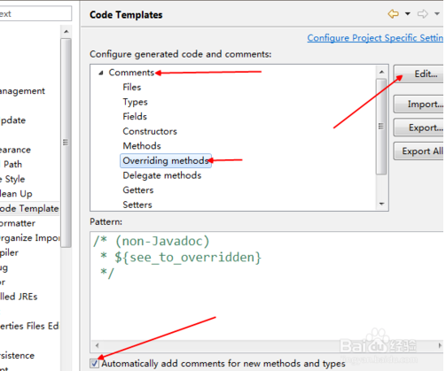
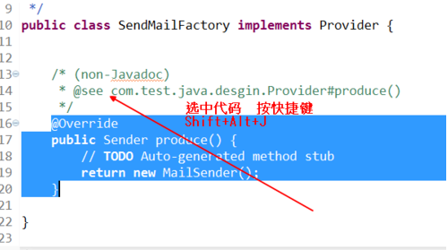

## Eclipse基本配置

### 添加javadoc

1. Window→Pereferences，打开参数选择对话框，展开Java节点，单击“Installed JREs"，此时右边窗口会显示已经加载的jre；


2. 选中要设置的jre版本，单击"Edit"，弹出JRE编辑窗口；


3. 添加javadoc：将JRE system libraries下的所有包选中，单击右边的“Javadoc Location”按钮，弹出javadoc设置窗口。选择“Javadoc URL”单选框，单击“Browse”按钮，选中docs/api目录，然后点击“OK”。

### 添加source

1. 点击 “Window”→“Preferences”→“Java”→“Installed JRES”；
2. 此时“Installed JRES”右边是列表窗格，列出了系统中的 JRE 环境，选择你的JRE，然后点边上的“Edit...”， 会出现一个窗口(Edit JRE)；
3. 选中rt.jar文件的这一项：“C:\Program files\java\jre1.5.006\lib*.jar” ，点 左边的“+” 号展开它；

4. 展开后，可以看到“Source Attachment:(none)”，点这一项，点右边的按钮“Source Attachment...”, 选择你的JDK目录下的 “src.zip”文件；
5. 一路点"ok",结束。


在添加好了javadoc与source后，在Eclipse中，使用快捷键“Shift+F2”，可快速调出选中类的API文档；使用快捷建F3（或在类上点击右键，现在查看声明），可打开类的源文件。

### 配置主题

1. 打开 “Help”→”Eclipse Marketplace“, 如下图： 

   ​

2. 接着在Eclipse Marketplace中搜索”Color Eclipse Themes“，让后安装"Eclipse Color Theme”就行了， 如下图：


3. 打开偏好设置（Preferences）（mac上按"Cmd+，"就可以了）, 设置你所喜欢的theme， 如下图：

http://www.eclipsecolorthemes.org/

### 添加Servlet源码

1. 首先下载Servlet源码文件：http://tomcat.apache.org/download-90.cgi，我下载的文件名为”apache-tomcat-9.0.0.M17-src.zip“


2. 点击 “Window”→“Preferences”→“Java”→“Installed JRES”→“Edit”→“Add External JARs”，选择下载好的“apache-tomcat-9.0.0.M17-src.zip”即可。

### 修改拼写检查规则

1. 在使用spelling功能时请导入词典库(一个txt文档，每行一个单词).。如果需要素材,，可到[Kevin's Word List on Sourceforge.net]()上获取。不过若是觉得在这上面寻找麻烦,，也可以使用[作者上传的词库](http://www.javalobby.org/images/postings/rj/eclipse_spelling/dictionary.txt)。将该页面打开, 可以看到一行行词汇， 将他们全部复制保存到txt文档中,，然后在Eclipse中导入就可以了。你也可以添加自己的词汇。
2. 在使用过程中，Eclipse会在拼写错误的单词下面显示红色的波浪线,，这时你只要按下Ctrl+1就可以看到供选择的匹配项。不过Eclipse在最佳匹配这方面做得差强人意,，大伙就将就下吧。


### 更改文件编码和换行符

为了避免数据库的查询出现乱码和错误，需要将文件的编码格式改为UTF-8。点击 “Window”→“Preferences”→“General”→“Workspace”，将下面的“Text file encoding”框里的单选按钮改为“Other：UTF-8”，将“New text file line delimiter”框里的单选按钮改为“Other：Unix”。


### 设置自动添加Javadoc注释

点击 “Window”→“Preferences”→“Java”→“Code Templates”（或者直接在Preferences中直接搜索“Code Templates”）。找到Comments。该目录下就是有关注释的相关代码风格设置，这里有各种类型，字段，类型，构造方法以及继承的方法，这里面已经是系统默认的注释，你可以点击Edit按钮自行定义，现在重要的是点击下面的勾选按钮进行勾选，然后应用设置即可使用默认的设置。






### Eclipse插件安装

Eclipse插件安装方法大体有以下四种：

1. 直接复制法

   假设Eclipse的安装目录在C:\eclipse，解压下载的eclipse 插件或者安装eclipse 插件到指定目录AA(如：C:\AA)文件夹，打开AA 文件夹，在AA文件夹里分别包含两个文件夹features和plugins ，然后把两个文件夹里的文件分别复制到C:\eclipse下所对应的文件夹下的features 和plugins 下，一般的把插件文件直接复制到eclipse目录里是最直接也是最愚蠢的一种方法！因为日后想要删除这些插件会非常的困难，不推荐使用。

   注意：直接将插件包解压到plugins文件夹下之后，重启eclipse，可能不会加载新的插件。

   解决方法是：

   1、打开命令行，到当前eclipse的目录下，输入eclipse -clean，重新启动eclipse，这样eclipse就会加上新的插件了。

   2、如果插件不能生效，则请将eclipse\configuration\org.eclipse.update目录删除后再启动eclipse；

   你可以在eclipse的菜单“Help”→“About Eclipse SDK”→“Feature Details”和“Plug-in Details”中看到新安装的插件。

2. 使用link文件法

   a.假设Eclipse的安装目录在C:\eclipse，在该文件夹下，新建这样的目录结构C:\eclipse\PluginsEclipse\jode\eclipse；

   b.解压下载的eclipse 插件或者安装eclipse 插件到指定目录BB（如：C:\BB）文件夹，打开BB文件夹，然后把 BB文件夹里的两个文件夹features和plugins复制到刚刚新建好C:\eclipse\PluginsEclipse\jode\eclipse，这样eclipse中就有了两个插件目录features and plugins下。

   c.在C:\eclipse目录中新建links（C:\eclipse\links）目录，在links目录中建立一个以link为扩展名的文本文件如jode.link，内容如下path=C:/eclipse/PluginsEclipse/jode 或者path=C:\\eclipse\\PluginsEclipse\\jode（插件的目录），保存后重启eclipse插件就会安装完成。

   注意：link文件中path=插件目录的path路径分隔要用\\或是/

   Java代码

   /eclipse/

   links/

   jode.link

   webtools.link

   updateManager.link

   ...

   ...

   /eclipse/ links/ jode.link webtools.link updateManager.link ... ... 可以在eclipse的菜单“Help”→“AboutEclipse SDK”→“Feature Details”和“Plug-in Details”中看到新安装的插件。

3. 使用eclipse自带图形界面安装

   选择“Help”→“Software Updates”→“Manager Configuration”，再选择“Add”→“Extension Location”，找到你要安装插件的目录就可以了。使用Eclipse的“Help”→“SoftwareUpdates”→“Find and install”→“Search for new features”，输入软件安装地址进行安装强烈推荐这种方法，优点很多比如可以方便的添加删除，也不用自己写link文件！

   备注：Eclipse插件的目录结构

   Java代码

   /eclipse-plugins/

   eclipse/

   .eclipseextension

   features/

   plugins/

第2种和第3种方法所指向的目录都指的是"Eclipse"目录。如果用第3种方法，在Eclipse这个目录下必须有文件.eclipseextension，如果下载的插件没有这个文件，那就随便Eclipse安装目录下的那个文件拷过去就行，只有有这么个文件就可以了，内容没什么用，主要是一些版本信息。例如：
Java代码
id=org.eclipse.platform name=Eclipse Platform
version=3.1.1
id=org.eclipse.platform name=Eclipse Platform version=3.1.1

4. 使用dropins安装插件

   从Eclipse3.5开始，安装目录下就多了一个dropins目录。只要将插件解压后拖到该目录即可安装插件。

   比如安装svn插件subclipse-1.8.16.zip，只需要如下的三步即可：

   1、使用winrar等压缩软件将压缩包解压至某一文件夹，比如subclipse-1.8.16

   2、将此目录移动/复制至Eclipse安装目录下的dropins目录

   3、重启Eclipse。

   由于此种安装方式可以将不同的插件安装在不同的目录里，并且不用麻烦地写配置文件，因此管理起来会非常方便，推荐使用。

### 安装Vim插件

在eclipse中使用vi模式的插件viplugin：

点击Eclipse中的“Help”→“Install New Software”→“Add”，添加网址 [http://www.viplugin.com/](http://www.viplugin.com/)。然后点击OK后，将搜索出的插件选项全部选上后点击 Next，然后选择Accept ，最后点击 Finish。安装完成后重启Eclipse，重启后会提示找不到路径中的文件。这是因为此插件需要收费，可以破解。破解步骤如下：

1、在eclipse根目录下建立名为viPlugin2.lic的文件。并使用记事本打开，将以下字符串插入其中：

```
q1MHdGlxh7nCyn_FpHaVazxTdn1tajjeIABlcgJBc20
```

2、重启Eclipse viplugin已经破解。