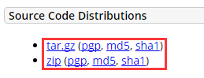

## Eclipse基本配置

### 添加javadoc

1. Window->Pereferences...打开参数选择对话框，展开Java节点，单击“Installed JREs"，此时右边窗口会显示已经加载的jre；

2. 选中要设置的jre版本，单击"Edit"，弹出JRE编辑窗口；

3. 添加javadoc：将JRE system libraries下的所有包选中，单击右边的“Javadoc Location”按钮，弹出javadoc设置窗口。选择“Javadoc URL”单选框，单击“Browse”按钮，选中docs/api目录，然后点击“OK”。

### 添加source

1. 点击 “Window”-> "Preferences" -> "Java" -> "Installed JRES"；
2. 此时"Installed JRES"右边是列表窗格，列出了系统中的 JRE 环境，选择你的JRE，然后点边上的 "Edit..."， 会出现一个窗口(Edit JRE)；
3. 选中rt.jar文件的这一项：“c:\program files\java\jre1.5.006\lib*.jar” ，点 左边的“+” 号展开它；

4. 展开后，可以看到“Source Attachment:(none)”，点这一项，点右边的按钮“Source Attachment...”, 选择你的JDK目录下的 “src.zip”文件；
5. 一路点"ok",结束。

在添加好了javadoc与source后，在eclipse中，使用快捷键"Shift+F2"，可快速调出选中类的api文档；使用快捷建F3（或在类上点击右键，现在查看声明），可打开类的源文件。

### 配置主题

1. 打开 “Help”-> ”Eclipse Marketplace“, 如下图： 

   ​

2. 接着在Eclipse Marketplace中搜索”Color Eclipse Themes“，让后安装"Eclipse Color Theme”就行了， 如下图：

3. 打开偏好设置（Preferences）（mac上按"Cmd+，"就可以了）, 设置你所喜欢的theme， 如下图：

http://www.eclipsecolorthemes.org/

### 添加Servlet源码

1. 首先下载Servlet源码文件：http://tomcat.apache.org/download-90.cgi，我下载的文件名为”apache-tomcat-9.0.0.M17-src.zip“

2. 点击 “Window”-> "Preferences" -> “Java” -> “Installed JRES” -> ”Edit“ -> ”Add External JARs“，选择下载好的”apache-tomcat-9.0.0.M17-src.zip“即可。

### 修改拼写检查规则

1. 在使用spelling功能时请导入词典库(一个txt文档，每行一个单词).。如果需要素材,，可到[Kevin's Word List on Sourceforge.net]()上获取。不过若是觉得在这上面寻找麻烦,，也可以使用[作者上传的词库](http://www.javalobby.org/images/postings/rj/eclipse_spelling/dictionary.txt)。将该页面打开, 可以看到一行行词汇， 将他们全部复制保存到txt文档中,，然后在Eclipse中导入就可以了。你也可以添加自己的词汇。
2. 在使用过程中，Eclipse会在拼写错误的单词下面显示红色的波浪线,，这时你只要按下Ctrl+1就可以看到供选择的匹配项。不过Eclipse在最佳匹配这方面做得差强人意,，大伙就将就下吧。

