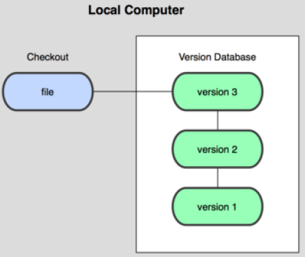
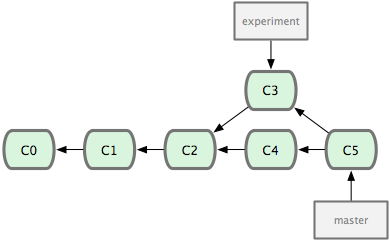
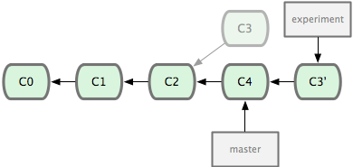
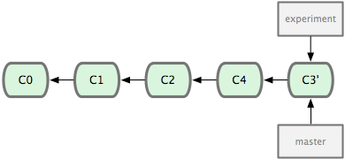
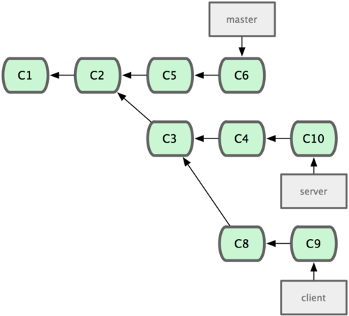
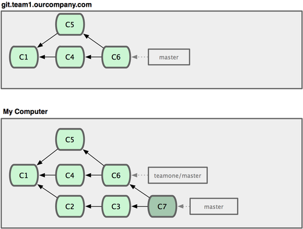

## **1. Git起步**

### **1.1  版本控制系统的发展**

版本控制系统（Version Control System，简称VCS）依次经历了以下发展阶段：

**本地版本控制系统**（Local Version Control Systems）采用复制整个项目目录的形式来保存不同的版本，其原理如下图所示：



**集中式版本控制系统**（Centralized Version Control Systems，简称CVCS）使用一个单一的集中管理的服务器，保存所有文件的修订版本，而协同工作的人们都通过客户端实时连到这台服务器，取出最新的文件或者提交更新。其原理如下图所示：


这种VCS的缺点是中央服务器宕机所有人都无法进行协同工作，一旦中央服务器出现问题就可能丢失所有更新记录。

**分布式版本控制系统**（Distributed Version Control System，简称DVCS）如Git、Mercurial、Bazaar以及Darcs等，客户端并不只提取最新版本的文件快照，而是把代码仓库完整地镜像下来。这么一来，任何一处协同工作用的服务器发生故障，事后都可以用任何一个镜像出来的本地仓库来恢复。 你可以根据需要设定不同的协作流程，比如层次模型式的工作流，而这在以前的集中式系统中是无法实现的。其原理如下图所示：


大部分DVCS以文件变更列表的方式存储信息，即将它们保存的信息看作是一组基本文件和每个文件随时间逐步累积的差异。其原理如下图所示：


而Git把数据看作是对文件系统的一组快照，即对当时的全部文件制作一个快照并保存这个快照的索引。为了高效，如果文件没有修改，Git不再重新存储该文件，而是只保留一个链接指向之前存储的文件。Git对待数据更像是一个快照流。其原理如下图所示：


Git具有很多优点，如快速、设计简单、支持非线性开发模式（允许成千上万个并行开发的分支）、完全分布式、能高效管理超大规模项目。在Git中的绝大多数操作都只需要访问本地文件和资源，只有推送更新到服务器时才使用到网络连接。要浏览项目的历史，只需直接从本地数据库中读取。Git中所有数据在存储前都计算校验和，然后以校验和来引用。这意味着任何改动都会被Git知晓。Git一般只在原来快照的基础上添加数据（即使你执行了删除某个文件的操作），所以Git可以找回每一次的更新。

### **1.2 Git简介**

Git的发展经历了以下历史：

- 1991 Linux创建Linux，需要管理；
- 2002年以前，Linux手动合并开发者提供的代码；
- 2002~2005：BitMover公司的BitKeeper免费给Linux使用；
- 2005开发Samba的Andrew试图破解BitKeeper的协议，被BitMover公司发现了，要收回Linux社区的免费使用权；
- Linus花了两周时间自己用C写了一个分布式版本控制系统-Git，一个月之后Linux源码由此代理；
- 2008年Github上线，为开源项目提供免费Git存储。

Git中的文件有三种状态：已提交（`committed`）、已修改（`modified）`和已暂存（`staged`）。已提交表示数据已经安全地保存在本地数据库中。已修改表示修改了文件，但还没保存到数据库中。已暂存表示对一个已修改文件的当前版本做了标记，使之包含在下次提交的快照中。由此引入Git项目的三个工作区域的概念：Git仓库（`git directory`）、工作目录（`working directory`）以及暂存区域（`staging area`）。


- **Git 仓库**是Git用来保存项目的元数据和对象数据库的地方。这是Git中最重要的部分，从其它计算机克隆仓库时，拷贝的就是这里的数据。有时候也被叫做版本库；
- **工作目录**是对项目的某个版本独立提取出来的内容。 这些 Git仓库的压缩数据库中提取出来的文件，放在磁盘上供你使用或修改；
- **暂存区域**是一个文件，保存了下次将提交的文件列表信息，一般在Git仓库目录中。 一般存放在 ".git目录下" 下的index文件（.git/index）中，所以有时候也被叫做“**索引（`Index`）**”，不过一般说法还是叫暂存区域。


工作区、版本库中的暂存区和版本库之间的关系如下图所示。


Git GUI界面和命令行两种操作模式（安装Git时，可以选择安装Git GUI和Git Bash，分别用于两种模式的操作），但GUI软件只实现了Git的部分功能功能，所以建议一定要学会命令行模式，然后GUI模式就不在话下了。

### **1.3 Git的安装**

#### **1.3.1 在 Linux 上安装**

Fedora使用`yum`：

```shell
 $ sudo yum install git
```

Debian/Ubuntu使用`apt-get`：

```shell
$ sudo apt-get install git
```

其他发行版的Linux安装方法参考：[http://git-scm.com/download/linux](http://git-scm.com/download/linux)

#### **1.3.2 在 Mac 上安装**

在 Mac 平台上安装 Git 最容易的当属使用图形化的 Git 安装工具，下载地址为：[http://sourceforge.net/projects/git-osx-installer/](http://sourceforge.net/projects/git-osx-installer/)

安装界面如下所示：


#### **1.3.3 在 Windows 上安装**

在 Windows 平台上安装 Git 同样轻松，有个叫做 msysGit 的项目提供了安装包，可以到 GitHub 的页面上下载 exe 安装文件并运行：

安装包下载地址：[http://msysgit.github.io/](http://msysgit.github.io/)


### **1.4 初次运行Git前的配置**

**为所有本地仓库配置用户信息，每次提交都会使用这些信息，并且它会写入到你的每一次提交中，且不可更改**

设置每次提交时的用户名和邮箱：

```shell
$ git config --global user.name "Your Name"
$ git config --global user.email "email@example.com"
```

设置需要输入消息时所用的默认编辑器，默认为Vim：

```shell
$ git config --global core.editor emacs
```

设置用来解决合并冲突的默认diff工具：

```shell
$ git config --global merge.tool vimdiff
```

设置彩色化的命令行输出，便于识别不同信息：

```shell
$ git config --global color.ui auto
```

查看当前的所有配置信息（可能会看到重复的变量名，因为Git会从不同的文件中读取同一个配置，如 `/etc/gitconfig`与`~/.gitconfig`（Linux系统下），这种情况下Git会使用它找到的每一个变量的最后一个配置）：

```shell
$ git config --list
user.name=Scott Chacon
user.email=schacon@gmail.com
color.status=auto
color.branch=auto
color.interactive=auto
color.diff=auto
...
```

查看某一项的配置信息，执行`git config <key>`：

```shell
$ git config user.name
John Doe
```

上面的配置信息会保存在在你的用户目录建立一个`.gitconfig`的配置文件中（(Linux下为`~/.gitconfig`，Windows下为`C:\Users\username\.gitconfig`）。上面`config`命令的`--global`选项配置的信息适用于所有Git仓库的操作，如果你想在对不同的项目使用不同的配置信息，可以在那个项目文件夹下运行没有`--global`选项的`config`命令。

### **1.5 获取帮助**

可以通过以下三种方式来获取帮助信息：

```shell
$ git help &lt;verb>
$ git &lt;verb> --help
$ man git -&lt;verb>
```

如通过执行`git help <key>`来查看`<key>`命令在用户手册中的帮助信息（无须联网）：：

```shell
$ git help config
```

## **2. Git基础**

### **2.1  获取仓库**

#### **2.1.1 在现有目录中创建一个仓库**

在进入该项目目录后执行`git init`：

```shell
$ cd StudyNotes/
$ git init
Initialized empty Git repository in C:/Users/Vincent Huang/Desktop/StudyNotes/.git/
```

上面的操作执行之后，瞬间Git就把仓库建好了，而且告诉你是一个空的仓库（empty Git repository）。第一步先`codebase`文件夹中创建一个`.git`的子目录，这个子目录含有你初始化的Git仓库中所有的必须文件。没事千万不要手动修改这个目录里面的文件，不然改乱了，就把Git仓库给破坏了；也可以在`git init`命令后添加一个指定的项目名称。**如果你使用Windows系统，为了避免遇到各种莫名其妙的问题，请确保目录名（包括父目录）不包含中文**。

#### **2.1.2 克隆一个现有仓库**

这将复制一个项目的所有版本历史文件：

```shell
$ git clone [url] [other_name]
```

其中`other_name`是放置克隆文件的目录，`url`可以是以下形式：

- ssh://[user@]host.xz[:port]/path/to/repo.git/
- [user@]host.xz:path/to/repo.git/
- git://host.xz[:port]/path/to/repo.git/
- http[s]://host.xz[:port]/path/to/repo.git/
- ftp[s]://host.xz[:port]/path/to/repo.git/

其中`git://URL`没有使用身份验证，在不安全网络下小心使用。

如：

```shell
$ git clone git://github.com/schacon/grit.git mygrit
```

### **2.2 记录仓库的变化**

工作目录下的每一个文件不外乎两种状态：已跟踪(`tracked`)或未跟踪（`untracked`）。已跟踪的文件是指那些被纳入了版本控制的文件（即处于上面介绍的已提交、已修改、已暂存三种状态的文件），在上一次快照中有它们的记录，在工作一段时间后，它们的状态可能处于未修改，已修改或已放入暂存区。而未跟踪文件既不存在于上次快照的记录中，也没有放入暂存区。初次克隆某个仓库的时候，工作目录中的所有文件都属于已跟踪文件，并处于未修改状态。

基本的Git工作流程如下：

1. 如果新建的仓库是空仓库，使用`git add`命令跟踪新建的文件之后，文件处于已跟踪状态；
2. 然后在工作目录中修改（`modify`）文件。之后文件处于已修改状态；
3. 然后暂存（`stage`）文件，将文件的快照放入暂存区域。之后文件处于暂存状态；
4. 然后提交（`commit`）修改内容的更新，将暂存区域的文件快照永久性存储在Git仓库目录。之后文件处于已提交状态；
5. 提交之后可以选择是否将已提交的文件快照推送（`push`）到服务器，建议将重要更新推送到服务器。然后对已提交的文件进行修改，一直这样循环。

工作原理如下图所示：


#### **2.2.1 查看文件状态**

可以用`git status`命令。如果在刚使用`git init`命令仓库后立即使用此命令，会看到类似这样的输出：

```shell
$ git status
On branch master

Initial commit

nothing to commit (create/copy files and use "git add" to track)
```

这说明当前目录下很干净，没有任何被跟踪的文件。

如果在克隆仓库后立即使用此命令，会看到类似这样的输出：

```shell
$ git status
On branch master

nothing to commit, working directory clean
```

这说明所有已跟踪文件在上次提交之后还没有被修改过。当前目录下没有出现任何处于未跟踪状态的新文件，否则Git会在这里列出来。分支名是 `master`，这是默认的分支名。

首先这里再明确一下，所有的版本控制系统，其实只能跟踪**文本文件**的改动，比如TXT文件，网页，所有的程序代码等等，Git也不例外。版本控制系统可以告诉你每次的改动，比如在第5行加了一个单词“Linux”，在第8行删了一个单词“Windows”。而图片、视频这些二进制文件，虽然也能由版本控制系统管理，但没法跟踪文件的变化，只能把二进制文件每次改动串起来，也就是只知道图片从100KB改成了120KB，但到底改了啥，版本控制系统不知道，也没法知道。

不幸的是，Microsoft的Word格式是二进制格式，因此，版本控制系统是没法跟踪Word文件的改动的，前面我们举的例子只是为了演示，如果要真正使用版本控制系统，就要以纯文本方式编写文件。

因为文本是有编码的，比如中文有常用的GBK编码，日文有Shift_JIS编码，如果不需要兼容旧版本，强烈建议使用标准的UTF-8编码，所有语言使用同一种编码，既没有冲突，又被所有平台所支持。

使用Windows的童鞋千万不要使用Windows自带的**记事本**编辑任何提交的文本文件。原因是Microsoft记事本在每个文件开头添加了0xefbbbf（十六进制）的字符，你会遇到很多不可思议的问题，比如，网页第一行可能会显示一个“?”，明明正确的程序一编译就报语法错误，等等。建议你下载[Notepad++](http://notepad-plus-plus.org/)代替记事本，不但功能强大，而且免费！记得把Notepad++的默认编码设置为UTF-8 without BOM即可。


下面我们在项目下创建一个新的README.md文件：

```shell
$ vim README.md
This is my personal study notes of learning programing.
Welcome to communicate with me at my email.
$ ls
README.md
```

这里我们使用vim编辑器为README.md添加了两行内容，当然你也可以使用NotePad++来创建编辑该文件。执行`ls`命令就看到了该文件。

如果之前并不存在这个文件，使用`git status`命令，你将看到一个新的未跟踪文件：

```shell
$ git status
On branch master

Initial commit

Untracked files:
  (use "git add <file>..." to include in what will be committed)

        README.md

nothing added to commit but untracked files present (use "git add" to track)
```

新建的README文件出现在Untracked files下面。未跟踪的文件意味着Git在之前的快照（提交）中没有这些文件；Git不会自动将之纳入跟踪范围。

#### **2.2.2 跟踪一个文件**

使用`git add`命令。跟踪README.md文件：

```shell
$ git add README.md
warning: LF will be replaced by CRLF in README.md.
The file will have its original line endings in your working directory.
```

上面的警告信息只会出现在Windows系统中，具体原因请参考Git安装过程中对各系统针对回车换行符的处理方式介绍。

然后再使用`git status`命令查看文件状态，会看到README.md文件已被跟踪，并处于暂存状态：

```shell
$ git status
On branch master

Initial commit

Changes to be committed:
  (use "git rm --cached <file>..." to unstage)

        new file:   README.md
```

**在 Changes to be committed 这行下面的文件说明是已暂存状态。 如果此时提交，那么该文件此时此刻的版本将被留存在历史记录中。`git add`命令使用文件或目录的路径作为参数；如果参数是目录的路径，该命令将递归地跟踪该目录下的所有文件。如可以使用`git add .`命令将跟踪当前路径下的所有文件**。

#### **2.2.3 暂存已修改文件**

也是使用`git add`命令。如果你修改了README.md文件（合并为一行）：

```shell
$ vim README.md
This is my personal study notes of learning programing.Welcome to communicate with me at my email.
```

然后运行`git status`命令，会看到下面内容：

```shell
$ git status
On branch master

Initial commit

Changes to be committed:
  (use "git rm --cached <file>..." to unstage)

        new file:   README.md

Changes not staged for commit:
  (use "git add <file>..." to update what will be committed)
  (use "git checkout -- <file>..." to discard changes in working directory)

        modified:   README.md
```

**README.md出现在Changes not staged for commit这行下面，说明已工作目录中的跟踪文件的内容发生了变化，但还没有放到暂存区。但是README.md也出现在Changes to be committed这行下面，就说明暂存区也有README.md的暂存版本（前面执行）**。**运行了`git add`之后又作了修改的文件，需要重新运行`git add`把最新版本重新暂存起来**：

```shell
$ git add README.md
$ git status
On branch master

Initial commit

Changes to be committed:
  (use "git rm --cached <file>..." to unstage)

        new file:   README.md
```

**`git add`命令是一个多功能命令，可以用它开始跟踪新文件，或者把已跟踪的文件放到暂存区，还能用于合并时把有冲突的文件标记为已解决状态等**。

#### **2.2.4 简化状态输出**

`git status`命令的输出十分详细，如果加上`-s`或`--short`选项，将得到一种更为紧凑的格式输出：

```shell
$ git status -s
 M README
MM Rakefile
A  lib/git.rb
M  lib/simplegit.rb
?? LICENSE.txt
```

新添加的未跟踪文件前面有 `??` 标记，新添加到暂存区中的文件前面有`A`标记，修改过的文件前面有`M`标记。 `M`有两个可以出现的位置，出现在右边的`M`表示该文件被修改了但是还没放入暂存区，出现在靠左边的`M`表示该文件被修改了并放入了暂存区。

#### **2.2.5 忽略文件**

有些文件（如日志文件，或者编译过程中创建的临时文件等）无需纳入 Git 的管理，也不希望它们总出现在未跟踪文件列表中，我们可以创建一个名为`.gitignore`的文件，列出要忽略的文件模式：

```shell
$ cat .gitignore
*.[oa]
*~
```

第一行忽略所有以`.o`或`.a`结尾的文件（一般这类对象文件和存档文件都是编译过程中出现的）。 第二行忽略所有以波浪符结尾的文件（许多文本编辑软件（比如Emacs）都用这样的文件名保存副本）。 此外，你可能还需要忽略`log`，`tmp`或者`pid`目录，以及自动生成的文档等等。 要养成一开始就设置好`.gitignore`文件的习惯，以免将来误提交这类无用的文件。

`.gitignore`文件的格式规范如下：

- 所有空行或者以＃开头的行都会忽略；

- 可以使用标准的`glob`模式匹配；

- 匹配模式可以以（/）开头防止递归；

- 匹配模式可以以（/）结尾指定目录；

- 要忽略指定模式以外的文件或目录，可以在模式前加上惊叹号（!）取反。

所谓`glob`模式是指shell所使用的**简化了的正则表达式**。 星号`*`匹配零个或多个任意字符；`[abc] `匹配任何一个列在方括号中的字符；问号`?`只匹配一个任意字符；`[m-n]`匹配`m-n`之中的任意一个字符；连续两个星号`**`匹配任意中间目录，如`a/**/z`可以匹配`a/z`，`a/b/z`或`a/b/c/z`等。

```shell
# no .a files
*.a

# but do track lib.a, even though you're ignoring .a files above
!lib.a

# only ignore the TODO file in the current directory, not subdir/TODO
/TODO

# ignore all files in the build/ directory
build/

# ignore doc/notes.txt, but not doc/server/arch.txt
doc/*.txt

# ignore all .pdf files in the doc/ directory
doc/**/*.pdf
```

GitHub上有一个十分详细的针对数十种项目及语言的[`.gitignore文件列表`](https://github.com/github/gitignore)，也可以参考章鱼猫（[octocat](https://gist.github.com/octocat)）推荐的一些常用的[`.gitignore配置`](https://gist.github.com/octocat/9257657)。

**创建本地的`.gitignore`文件**

则进入项目主目录，新建一个适用于本仓库的`.gitignore`文件即可。如果已经跟踪了某些文件，现在又不想跟踪了，则应该先执行以下命令来`untrack`这些文件：

```shell
$ git rm --cached FILENAME
```

**创建全局的`.gitignore`文件**

全局的`.gitignore`文件里的规则适用于本机上的所有Git仓库：

```shell
$ git config --global core.excludesfile ~/.gitignore_global
```

**确定排除哪些文件**

如果你不想创建可与他人共享的`.gitignore`文件，也可以创建不提交文件所用的规则。如果你不想别人在远程仓库上就得到一些你自己创建的文件就可以使用这种技术：进入项目的仓库目录，像编辑`.gitignore`文件一样编辑`.git/info/exclude`文件即可。

#### **2.2.6 查看已暂存和未暂存的修改**

`git diff` 命令可以使用默认的`diff`工具（前面已经通过`git config --global merge.tool vimdiff`设置为Vim的`diff`工具了）来详细地**对比未暂存文件相对于之前已暂存文件具体修改了哪些内容**，这是`git status`命令不具备的。

再次修改 README 文件后先不暂存。要查看尚未暂存的文件更新了哪些部分，不加参数直接输入`git diff`：

```shell
$ git diff
diff --git a/README.md b/README.md
index c2afcd2..5eff252 100644
--- a/README.md
+++ b/README.md
@@ -1,4 +1,4 @@
-This is my personal study notes of learning programing.Welcome to fork or communicate with me at hzx_rosydawn@163.com.
-
+This is my personal study notes of learning programing.
+Welcome to fork or communicate with me at hzx_rosydawn@163.com.
 Welcome little_dingdang fork this directory.
 He said the notes hleped him as tips for a beginner.
```
上面的输出格式符合下面的规则：
```shell
index <hash>,<hash>..<hash>
--- a/file
+++ b/file
@@@ <from-file-range> <from-file-range> <to-file-range> @@@
- the deleted content of a file
  the content of a file that not changed
+ the added content of b file
  the content of b file that not changed
```

关于`git diff`命令的详细介绍，参考`git help diff`。

**查看已暂存的将要添加到下次提交里的内容**，可以用`git diff --cached`命令（Git 1.6.1 及更高版本
还允许使用`git diff --staged`命令，这个命令更好记忆）：

```shell
$ git diff --staged
diff --git a/README.md b/README.md
new file mode 100644
index 0000000..c2afcd2
--- /dev/null
+++ b/README.md
@@ -0,0 +1,4 @@
+This is my personal study notes of learning programing.Welcome to fork or communicate with me at hzx_rosydawn@163.com.
+
+Welcome little_dingdang fork this directory.
+He said the notes hleped him as tips for a beginner.
```

**`git diff`只显示尚未暂存的改动，而不是自上次提交以来所做的所有改动**。所以有时候你一下子暂存了所有更新过的文件后，运行 git diff 后却什么也没有。

也可以使用通过图形化的方式或其它格式输出方式来对比差异。使用`git difftool`命令来用Araxis ，emerge 或 vimdiff 等软件输出`diff`分析结果。 使用`git difftool --tool-help`命令来看你的系统支持哪些Git Diff插件：

```shell
$ git difftool --tool-help
'git difftool --tool=<tool>' may be set to one of the following:
                vimdiff
                vimdiff2
                vimdiff3

The following tools are valid, but not currently available:
                araxis
                bc
                bc3
                codecompare
                deltawalker
                diffmerge
                diffuse
                ecmerge
                emerge
                examdiff
                gvimdiff
                gvimdiff2
                gvimdiff3
                kdiff3
                kompare
                meld
                opendiff
                p4merge
                tkdiff
                winmerge
                xxdiff

Some of the tools listed above only work in a windowed environment. If run in a terminal-only session, they will fail.
```

执行`git difftool --tool=<tool>`命令将会启动相应的外部工具来展示两棵文件树之间的差异。

#### **2.2.7 提交更新**

一定要确认还有什么修改过的或新建的文件还没有通过`git add`暂存过，否则提交的时候不会记录这些还没暂存起来的变化。这些修改过的文件只保留在本地磁盘。所以，每次准备提交前，先用`git status`看一下，是不是都已暂存起来了， 然后再运行提交命令`git commit`：

```
$ git commit
```

这种方式会启动文本编辑器（默认会启用shell的环境变量$EDITOR所指定的软件，一般都是Vim或Emacs。当然也可以按照前面使用`git config --global core.editor`命令设定你喜欢的编辑器）来输入本次提交的说明。以Vim为例：

```shell
# Please enter the commit message for your changes. Lines starting
# with '#' will be ignored, and an empty message aborts the commit.
# On branch master
#
# Initial commit
#
# Changes to be committed:
#	new file:   README.md
#
```

默认的提交消息包含最后一次运行`git status`的输出，放在注释行里，另外开头还有一空行，供你输入提交说明。完全可以去掉这些注释行，不过留着也没关系，多少能帮你回想起这次更新的内容有哪些。也可以用`git commit -v`命令，这会将你所做改变`diff`输出放到编辑器中从而使你知道本次提交具体做了哪些修改。退出编辑器时，Git就会丢掉注释行或`diff`的输出信息，用你输入的提交附带信息生成一次提交。

也可以在 commit 命令后添加 -m 选项，将提交信息与命令放在同一行：

```shell
$ git commit -m "add a README.md file"
[master (root-commit) 8baa043] add a README.md file
 1 file changed, 4 insertions(+)
 create mode 100644 README.md
```

提交后它会告诉你，当前是在哪个分支（master）提交的，本次提交的完整 SHA-1 校验和是什么（8baa043），以及在本次提交中，有多少文件修订过，多少行添加和删改过。

#### **2.2.8 跳过使用暂存区域**

Git提供了一种直接把所有已经跟踪过的文件暂存起来一并提交的命令，即`git commit -a`，从而跳过`git add`步骤：

```shell
$ git status
On branch master
Changes not staged for commit:
  (use "git add <file>..." to update what will be committed)
  (use "git checkout -- <file>..." to discard changes in working
directory)

    modified:   CONTRIBUTING.md

no changes added to commit (use "git add" and/or "git commit -a")
$ git commit -a -m 'added new benchmarks'
[master 83e38c7] added new benchmarks
 1 file changed, 5 insertions(+), 0 deletions(-)
```

#### **2.2.9 移除文件**

如果只是简单地从工作目录中手动删除（可以通过`rm`命令或直接从资源管理器中删除）某个文件，运行`git status`时仍会在 “Changes not staged for commit” 部分（也就是未暂存清单）看到该文件，文件依然存在于Git的仓库中：

```shell
$ rm PROJECTS.md
$ git status
On branch master
Your branch is up-to-date with 'origin/master'.
Changes not staged for commit:
  (use "git add/rm <file>..." to update what will be committed)
  (use "git checkout -- <file>..." to discard changes in working
directory)

        deleted:    PROJECTS.md

no changes added to commit (use "git add" and/or "git commit -a")
```

要想从Git中移除某个文件，就再用`git rm`命令将文件从工作目录中和暂存区域中都移除，该文件也就从已跟踪文件清单中移除了，然后提交。这样该文件以后就不会出现在未跟踪文件清单中了。

```shell
$ git rm PROJECTS.md
rm 'PROJECTS.md'
$ git status
On branch master
Changes to be committed:
  (use "git reset HEAD <file>..." to unstage)

    deleted:    PROJECTS.md
```

> 注意：上面第二行的`rm 'README.md'`是前一行`git rm README.md`命令的输出结果，而不是`rm`删除命令。

下一次提交时，该文件就不再纳入版本管理了。如果想一步到位，直接从文件目录和暂存区都删除该文件，就用强制删除选项`-f`：

```shell
$ git rm -f README.md
```

上面的命令执行后，README.md文件中上次暂存的修改内容是不能被Git恢复的（因为修改的内容还未提交就被删除了）。`-f`选项的存在是为了防止误删还没有添加到快照的数据。

如果想让文件保留在磁盘中但并不想让Git继续跟踪，即想把文件从暂存区域移除，但仍然希望保留在当前工作目录中。那么使用`--cached`选项：

```shell
$ git rm --cached README.md
```

当你忘记添加`.gitignore`文件，不小心把一个很大的日志文件或一堆`.a`这样的编译生成文件添加到暂存区时，这一做法尤其有用。

`git rm`命令后面可以列出文件或者目录的名字，也可以使用`glob`模式。比方说下面两种执行方式：

```shell
$ git rm log/\*.log
$ git rm \*~
```

上面第一条命令删除`log/`目录下扩展名为`.log`的所有文件；第二条命令删除以`~`结尾的所有文件。

#### **2.2.10 移动或重命名**

`git mv`命令用于移动文件位置或重命名文件。

将文件移动到另一个文件夹：

```
$ mkdir lib
$ git mv hello.html lib
$ git commit -m "Moved hello.html to lib"
```

上面的命令与下面的命令具有完全相同的效果：

```
$ mkdir lib
$ mv hello.html lib
$ git add lib/hello.html
$ git rm hello.html
$ git commit -m "Moved hello.html to lib"
```

要在Git 中对文件改名，可以这么做：

```shell
$ git mv file_from file_to
```

如：

```shell
$ git mv README.md README
$ git status
On branch master
Changes to be committed:
  (use "git reset HEAD <file>..." to unstage)

    renamed:    README.md -> README
```

上面的`git mv`命令与下面三条命令具有完全相同的效果：

```shell
$ mv README.md README
$ git rm README.md
$ git add README
```

### **2.3 查看提交历史**

如果你想回顾下以前的提交历史，那么执行`git log`命令：

```shell
$ git clone https://github.com/schacon/simplegit-progit
$ git log
commit ca82a6dff817ec66f44342007202690a93763949
Author: Scott Chacon <schacon@gee-mail.com>
Date:   Mon Mar 17 21:52:11 2008 -0700

    changed the version number

commit 085bb3bcb608e1e8451d4b2432f8ecbe6306e7e7
Author: Scott Chacon <schacon@gee-mail.com>
Date:   Sat Mar 15 16:40:33 2008 -0700

    removed unnecessary test

commit a11bef06a3f659402fe7563abf99ad00de2209e6
Author: Scott Chacon <schacon@gee-mail.com>
Date:   Sat Mar 15 10:31:28 2008 -0700

    first commit
```

默认不用任何参数的话，`git log`会按提交时间列出所有的更新，最近的更新排在最上面。 这个命令会列出每个提交的 SHA-1 校验和、作者的名字和电子邮件地址、提交时间以及提交说明。

`git log`命令可以跟一些选项。常用选项如下表所示：
| 选项              | 描述                                       |
| --------------- | ---------------------------------------- |
| -p              | 按补丁格式显示每个更新之间的差异。                        |
| --stat          | 显示每次更新的文件修改统计信息。                         |
| --shortstat     | 只显示 --stat 中最后的行数修改添加移除统计。               |
| --name-only     | 仅在提交信息后显示已修改的文件清单。                       |
| --name-status   | 显示新增、修改、删除的文件清单。                         |
| --abbrev-commit | 仅显示 SHA-1 的前几个字符，而非所有的 40 个字符。           |
| --relative-date | 使用较短的相对时间显示（比如，“2 weeks ago”）。           |
| --graph         | 显示 ASCII 图形表示的分支合并历史。                    |
| --pretty        | 使用其他格式显示历史提交信息。可用的选项包括 oneline，short，full，fuller 和format（后跟指定格式）。 |
如`-p`选项可以加上`-2`来仅显示最近两次提交：

```shell
$ git log -p -2
commit ca82a6dff817ec66f44342007202690a93763949
Author: Scott Chacon <schacon@gee-mail.com>
Date:   Mon Mar 17 21:52:11 2008 -0700

    changed the version number

diff --git a/Rakefile b/Rakefile
index a874b73..8f94139 100644
--- a/Rakefile
+++ b/Rakefile
@@ -5,7 +5,7 @@ require 'rake/gempackagetask'
 spec = Gem::Specification.new do |s|
     s.platform  =   Gem::Platform::RUBY
     s.name      =   "simplegit"
-    s.version   =   "0.1.0"
+    s.version   =   "0.1.1"
     s.author    =   "Scott Chacon"
     s.email     =   "schacon@gee-mail.com"
     s.summary   =   "A simple gem for using Git in Ruby code."

commit 085bb3bcb608e1e8451d4b2432f8ecbe6306e7e7
Author: Scott Chacon <schacon@gee-mail.com>
Date:   Sat Mar 15 16:40:33 2008 -0700

    removed unnecessary test

diff --git a/lib/simplegit.rb b/lib/simplegit.rb
index a0a60ae..47c6340 100644
--- a/lib/simplegit.rb
+++ b/lib/simplegit.rb
@@ -18,8 +18,3 @@ class SimpleGit
     end

 end
-
-if $0 == __FILE__
-  git = SimpleGit.new
-  puts git.show
-end
\ No newline at end of file
```

如果你想看到每次提交的简略的统计信息，你可以使用`--stat`选项：

```shell
$ git log --stat
commit ca82a6dff817ec66f44342007202690a93763949
Author: Scott Chacon <schacon@gee-mail.com>
Date:   Mon Mar 17 21:52:11 2008 -0700

    changed the version number

 Rakefile | 2 +-
 1 file changed, 1 insertion(+), 1 deletion(-)

commit 085bb3bcb608e1e8451d4b2432f8ecbe6306e7e7
Author: Scott Chacon <schacon@gee-mail.com>
Date:   Sat Mar 15 16:40:33 2008 -0700

    removed unnecessary test

 lib/simplegit.rb | 5 -----
 1 file changed, 5 deletions(-)

commit a11bef06a3f659402fe7563abf99ad00de2209e6
Author: Scott Chacon <schacon@gee-mail.com>
Date:   Sat Mar 15 10:31:28 2008 -0700

    first commit

 README           |  6 ++++++
 Rakefile         | 23 +++++++++++++++++++++++
 lib/simplegit.rb | 25 +++++++++++++++++++++++++
 3 files changed, 54 insertions(+)
```

`--stat`选项在每次提交的下面列出额所有被修改过的文件、有多少文件倍修改了以及被修改过的文件的哪些行被移除或是添加了，在每次提交的最后还有一个总结。

另外一个常用的选项是`--pretty`，该选项可以通过指定各种子选项来使用多种格式展示提交历史。如`oneline`子选项可以将每个提交放在一行显示，查看的提交数很大时非常有用：

```shell
$ git log --pretty=oneline
ca82a6dff817ec66f44342007202690a93763949 changed the version number
085bb3bcb608e1e8451d4b2432f8ecbe6306e7e7 removed unnecessary test
a11bef06a3f659402fe7563abf99ad00de2209e6 first commit
```

此外，`--pretty`还有还有`short`，`full`，`fuller`，`email`和`raw`可以用，展示的信息或多或少有些不同。最有意思的是`format`子选项了，可以定制要显示的记录格式。

```shell
$ git log --pretty=format:"%h - %an, %ar : %s"
ca82a6d - Scott Chacon, 6 years ago : changed the version number
085bb3b - Scott Chacon, 6 years ago : removed unnecessary test
a11bef0 - Scott Chacon, 6 years ago : first commit
```

`git log --pretty=format`常用的选项如下表所示：

| 选项   | 说明                         |
| ---- | -------------------------- |
| %H   | 提交对象（commit）的完整哈希字串        |
| %h   | 提交对象的简短哈希字串                |
| %T   | 树对象（tree）的完整哈希字串           |
| %t   | 树对象的简短哈希字串                 |
| %P   | 父对象（parent）的完整哈希字串         |
| %p   | 父对象的简短哈希字串                 |
| %an  | 作者（author）的名字              |
| %ae  | 作者的电子邮件地址                  |
| %ad  | 作者修订日期（可以用 --date= 选项定制格式） |
| %ar  | 作者修订日期，按多久以前的方式显示          |
| %cn  | 提交者(committer)的名字          |
| %ce  | 提交者的电子邮件地址                 |
| %cd  | 提交日期                       |
| %cr  | 提交日期，按多久以前的方式显示            |
| %s   | 提交说明                       |

上面表格中的作者指的是实际作出修改的人，提交者指的是最后将此工作成果提交到仓库的人。还有其他多种子选项可以使用，请参考`git help log`。

#### **2.3.1 限制输出长度**

前面的`-2`选项是`-<n>`选项的写法，其中的`n`可以是任何整数，表示仅显示最近的若干条提交。实践中我们是不太用这个选项的，Git在输出所有提交时会自动调用分页程序，所以你一次只会看到一页的内容。

限制`git log`输出的选项如下表所示：
| 选项                | 说明                |
| ----------------- | ----------------- |
| -(n)              | 仅显示最近的 n 条提交      |
| --since, --after  | 仅显示指定时间之后的提交。     |
| --until, --before | 仅显示指定时间之前的提交。     |
| --author          | 仅显示指定作者相关的提交。     |
| --committer       | 仅显示指定提交者相关的提交。    |
| --grep            | 仅显示含指定关键字的提交      |
| -S                | 仅显示添加或移除了某个关键字的提交 |

时间限制的例子如：

```shell
$ git log --since=2.weeks
```

这个命令可以在多种格式下工作，比如说具体的某一天"2008-01-15"，或者是相对地多久以前"2 years 1 day 3 minutes ago"。

> 注意：如果要得到同时满足这两个选项搜索条件的提交，就必须用`--all-match`选项。否则，满足任意一个条件的提交都会被匹配出来。

### **2.4 撤消操作**

在任何阶段都有可能想要撤消某些操作。注意Git中有些撤消操作是不可逆的，这是Git中会因为操作失误而导致之前的工作丢失的少有的几个情况之一。

#### **2.4.1 修改上次的提交**

如果上次提交时忘记添加了某几个文件或提交信息写错了，可以使用`--amend`选项来再次提交暂存区中的文件，这次提交将替换上次提交的的结果：

```shell
$ git commit -m 'initial commit'
$ git add forgotten_file
$ git commit --amend -m 'new commit message'
```

#### **2.4.2 取消暂存的文件**

`git status`命令在显示文件状态的同时也会给出撤销上次操作的命令提示。如：

```shell
$ git add .
$ git status
On branch master
Changes to be committed:
	(use "git reset HEAD <file>..." to unstage)

		modified: README.txt
		modified: benchmarks.rb
```

上面的`git status`命令给出了`git reset HEAD <file>...`取消暂存的命令提示。按照提示执行：

```shell
$ git reset HEAD benchmarks.rb
benchmarks.rb: locally modified
$ git status
On branch master
Changes to be committed:
	(use "git reset HEAD <file>..." to unstage)

		modified: README.txt

Changed but not updated:
	(use "git add <file>..." to update what will be committed)
	(use "git checkout -- <file>..." to discard changes in working directory)

		modified: benchmarks.rb
```

> 注意：虽然在调用时加上`--hard`选项可以令`git reset`成为一个危险的命令（译注：可能导致工作目录中所有当前进度丢失！），但本例中工作目录内的文件并不会被修改。不加选项地调用`git reset`并不危险 — 它只会修改暂存区域。

**2.4.3 撤消到某次提交**

也可以使用 `git reset --hard commit ID` 命令来会滚到某次提交之前的状态。

#### **2.4.4 撤消对文件的修改**

如果想撤销某些修改，将它还原成上次提交时的样子（或者刚克隆完的样子，或者刚把它放入工作目录时的样子）。可以参考`git status`的提示：

```shell
Changes not staged for commit:
  (use "git add <file>..." to update what will be committed)
  (use "git checkout -- <file>..." to discard changes in working
directory)

    modified:   CONTRIBUTING.md
```

按照提示执行：

```shell
$ git checkout -- CONTRIBUTING.md
$ git status
On branch master
Changes to be committed:
  (use "git reset HEAD <file>..." to unstage)

    renamed:    README.md -> README
```

> 注意：你需要知道`git checkout -- [file]`是一个危险的命令。只是拷贝了另一个文件来覆盖那个文件，所做的任何修改都会消失。除非你确实清楚不想要那个文件了，否则不要使用这个命令。如果你仍然想保留对那个文件做出的修改，但是现在仍然需要撤消，请参考分支的介绍。

### **2.5 远程仓库的使用**

远程仓库是指托管在因特网或其他网络中的你的项目的版本库。你可以有好几个远程仓库，通常有些仓库对你只读，有些则可以读写。 与他人协作涉及管理远程仓库以及根据需要推送或拉取数据。管理远程仓库包括了解如何添加远程仓库、移除无效的远程仓库、管理不同的远程分支并定义它们是否被跟踪等等。

#### **2.5.1 查看远程仓库**

`git remote`命令会列出你指定的每一个远程服务器的简写。如果你已经克隆了自己的仓库，那么至少应该能看到`origin -`，这是**所克隆的仓库服务器的默认名字**：

```shell
$ git clone https://github.com/schacon/ticgit
Cloning into 'ticgit'...
remote: Reusing existing pack: 1857, done.
remote: Total 1857 (delta 0), reused 0 (delta 0)
Receiving objects: 100% (1857/1857), 374.35 KiB | 268.00 KiB/s, done.
Resolving deltas: 100% (772/772), done.
Checking connectivity... done.
$ cd ticgit
$ git remote
origin
```

也可以指定选项`-v`，将会显示远程仓库在Git上可存储为简写的URL：

```shell
$ git remote -v
origin git://github.com/schacon/ticgit.git
```

如果你的远程仓库不止一个，该命令会将它们全部列出。如：

```shell
$ cd grit
$ git remote -v
bakkdoor  https://github.com/bakkdoor/grit (fetch)
bakkdoor  https://github.com/bakkdoor/grit (push)
cho45     https://github.com/cho45/grit (fetch)
cho45     https://github.com/cho45/grit (push)
defunkt   https://github.com/defunkt/grit (fetch)
defunkt   https://github.com/defunkt/grit (push)
koke      git://github.com/koke/grit.git (fetch)
koke      git://github.com/koke/grit.git (push)
origin    git@github.com:mojombo/grit.git (fetch)
origin    git@github.com:mojombo/grit.git (push)
```

这样我们就可以轻松拉取其中任何一个用户的贡献。此外，我们大概还会有某些远程仓库的推送权限。

#### **2.5.2 添加远程仓库**

运行`git remote add <shortname> <url>`添加一个新的远程Git仓库，同时指定一个你可以轻松引用的简写：

```shell
$ git remote
origin
$ git remote add pb https://github.com/paulboone/ticgit
$ git remote -v
origin https://github.com/schacon/ticgit (fetch)
origin https://github.com/schacon/ticgit (push)
pb https://github.com/paulboone/ticgit (fetch)
pb https://github.com/paulboone/ticgit (push)
```

现在你可以在命令行中使用字符串`pb`来代替整个URL，如果你想拉取 Paul 的仓库中有但你没有的信息，可以运行`git fetch pb`：

```shell
$ git fetch pb
remote: Counting objects: 43, done.
remote: Compressing objects: 100% (36/36), done.
remote: Total 43 (delta 10), reused 31 (delta 5)
Unpacking objects: 100% (43/43), done.
From https://github.com/paulboone/ticgit
 * [new branch]      master     -> pb/master
 * [new branch]      ticgit     -> pb/ticgit
```

#### **2.5.3 从远程仓库中抓取与拉取**

从远程仓库中获得你还没有的数据，可以执行：

```shell
$ git fetch [remote-name]
```

上面的命令执行完成后，你将会拥有那个远程仓库中所有分支的引用，可以随时合并或查看。

**如果你使用`clone`命令克隆了一个仓库，该命令会自动将这个仓库添加为远程仓库并默认以`origin`为简写。所以，`git fetch origin`会抓取克隆（或上一次抓取）后新推送的所有工作。必须注意`git fetch`命令会将数据拉取到你的本地仓库，它并不会自动合并或修改你当前的工作。当准备好时你必须手动将其合并入你的工作**。

**可以使用`git pull`命令来抓取当前分支所跟踪的远程分支，然后合并远程分支到当前分支。默认情况下，`git clone`命令会自动设置本地`master`分支跟踪克隆的远程仓库的`master`分支**（或不管是什么名字的默认分支）。**运行`git pull`通常会从最初克隆的服务器上抓取数据并自动尝试合并到当前所在的分支**。

#### **2.5.4 推送到远程仓库**

**可以通过`git push [remote-name] [branch-name]`命令将你的本地仓库（通常已做过修改）推送到远程仓库**。例如将`master`分支推送到`origin`服务器：

```shell
$ git push origin master
```

**只有当你有所克隆服务器的写入权限，并且之前没有人推送过时，这条命令才能生效。如果其他人在克隆了该仓库之后做了修改且修改内容和你的不同，当他们在你推送前将他们的修改推送到了远程仓库，你的推送就会被拒绝。你必须先将他们的工作拉取下来并将其合并进你的工作后才能推送**。

#### **2.5.5 查看远程仓库**

使用`git remote show [remote-name]`命令可以查看某一个远程仓库的更多信息。如果想以一个特定的缩写名运行这个命令，例如`origin`，会得到像下面类似的信息：

```shell
$ git remote show origin
* remote origin
  Fetch URL: https://github.com/schacon/ticgit
  Push  URL: https://github.com/schacon/ticgit
  HEAD branch: master
  Remote branches:
    master                               tracked
    dev-branch                           tracked
  Local branch configured for 'git pull':
    master merges with remote master
  Local ref configured for 'git push':
    master pushes to master (up to date)
```

它同样会列出远程仓库的URL与跟踪分支的信息。这些信息非常有用，它告诉你**正处于`master`分支**，并且**如果运行`git pull`，就会抓取所有的远程引用，然后将远程`master`分支合并到本地`master`分支**。它也会列出拉取到的所有远程引用。

如果你是Git的重度使用者，那么还可以通过`git remote show`看到更多的信息：

```shell
$ git remote show origin
* remote origin
  URL: https://github.com/my-org/complex-project
  Fetch URL: https://github.com/my-org/complex-project
  Push  URL: https://github.com/my-org/complex-project
  HEAD branch: master
  Remote branches:
    master                           tracked
    dev-branch                       tracked
    markdown-strip                   tracked
    issue-43                         new (next fetch will store in remotes/origin)
    issue-45                         new (next fetch will store in remotes/origin)
    refs/remotes/origin/issue-11     stale (use 'git remote prune' to remove)
  Local branches configured for 'git pull':
    dev-branch merges with remote dev-branch
    master     merges with remote master
  Local refs configured for 'git push':
    dev-branch       pushes to dev-branch (up to date)
    markdown-strip   pushes to markdown-strip (up to date)
    master           pushes to master (up to date)
```

这个命令列出了当你在特定的分支上执行`git push`会自动地推送到哪一个远程分支。它也同样地列出了哪些远程分支不在你的本地，哪些远程分支已经从服务器上移除了，还有当你执行`git pull`时哪些分支会自动合并。

#### **2.5.6远程仓库的移除与重命名**

若要修改一个远程仓库的简写名，可以运行`git remote rename`命令：

```shell
$ git remote rename pb paul
$ git remote
origin
paul
```

这也会修改你的远程分支名字。 那些过去引用`pb/master`的现在会引用`paul/master`。

如果想要移除一个远程仓库，可以使用`git remote rm`命令 ：

```shell
$ git remote rm paul
$ git remote
origin
```

### **2.6 打标签**

Git可以给历史中的某一个提交打上标签，以示重要。比较有代表性的是人们会使用这个功能来标记发布结点（v1.0 等等）。

#### **2.6.1 列出标签**

列出已有的标签使用`git tag`命令：

```shell
$ git tag
v0.1
v1.3
```

这个命令以字母顺序列出标签，但这个顺序并不重要。你也可以使用特定的模式查找标签：

```shell
$ git tag -l 'v1.8.5*'
v1.8.5
v1.8.5-rc0
v1.8.5-rc1
v1.8.5-rc2
v1.8.5-rc3
v1.8.5.1
v1.8.5.2
v1.8.5.3
v1.8.5.4
v1.8.5.5
```

#### **2.6.2 创建标签**

Git使用两种主要类型的标签：轻量标签（lightweight）与附注标签（annotated）。

一个轻量标签很像一个不会改变的分支， 它只是一个特定提交的引用。

而附注标签是存储在Git数据库中的一个完整对象 它们是可以被校验的；其中包含打标签者的名字、电子邮件地址、日期时间；还有一个标签信息；并且可以使用GNU Privacy Guard （GPG）签名与验证。**通常建议创建附注标签**，这样你可以拥有以上所有信息；但是如果你只是想用一个临时的标签，或者因为某些原因不想要保存那些信息，轻量标签也是可用的。

##### **2.6.2.1  附注标签**

运行`git tag`命令时指定`-a`选项可以创建一个附注标签：

```shell
$ git tag -a v1.4 -m 'my version 1.4'
$ git tag
v0.1
v1.3
v1.4
```

`-m`选项指定了一条将会存储在标签中的信息。如果没有为附注标签指定一条信息，Git会运行编辑器要求你输入信息。使用 git show 命令可以看到标签信息与对应的提交信息：

```shell
$ git show v1.4
tag v1.4
Tagger: Ben Straub <ben@straub.cc>
Date:   Sat May 3 20:19:12 2014 -0700

my version 1.4

commit ca82a6dff817ec66f44342007202690a93763949
Author: Scott Chacon <schacon@gee-mail.com>
Date:   Mon Mar 17 21:52:11 2008 -0700

    changed the version number
```

##### **2.6.2.2 轻量标签**

轻量标签本质上是存储到一个文件中的提交校验和， 没有保存任何其他信息。创建轻量标签只需要提供标签名字：

```shell
$ git tag v1.4-lw
$ git tag
v0.1
v1.3
v1.4
v1.4-lw
v1.5
```

如果在标签上运行`git show`，你不会看到额外的标签信息。命令只会显示出提交信息：

````shell
$ git show v1.4-lw
commit ca82a6dff817ec66f44342007202690a93763949
Author: Scott Chacon <schacon@gee-mail.com>
Date:   Mon Mar 17 21:52:11 2008 -0700

    changed the version number
````

#### **2.6.3 后期打标签**

也可以对过去的提交打标签。 假设提交历史是这样的：

```shell
$ git log --pretty=oneline
15027957951b64cf874c3557a0f3547bd83b3ff6 Merge branch 'experiment'
a6b4c97498bd301d84096da251c98a07c7723e65 beginning write support
0d52aaab4479697da7686c15f77a3d64d9165190 one more thing
6d52a271eda8725415634dd79daabbc4d9b6008e Merge branch 'experiment'
0b7434d86859cc7b8c3d5e1dddfed66ff742fcbc added a commit function
4682c3261057305bdd616e23b64b0857d832627b added a todo file
166ae0c4d3f420721acbb115cc33848dfcc2121a started write support
9fceb02d0ae598e95dc970b74767f19372d61af8 updated rakefile
964f16d36dfccde844893cac5b347e7b3d44abbc commit the todo
8a5cbc430f1a9c3d00faaeffd07798508422908a updated readme
```

假设在 v1.2 时你忘记给项目打标签，也就是在 “updated rakefile” 提交。你可以在之后补上标签。要在那个提交上打标签，你需要在命令的末尾指定提交的校验和（或部分校验和）:

```shell
$ git tag -a v1.2 9fceb02
```

#### **2.6.4 共享标签**

默认情况下，`git push`命令并不会传送标签到远程仓库服务器上。在创建完标签后你必须显式地通过运行`git push origin [tagname]`来将标签推送到共享服务器上：

```shell
$ git push origin v1.5
Counting objects: 14, done.
Delta compression using up to 8 threads.
Compressing objects: 100% (12/12), done.
Writing objects: 100% (14/14), 2.05 KiB | 0 bytes/s, done.
Total 14 (delta 3), reused 0 (delta 0)
To git@github.com:schacon/simplegit.git
 * [new tag]         v1.5 -> v1.5
```

也可以使用带有`--tags`选项的`git push`命令来一次性推送所有不在远程仓库服务器上的标签：

```shell
$ git push origin --tags
Counting objects: 1, done.
Writing objects: 100% (1/1), 160 bytes | 0 bytes/s, done.
Total 1 (delta 0), reused 0 (delta 0)
To git@github.com:schacon/simplegit.git
 * [new tag]         v1.4 -> v1.4
 * [new tag]         v1.4-lw -> v1.4-lw
```

现在，当其他人从仓库中克隆或拉取，他们也能得到你的那些标签。

#### **2.6.5 检出(checkout)标签**

在Git中你并不能真的检出一个标签，因为它们并不能像分支一样来回移动。如果你想要工作目录与仓库中特定的标签版本完全一样，可以使用`git checkout -b [branchname] [tagname]` 在特定的标签上创建一个新分支：

```shell
$ git checkout -b version2 v2.0.0
Switched to a new branch 'version2'
```

如果在这之后又进行了一次提交，version2 分支会因为改动向前移动了，那么 version2 分支就会和v2.0.0 标签稍微有些不同。

### **2.7 别名**

Git并不会在你输入部分命令时自动推断出你想要的命令。如果不想每次都输入完整的Git命令，可以通过`git config`文件来轻松地为每一个命令设置一个别名。这里有一些例子你可以试试：

```shell
$ git config --global alias.co checkout
$ git config --global alias.br branch
$ git config --global alias.ci commit
$ git config --global alias.st status
```

当要输入`git commit`时，只需要输入`git ci`。随着你继续不断地使用Git，可能也会经常使用其他命令，所以创建别名时不要犹豫。

为了解决取消暂存文件命令的易用性问题，可以向Git中添加自定义的取消暂存命令的别名：

```shell
$ git config --global alias.unstage 'reset HEAD --'
```

这会使下面的两个命令等价：

```shell
$ git unstage fileA
$ git reset HEAD -- fileA
```

想要执行外部命令，而不是一个Git 子命令。如果是那样的话，可以在命令前面加入 ! 符号。如果你自己要写一些与Git仓库协作的工具的话，那会很有用。我们现在演示将 git visual 定义为`gitk`的别名：

```shell
$ git config --global alias.visual '!gitk'
```

## **3. Git分支**

先来理解Git的工作过程。在进行提交操作时，Git会保存一个提交对象（`commit object`），该提交对象会包含一个指向暂存内容快照的指针，而且还包含了作者的姓名和邮箱、提交时输入的信息以及指向它的父对象的指针。首次提交产生的提交对象没有父对象，普通提交操作产生的提交对象有一个父对象，而由多个分支合并产生的提交对象有多个父对象。

假设有一个刚刚本地初始化的工作目录，里面刚添加了三个将要被暂存和提交的文件。执行：

```shell
$ git add README test.rb LICENSE
```

暂存操作会根据SHA-1哈希算法为每一个文件计算校验和，然后会把当前版本的文件快照保存到Git仓库中（Git使用`blob`对象来保存它们），最终将校验和加入到暂存区域等待提交。

```shell
$ git commit -m 'The initial commit of my project'
```

进行提交操作时，Git会先计算每一个子目录（本例中只有项目根目录）的校验和，然后在Git仓库中这些校验和保存为树对象。 随后，Git便会创建一个提交对象，它除了包含上面提到的那些信息外，还包含指向这个树对象（项目根目录）的指针。如此一来，Git就可以在需要的时候重现此次保存的快照。

现在，Git仓库中有五个对象：三`blob`对象（保存着文件快照）、一个树对象（记录着目录结构和`blob`对象索引）以及一个提交对象（包含着指向前面树对象的指针和所有提交信息）。结构如下图所示：


做些修改后再次提交，那么这次产生的提交对象会包含一个指向上次提交对象（父对象）的指针。结构如下图所示：


Git的分支(branch)本质上仅仅是指向提交对象的可变指针。Git的默认分支名字是`master`。 在多次提交操作之后，你其实已经有一个指向最后那个提交对象的`master`分支。它会在每次的提交操作中自动向前移动。`master`分支与其他分支没有区别，只是它是由`git init`命令默认创建的，多数人都懒得去改动它。分支的存在形式如下图中的v1.0分支所示：


### **3.1 分支简介**

#### **3.1.1 分支创建**

创建新分支很简单，只需要执行：

```shell
$ git branch testing
```

这会在当前所在的提交对象上创建一个指针。testing即为分支的名称。下图中的`master`分支和`testing`分支都指向了同一个提交历史：


Git提供了一个指向当前所在的本地分支的HEADER指针，通过该指针Git可以判断当前在哪一个分支上（可将HEAD想象为当前分支的别名）。在上面的例子中，仍然在`master`分支上，因为`git branch`命令仅仅创建一个新分支，并不会自动切换到新分支中去。


#### **3.1.2 分支切换**

切换到一个已存在的分支，就执行：

```shell
$ git checkout testing
```

这样 HEAD 就指向 testing 分支了：


再提交一次：

```shell
$ vim test.rb
$ git commit -a -m 'made a change'
```


如图所示，你的`testing`分支向前移动了，但是`master`分支却没有，它仍然指向运行`git checkout`时所
指的对象。现在我们切换回`master`分支看看：

```shell
$ git checkout master
```


这条命令做了两件事：一是使HEAD指回`master`分支，二是将工作目录恢复成`master`分支所指向的快照内容。在切换分支时，一定要注意你工作目录里的文件会被改变。如果是切换到一个较旧的分支，你的工作目录会恢复到该分支最后一次提交时的样子。如果Git不能干净利落地完成这个任务，它将禁止切换分支。

不妨再稍微做些修改并提交：

```shell
$ vim test.rb
$ git commit -a -m 'made other changes'
```

上述两次改动针对的是不同分支：你可以在不同分支间不断地来回切换和工作，并在时机成熟时将它们合并起来。而所有这些工作，你需要的命令只有`branch`、`checkout`和`commit`。


可以使用` git log` 命令查看分叉历史，如运行`git log --oneline --decorate --graph --all` ，它会输出你的提交历史、各个分支的指向以及项目的分支分叉情况：

```shell
$ git log --oneline --decorate --graph --all
* c2b9e (HEAD, master) made other changes
| * 87ab2 (testing) made a change
|/
* f30ab add feature #32 - ability to add new formats to the
* 34ac2 fixed bug #1328 - stack overflow under certain conditions
* 98ca9 initial commit of my project
```

由于Git的分支实质上仅是包含所指对象校验和（长度为 40 的 SHA-1 值字符串）的文件，所以它的创建和销毁都异常高效。而过去大多数版本控制系统在创建分支时，将所有的项目文件都复制一遍，并保存到一个特定的目录。所需时间的长短，完全取决于项目的规模。而在Git中，任何规模的项目都能在瞬间创建新分支。由于每次提交都会记录父对象，所以寻找恰当的合并基础（译注：即共同祖先）也是同样的简单和高效。

### **3.2 分支的新建与合并**

现实中可能有这样一个情景：开发某个网站，为实现某个新的需求创建一个分支，并在这个分支上开展工作。然后，你突然接到一个电话说有个很严重的问题需要紧急修补，那么可以按照下面的方式处理：

1. 切换到你的线上分支（production branch）；
2. 为这个紧急任务新建一个分支，并在其中修复它；
3. 在测试通过之后，切换回线上分支，然后合并这个修补分支，最后将改动推送到线上分支；
4. 切换回你最初工作的分支上，继续工作。

#### **3.2.1 新建分支**

假设你正在你的项目上工作，并且已经有一些提交，此时状态如下图所示：


现在，你决定要解决你的公司使用的问题追踪系统中的 #53 问题。想要新建一个分支并同时切换到那个分支上，你可以运行一个带有 `-b` 参数的 `git checkout` 命令：

```shell
$ git checkout -b iss53
Switched to a new branch "iss53"
```

上面的一条命令等效于：

```shell
$ git branch iss53
$ git checkout iss53
```

此时状态如下图所示：


开始尝试修复问题，在提交了若干次更新后，`iss53` 分支的指针也会随着向前推进，因为它就是当前分支：

```shell
$ vim index.html
$ git commit -a -m 'added a new footer [issue 53]'
```

此时状态如如下图所示：


现在你就接到了那个网站问题的紧急电话，需要马上修补。此时仅需要切换回 `master` 分支，然后创建新的分支解决问题就行了。不过在切换分支之前，应该先提交你当前分支中的修改，否则那些还没有提交的修改会和你即将检出的分支产生冲突从而阻止Git 为你切换分支。提交了所有修改之后，就可以正常切换到 `master` 分区了：

```shell
$ git checkout master
    Switched to branch "master"
```

此时工作目录中的内容和你在解决问题 #53 之前一模一样，你可以集中精力进行紧急修补。Git 会把工作目录的内容恢复为检出某分支时它所指向的那个提交对象的快照。它会自动添加、删除和修改文件以确保目录的内容和你当时提交时完全一样。我们创建一个紧急修补分支 `hotfix` 来开展工作，直到搞定：

```shell
$ git checkout -b hotfix
Switched to a new branch 'hotfix'
$ vim index.html
$ git commit -a -m 'fixed the broken email address'
[hotfix 1fb7853] fixed the broken email address
 1 file changed, 2 insertions(+)
```


运行测试后，确认修改是正确的，然后将其合并回你的 `master` 分支来部署到线上。 合并分支可以使用`git merge` 命令来达到上述目的：

```shell
$ git checkout master
$ git merge hotfix
Updating f42c576..3a0874c
Fast-forward
 index.html | 2 ++
 1 file changed, 2 insertions(+)
```

在合并的时候，你应该注意到了"快进（fast-forward）"这个词。由于当前 `master` 分支所指向的提交是你当前提交（有关 `hotfix` 的提交）的直接上游，所以 Git 只是简单的将指针向前移动。 也就是说，当你试图合并两个分支时，如果顺着一个分支走下去能够到达另一个分支，那么 Git 在合并两者的时候，只会简单的将指针向前推进（指针右移），因为这种情况下的合并操作没有需要解决的分歧。这就叫做 **快进（fast-forward）**。

现在，最新的修改已经在 `master` 分支所指向的提交快照中，你可以着手发布该修复了。


问题的解决方案发布之后，在准备回到`iss53` 分支之前应该先删除 `hotfix` 分支，因为 `master` 分支已经指向了同一个位置，也就不再需要`hotfix`了。可以使用带 `-d` 选项的 `git branch` 命令来删除分支：

```shell
$ git branch -d hotfix
Deleted branch hotfix (3a0874c).
```

现在你可以切换回`iss53` 分支继续继续你之前的工作：

```shell
$ git checkout iss53
Switched to branch "iss53"
$ vim index.html
$ git commit -a -m 'finished the new footer [issue 53]'
[iss53 ad82d7a] finished the new footer [issue 53]
1 file changed, 1 insertion(+)
```


你在 `hotfix` 分支上所做的工作并没有包含到 `iss53` 分支中。如果你需要拉取 `hotfix` 所做的修改，你可以使
用 `git merge master` 命令将 `master` 分支合并入 `iss53` 分支，或者你也可以等到 `iss53` 分支完成其使命，
再将其合并回 `master` 分支。

#### **3.2.2 分支的合并**

假设你已经修正了 #53 问题，并且打算将 `iss53` 分支合并入 master 分支。这和之前你合并 `hotfix` 分支所做的工作差不多，只需要检出到你想合并入的分支，然后运行 `git merge` 命令：

```shell
$ git checkout master
Switched to branch 'master'
$ git merge iss53
Merge made by the 'recursive' strategy.
index.html | 1 +
1 file changed, 1 insertion(+)
```

这和你之前合并 `hotfix` 分支的时候看起来有一点不一样：`master` 分支所在提交并不是` iss53` 分支所在提交的直接祖先，Git 不得不做一些额外的工作。出现这种情况的时候，Git 会使用两个分支的末端所指的快照（C4 和 C5）以及这两个分支的工作祖先（C2），做一个简单的三方合并计算。


Git 将此次三方合并的结果做了一个新的快照并且自动创建一个新的提交指向它。这个被称作一次**合并提交**，它的特别之处在于他有**不止一个父提交**。值得一提的是 Git 可以自己决定选择哪个共同祖先才是最佳合并基础。


既然你的修改已经合并进来了，你已经不再需要 `iss53` 分支了。现在你可以在任务追踪系统中关闭此项任务，并删除这个分支。

```shell
$ git branch -d iss53
```

#### **3.2.3 遇到冲突时的分支合并**

时候合并操作不会如此顺利。如果你在两个不同的分支中，对同一个文件的同一个部分进行了不同的修改，Git 就没法干净的合并它们。 如果你对 #53 问题的修改和有关 hotfix 的修改都涉及到同一个文件的同一处，在合并它们的时候就会产生合并冲突：

```shell
$ git merge iss53
Auto-merging index.html
CONFLICT (content): Merge conflict in index.html
Automatic merge failed; fix conflicts and then commit the result.
```

出现冲突后 Git 会暂停下来，等待你去解决合并产生的冲突。你可以在合并冲突后的任意时刻使用 `git status` 命令来查看那些因包含合并冲突而处于未合并（unmerged）状态的文件：

```shell
$ git status
On branch master
You have unmerged paths.
 (fix conflicts and run "git commit")

Unmerged paths:
 (use "git add <file>..." to mark resolution)

 both modified: index.html

no changes added to commit (use "git add" and/or "git commit -a")
```

任何因包含合并冲突而有待解决的文件，都会以未合并状态标识出来。Git 会在有冲突的文件中加入标准的冲突解决标记，这样你可以打开这些包含冲突的文件然后手动解决冲突。出现冲突的文件会包含一些特殊区段，看起来像下面这个样子：

```shell
<<<<<<< HEAD:index.html
<div id="footer">contact : email.support@github.com</div>
=======
<div id="footer">
 please contact us at support@github.com
</div>
>>>>>>> iss53:index.html
```

这表示 `HEAD` 所指示的版本（也就是你的 `master` 分支所在的位置，因为你在运行 `merge` 命令的时候已经检出
到了这个分支）在这个区段的上半部分（======= 的上半部分），而 `iss53` 分支所指示的版本在 ======= 的
下半部分。 为了解决冲突，你必须选择使用由 ======= 分割的两部分中的一个，或者你也可以自行合并这些内
容。 例如，你可以通过把这段内容换成下面的样子来解决冲突：

```html
<div id="footer">
please contact us at email.support@github.com
</div>
```

上述的冲突解决方案仅保留了其中一个分支的修改，并且 <<<<<<< , ======= , 和 >>>>>>> 这些行被完全删除了。在你解决了所有文件里的冲突之后，对每个文件**使用 `git add` 命令来将其标记为冲突已解决**。一旦暂存这些原本有冲突的文件，Git 就会将它们标记为冲突已解决。

如果你想使用图形化工具来解决冲突，你可以运行 `git mergetool`，该命令会为你启动一个合适的可视化合并
工具，并带领你一步一步解决这些冲突：

```shell
$ git mergetool

This message is displayed because 'merge.tool' is not configured.
See 'git mergetool --tool-help' or 'git help config' for more details.
'git mergetool' will now attempt to use one of the following tools:
opendiff kdiff3 tkdiff xxdiff meld tortoisemerge gvimdiff diffuse
diffmerge ecmerge p4merge araxis bc3 codecompare vimdiff emerge
Merging:
index.html

Normal merge conflict for 'index.html':
 {local}: modified file
 {remote}: modified file
Hit return to start merge resolution tool (opendiff):
```

如果你想使用除默认工具（在这里 Git 使用 `opendiff` 做为默认的合并工具，因为作者在 Mac 上运行该程序）外的其他合并工具，你可以在 “下列工具中（one of the following tools）” 这句后面看到所有支持的合并工具。 然后输入你喜欢的工具名字就可以了。等你退出合并工具之后，Git 会询问刚才的合并是否成功。如果你回答是，Git 会暂存那些文件以表明冲突已解决， 你可以再次运行 `git status` 来确认所有的合并冲突都已被解决：

```shell
$ git status
On branch master
All conflicts fixed but you are still merging.
 (use "git commit" to conclude merge)

Changes to be committed:

 modified: index.html
```

如果你对结果感到满意，并且确定之前有冲突的的文件都已经暂存了，这时你可以输入 `git commit` 来完成合并提交。默认情况下提交信息看起来像下面这个样子：

```shell
Merge branch 'iss53'

Conflicts:
 index.html
#
# It looks like you may be committing a merge.
# If this is not correct, please remove the file
#	.git/MERGE_HEAD
# and try again.

# Please enter the commit message for your changes. Lines starting
# with '#' will be ignored, and an empty message aborts the commit.
# On branch master
# All conflicts fixed but you are still merging.
#
# Changes to be committed:
#	modified: index.html
#
```

如果你觉得上述的信息不够充分，不能完全体现分支合并的过程，你可以修改上述信息，添加一些细节给未来检视这个合并的读者一些帮助，告诉他们你是如何解决合并冲突的，以及理由是什么。

### **3.3 分支管理**

`git branch` 命令不只是可以创建与删除分支。如果不加任何参数运行它，会得到当前所有分支的一个列表：

```shell
$ git branch
 iss53
* master
 testing
```

注意 `master` 分支前的 * 字符：它代表现在检出的那一个分支（也就是说，当前 HEAD 指针所指向的分支）。如果需要查看每一个分支的最后一次提交，可以运行 `git branch -v` 命令：

```shell
$ git branch -v
 iss53 93b412c fix javascript issue
* master 7a98805 Merge branch 'iss53'
 testing 782fd34 add scott to the author list in the readmes
```

`--merged` 与 `--no-merged` 这两个有用的选项可以过滤这个列表中已经合并或尚未合并到当前分支的分支。比如用 `git branch --merge` 查看哪些分支已被并入当前分支（译注：也就是说哪些分支是当前分支的直接上游）：

```shell
$ git branch --merged
 iss53
* master
```

之前我们已经合并了 `iss53`，所以在这里会看到它。一般来说，列表中没有 `*` 的分支通常都可以用 `git branch -d` 来删掉。原因很简单，既然已经把它们所包含的工作整合到了其他分支，删掉也不会损失什么。

另外可以用 `git branch --no-merged` 查看尚未合并的工作：

```shell
$ git branch --no-merged
    testing
```

它会显示还未合并进来的分支。由于这些分支中还包含着尚未合并进来的工作成果，所以简单地用 `git branch -d` 删除该分支会提示错误，因为那样做会丢失数据：

```shell
$ git branch -d testing
    error: The branch 'testing' is not an ancestor of your current HEAD.
    If you are sure you want to delete it, run 'git branch -D testing'.
```

不过，如果你确实想要删除该分支上的改动，可以用大写的删除选项 `-D` 强制执行，就像上面提示信息中给出的那样。

### **3.4 利用分支进行开发的工作流程**

#### **3.4.1 长期分支**

你可以同时拥有多个开放的分支，每个分支用于完成特定的任务，随着开发的推进，你可以随时把某个特性分支的成果并到其他分支中。许多使用 Git 的开发者都喜欢用这种方式来开展工作，比如仅在 `master` 分支中保留完全稳定的代码，即已经发布或即将发布的代码。与此同时，他们还有一个名为 `develop` 或 `next` 的平行分支，专门用于后续的开发，或仅用于稳定性测试 。当然并不是说一定要绝对稳定，不过一旦进入某种稳定状态，便可以把它合并到 `master` 里。这样，在确保这些已完成的特性分支（短期分支，比如之前的 `iss53` 分支）能够通过所有测试，并且不会引入更多错误之后，就可以并到主干分支中，等待下一次的发布。

本质上我们刚才谈论的，是随着提交对象不断右移的指针。稳定分支的指针总是在提交历史中落后一大截，而前沿分支总是比较靠前。如下图所示。


或者把它们想象成工作流水线（work silos），或许更好理解一些，经过测试的提交对象集合被遴选到更稳定的流水线。如下图所示。


你可以用这招维护不同层次的稳定性。某些大项目还会有个 `proposed`（建议） `pu`（proposed updates，建议更新）分支，它包含着那些可能还没有成熟到进入 `next` 或 `master` 的内容。这么做的目的是拥有不同层次的稳定性：当这些分支进入到更稳定的水平时，再把它们合并到更高层分支中去。再次说明下，使用多个长期分支的做法并非必需，不过一般来说，对于特大型项目或特复杂的项目，这么做确实更容易管理。

#### **3.4.2 特性分支**

在任何规模的项目中都可以使用特性（Topic）分支。一个特性分支是指一个短期的，用来实现单一特性或与其相关工作的分支。比如之前我们创建了 `iss53` 和 `hotfix` 这两个特性分支，在提交了若干更新后，把它们合并到主干分支，然后删除。因为你的工作分散在不同的流水线里，每个分支里的改变都和它的目标特性相关，浏览代码之类的事情因而变得更简单了。你可以把作出的改变保持在特性分支中几分钟，几天甚至几个月，等它们成熟以后再合并，而不用在乎它们建立的顺序或者进度。

现在我们来看一个实际的例子。请看下图，由下往上，起先我们在 `master` 工作到 C1，然后开始一个新分支 `iss91` 尝试修复 91 号缺陷，提交到 C6 的时候，又冒出一个解决该问题的新办法，于是从之前 C4 的地方又分出一个分支 `iss91v2`，干到 C8 的时候，又回到主干 `master` 中提交了 C9 和 C10，再回到 `iss91v2` 继续工作，提交 C11，接着，又冒出个不太确定的想法，从 `master` 的最新提交 C10 处开了个新的分支 `dumbidea` 做些试验。


现在，假定两件事情：我们最终决定使用第二个解决方案，即 `iss91v2` 中的办法；另外，我们把 `dumbidea` 分支拿给同事们看了以后，发现它竟然是个天才之作。所以接下来，我们准备抛弃原来的 `iss91` 分支（实际上会丢弃 C5 和 C6），直接在主干中并入另外两个分支。最终的提交历史将变成下图所示。


### **3.5 远程分支**

远程引用是对远程仓库的引用（指针），包括分支、标签等等。你可以通过 `git ls-remote `(remote) 来显式地获得远程引用的完整列表，或者通过 `git remote show` (remote) 获得远程分支的更多信息。 然而，一个更常见的做法是利用**远程分支**。

远程分支（remote branch）是对远程仓库中的分支的索引。它们是一些无法移动的本地分支；只有在 Git 进行网络交互时才会更新。远程分支就像是书签，提醒着你上次连接远程仓库时上面各分支的位置。

> 远程仓库名字 `origin` 与分支名字 `master` 一样，在 Git 中并没有任何特别的含义一样。 同时 `master` 是当你运行 `git init` 时默认的起始分支名字，原因仅仅是它的广泛使用，`origin` 是当你运行 `git clone` 时默认的远程仓库名字。 如果你运行 `git clone -o booyah`，那么你默认的远程分支名字将会是 `booyah/master`。

我们用 `(远程仓库名)/(分支名)` 这样的形式表示远程分支。比如我们想看看上次同 `origin` 仓库通讯时 `master` 分支的样子，就应该查看`origin/master` 分支。如果你和同伴一起修复某个问题，但他们先推送了一个 `iss53` 分支到远程仓库，虽然你可能也有一个本地的 `iss53` 分支，但指向服务器上最新更新的却应该是 `origin/iss53` 分支。

不妨举例说明。假设你们团队有个地址为 `git.ourcompany.com` 的 Git 服务器。如果你从这里克隆，Git 会自动为你将此远程仓库命名为 `origin`，并下载其中所有的数据，建立一个指向它的 `master` 分支的指针，在本地命名为 `origin/master`，但你无法在本地更改其数据。接着，Git 建立一个属于你自己的本地 `master` 分支，始于 `origin` 上 `master` 分支相同的位置，你可以就此开始工作。如下图所示。


如果你在本地 `master` 分支做了些改动，与此同时，其他人向 `git.ourcompany.com` 推送了他们的更新，那么服务器上的 `master` 分支就会向前推进，而于此同时，你在本地的提交历史正朝向不同方向发展。不过只要你不和服务器通讯，你的 `origin/master` 指针仍然保持原位不会移动。如下图所示。


可以运行 `git fetch origin` 来同步远程服务器上的数据到本地。该命令首先找到 `origin` 是哪个服务器（本例为 `git.ourcompany.com`），从上面获取你尚未拥有的数据，更新你本地的数据库，然后把 `origin/master` 的指针移到它最新的位置上。如下图所示。


为了演示拥有多个远程分支（在不同的远程服务器上）的项目是如何工作的，我们假设你还有另一个仅供你的敏捷开发小组使用的内部服务器 `git.team1.ourcompany.com`。可以用 `git remote add` 命令把它加为当前项目的远程分支之一。我们把它命名为 `teamone`，以便代替完整的 Git URL 以方便使用。如下图所示。


现在你可以用 `git fetch teamone` 来获取小组服务器上你还没有的数据了。由于当前该服务器上的内容是你 `origin` 服务器上的子集，Git 不会下载任何数据，而只是简单地创建一个名为 `teamone/master` 的远程分支，指向 `teamone` 服务器上 `master` 分支所在的提交对象 `31b8e`。如下图所示。


#### **3.5.1 推送本地分支**

要想和其他人分享某个本地分支，你需要把它推送到一个你拥有写权限的远程仓库。你创建的本地分支不会因为你的写入操作而被自动同步到你引入的远程服务器上，你需要明确地执行推送分支的操作。换句话说，对于无意分享的分支，你尽管保留为私人分支好了，而只推送那些协同工作要用到的特性分支。如果你有个叫 `serverfix` 的分支需要和他人一起开发，可以运行 `git push (远程仓库名) (分支名)`：

```shell
$ git push origin serverfix
    Counting objects: 20, done.
    Compressing objects: 100% (14/14), done.
    Writing objects: 100% (15/15), 1.74 KiB, done.
    Total 15 (delta 5), reused 0 (delta 0)
    To git@github.com:schacon/simplegit.git
    * [new branch] serverfix -> serverfix
```

这里有些工作被简化了。Git 自动把 `serverfix` 分支名扩展为 `refs/heads/serverfix:refs/heads/serverfix`，意为“推送本地的 `serverfix `分支来更新远程仓库上的 `serverfix` 分支”。详细请参考Git 内部原理章节。你也可以运行 `git push origin serverfix:serverfix` 来实现相同的效果，它的意思是“推送本地的 `serverfix` 分支，将其作为远程仓库的 `serverfix`分支。如果并不想让远程仓库上的分支叫做 `serverfix`，可以运行 `git push origin serverfix:awesomebranch` 来将本地的 `serverfix `分支推送到远程仓库上的 `awesomebranch` 分支。

下一次其他协作者从服务器上抓取数据时，他们会在本地生成一个远程分支 `origin/serverfix`，指向服务器的 `serverfix` 分支的引用：

```shell
$ git push origin serverfix
    Counting objects: 20, done.
    Compressing objects: 100% (14/14), done.
    Writing objects: 100% (15/15), 1.74 KiB, done.
    Total 15 (delta 5), reused 0 (delta 0)
    To git@github.com:schacon/simplegit.git
    * [new branch] serverfix -> serverfix
```

值得注意的是，在 `fetch` 操作下载好新的远程分支之后，你仍然无法在本地编辑该远程仓库中的分支。换句话说，在本例中，你不会有一个新的 `serverfix` 分支，有的只是一个你无法移动的 `origin/serverfix` 指针。如果要把该远程分支的内容合并到当前分支，可以运行 `git merge origin/serverfix`。如果想要一份自己的 `serverfix` 来开发，可以在远程分支的基础上分化出一个新的分支来：

```shell
$ git checkout -b serverfix origin/serverfix
    Branch serverfix set up to track remote branch refs/remotes/origin/serverfix.
    Switched to a new branch "serverfix"
```

这会给你一个用于工作的本地分支，并且起点位于 `origin/serverfix`。

#### **3.5.2 跟踪远程分支**

从远程分支 `checkout` 出来的本地分支，称为 **跟踪分支(tracking branch)**。跟踪分支是一种和某个远程分支有直接联系的本地分支。在跟踪分支里输入 `git push`，Git 会自行推断应该向哪个服务器的哪个分支推送数据。同样，在这些分支里运行 `git pull` 会获取所有远程索引，并把它们的数据都合并到本地分支中来。

在克隆仓库时，Git 通常会自动创建一个名为 `master` 的分支来跟踪 `origin/master`。这正是 `git push` 和 `git pull` 一开始就能正常工作的原因。当然，你可以随心所欲地设定为其它跟踪分支，比如 `origin` 上除了 `master` 之外的其它分支。刚才我们已经看到了这样的一个例子：`git checkout -b [branch] [remotename]/[branch]`。如果你有 1.6.2 以上版本的 Git，还可以用 `--track` 选项简化：

```shell
$ git checkout --track origin/serverfix
    Branch serverfix set up to track remote branch refs/remotes/origin/serverfix.
    Switched to a new branch "serverfix"
```

要为本地分支设定不同于远程分支的名字，只需在第一个版本的命令里换个名字：

````shell
$ git checkout -b sf origin/serverfix
    Branch sf set up to track remote branch refs/remotes/origin/serverfix.
    Switched to a new branch "sf"
````

现在你的本地分支 `sf` 会自动将推送和抓取数据的位置定位到 `origin/serverfix` 了。

设置已有的本地分支跟踪一个刚刚拉取下来的远程分支，或者想要修改正在跟踪的上游分支，你可以在任意时间
使用 `-u` 或 `--set-upstream-to` 选项运行 `git branch` 来显式地设置。

````shell
$ git branch -u origin/serverfix
Branch serverfix set up to track remote branch serverfix from origin.
````

#### **3.5.3 拉取**

当 `git fetch` 命令从服务器上抓取本地没有的数据时，它并不会修改工作目录中的内容。 它只会获取数据然后让你自己合并。 然而，有一个命令叫作 `git pull` 在大多数情况下它的含义是一个 `git fetch` 紧接着一个 `git merge` 命令。 如果有一个像之前章节中演示的设置好的跟踪分支，不管它是显式地设置还是通过 `clone` 或 `checkout` 命令为你创建的，`git pull` 都会查找当前分支所跟踪的服务器与分支，从服务器上抓取数据然后尝试合并入那个远程分支。

由于 `git pull` 的魔法经常令人困惑所以通常单独显式地使用 `fetch` 与 `merge` 命令会更好一些。

#### **3.5.4 删除远程分支**

如果不再需要某个远程分支了，比如搞定了某个特性并把它合并进了远程的 `master` 分支（或任何其他存放稳定代码的分支），可以用这个非常无厘头的语法来删除它：`git push [远程名] :[分支名]`。如果想在服务器上删除 `serverfix` 分支，运行下面的命令：

````shell
$ git push origin :serverfix
    To git@github.com:schacon/simplegit.git
    - [deleted] serverfix
````

> 注意：当设置好跟踪分支后，可以通过 `@{upstream}` 或 `@{u}` 快捷方式来引用它。 所以在 `master` 分支时并且它正在跟踪 `origin/master` 时，如果愿意的话可以使用 `git merge @{u}` 来取代 `git merge origin/master`。

如果想要查看设置的所有跟踪分支，可以使用 `git branch` 的 `-vv` 选项。 这会将所有的本地分支列出来并且包含更多的信息，如每一个分支正在跟踪哪个远程分支与本地分支是否是领先、落后或是都有。

````shell
$ git branch -vv
 iss53 7e424c3 [origin/iss53: ahead 2] forgot the brackets
 master 1ae2a45 [origin/master] deploying index fix
* serverfix f8674d9 [teamone/server-fix-good: ahead 3, behind 1] this
should do it
 testing 5ea463a trying something new
````

这里可以看到 `iss53 `分支正在跟踪 `origin/iss53` 并且 `ahead` 是 2，意味着本地有两个提交还没有推送到服务器上。也能看到 `master` 分支正在跟踪 `origin/master` 分支并且是最新的。 接下来可以看到 `serverfix` 分支正在跟踪 `teamone` 服务器上的 `server-fix-good` 分支并且领先 3 落后 1，意味着服务器上有一次提交还没有合并入同时本地有三次提交还没有推送。最后看到 `testing` 分支并没有跟踪任何远程分支。

需要重点注意的一点是这些数字的值来自于你从每个服务器上最后一次抓取的数据。 这个命令并没有连接服务
器，它只会告诉你关于本地缓存的服务器数据。 如果想要统计最新的领先与落后数字，需要在运行此命令前抓
取所有的远程仓库。 可以先后执行 `git fetch --al` 和 `git branch -vv`。

### **3.6 变基**

把一个分支中的修改整合到另一个分支的办法有两种：`merge` 和 `rebase`。

#### **3.6.1 变基的基本操作**

回顾之前有关合并的一节，如下图所示，你会看到开发进程分叉到两个不同分支，又各自提交了更新。


之前介绍过，最容易的整合分支的方法是 `merge` 命令，它会把两个分支最新的快照（C3 和 C4）以及二者最新的共同祖先（C2）进行三方合并，合并的结果是产生一个新的提交对象（C5）。如图所示。



其实，还有另外一个选择：你可以把在 C3 里产生的变化补丁在 C4 的基础上重新打一遍。在 Git 里，这种操作叫做**`变基（rebase）`**。有了 `rebase` 命令，就可以把在一个分支里提交的改变移到另一个分支里重放一遍。在上面这个例子中，运行：

````shell
$ git checkout experiment
    $ git rebase master
    First, rewinding head to replay your work on top of it...
    Applying: added staged command
````

它的原理是首先找到这两个分支（即当前分支 `experiment`、变基操作的目标基底分支 `master`）的最近共同祖先 C2，然后对比当前分支（也就是要进行变基的分支 `experiment`）相对于该祖先的历次提交（这里只有一个 C3），生成一系列文件补丁，然后以基底分支（也就是主干分支 `master`）最后一个提交对象（C4）为新的出发点，逐个应用之前准备好的补丁文件，最后会生成一个新的合并提交对象（C3'），从而改写 `experiment` 的提交历史，使它成为 `master` 分支的直接下游。如下图所示。



现在回到 `master` 分支，进行一次快进合并：



现在的 C3' 对应的快照，其实和普通的三方合并，即上个例子中的 C5 对应的快照内容一模一样了。虽然最后整合得到的结果没有任何区别，但变基能产生一个更为整洁的提交历史。如果视察一个变基过的分支的历史记录，看起来会更清楚：仿佛所有修改都是在一根线上先后进行的，尽管实际上它们原本是同时并行发生的。

一般我们这样做的目的是为了确保在向远程分支推送时能保持提交历史的整洁，比如向某个别人维护的项目贡献代码时。 在这种情况下，你首先在自己的分支里进行开发，当开发完成时你需要先将你的代码变基到 `origin/master`上，然后再向主项目提交修改。 这样的话，该项目的维护者就不再需要进行整合工作，只需要快进合并便可（译注：实际上是把解决分支补丁同最新主干代码之间冲突的责任，化转为由提交补丁的人来解决）。

变基，还是三方合并，都会得到相同的快照内容，只不过提交历史不同罢了。变基是将一系列提交按照原有次序依次应用到另一分支上，而合并是把最终结果合在一起。

#### **3.6.2 更有趣的变基例子**

变基也可以放到其他分支进行，并不一定要在目标分支上应用。以下图的历史为例，我们为了给服务器端代码添加一些功能而创建了特性分支 `server`，然后提交 C3 和 C4。然后又从 C3 的地方再增加一个 `client` 分支来对客户端代码进行一些相应修改，所以提交了 C8 和 C9。最后，又回到 `server` 分支提交了 C10。



假设你希望将 `client` 中的修改合并到主分支并发布，但暂时并不想合并 `server `中的修改，因为它们还需要经
过更全面的测试。 这时，你就可以使用 `git rebase` 命令的 `--onto` 选项，选中在 `client` 分支里但不在
`server` 分支里的修改（即 C8 和 C9），将它们在 `master` 分支上重演：

```shell
$ git rebase --onto master server client
```

以上命令的意思是：“取出 `client` 分支，找出 `client` 上处于 `client` 分支和 `server` 分支的共同祖先之后的修改，然
后把它们在 `master` 分支上重演一遍”。 这理解起来有一点复杂，不过效果非常酷。


现在可以快进 `master` 分支了：

```shell
$ git checkout master
    $ git merge client
```


现在我们决定把 `server` 分支的变化也包含进来。我们可以直接把 `server` 分支衍合到 `master`，而不用手工切换到 `server` 分支后再执行变基操作 — `git rebase [basebranch] [topicbranch]` 命令会先取出特性分支 `server`，然后在主分支 `master` 上重演：

```shell
$ git rebase master server
```

于是，server 的进度应用到 master 的基础上，如下图所示：


然后就可以快进主干分支 `master` 了：

```shell
$ git checkout master
    $ git merge server
```

现在 `client` 和 `server` 分支的变化都已经集成到主干分支来了，可以删掉它们了。最终我们的提交历史会变成如下图所示：


#### **3.6.3 变基的风险**

使用变基得遵守一条准则：**一旦分支中的提交对象发布到公共仓库，就千万不要对该分支进行变基操作。**如果你遵循这条金科玉律，就不会出差错。

变基操作的实质是丢弃一些现有的提交，然后相应地新建一些内容一样但实际上不同的提交。如果你已经将提交推送至某个仓库，而其他人也已经从该仓库拉取提交并进行了后续工作，此时，如果你用 `git rebase` 命令重新整理了提交并再次推送，你的同伴因此将不得不再次将他们手头的工作与你的提交进行整合，如果接下来你还要拉取并整合他们修改过的提交，事情就会变得一团糟。

让我们来看一个在公开的仓库上执行变基操作所带来的问题。假设你从一个中央服务器克隆然后在它的基础上进行了一些开发。你的提交历史如图所示：


然后，某人又向中央服务器提交了一些修改，其中还包括一次合并。你抓取了这些在远程分支上的修改，并将其合并到你本地的开发分支，然后你的提交历史就会变成这样：



接下来，那个推送 C6 上来的人决定用变基取代之前的合并操作；继而又用 `git push --force` 覆盖了服务器上的历史，得到 C4'。而之后当你再从服务器上下载最新提交后，会得到：


下载更新后需要合并，但此时变基产生的提交对象 C4' 的 SHA-1 校验值和之前 C4 完全不同，所以 Git 会把它们当作新的提交对象处理，而实际上此刻你的提交历史 C7 中早已经包含了 C4 的修改内容，于是合并操作会把 C7 和 C4' 合并为 C8：


C8 这一步的合并是迟早会发生的，因为只有这样你才能和其他协作者提交的内容保持同步。而在 C8 之后，你的提交历史里就会同时包含 C4 和 C4'，两者有着不同的 SHA-1 校验值，如果用 `git log` 查看历史，会看到两个提交拥有相同的作者日期与说明，令人费解。而更糟的是，当你把这样的历史推送到服务器后，会再次把这些变基后的提交引入到中央服务器，进一步困扰其他人（译注：这个例子中，出问题的责任方是那个发布了 C6 后又用变基发布 C4' 的人，其他人会因此反馈双重历史到共享主干，从而混淆大家的视听。）。

如果把变基当成一种在推送之前清理提交历史的手段，而且仅仅变基那些尚未公开的提交对象，就没问题。如果变基那些已经公开的提交对象，并且已经有人基于这些提交对象开展了后续开发工作的话，就会出现叫人沮丧的麻烦。