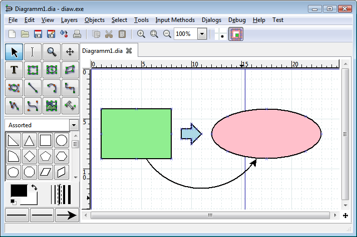
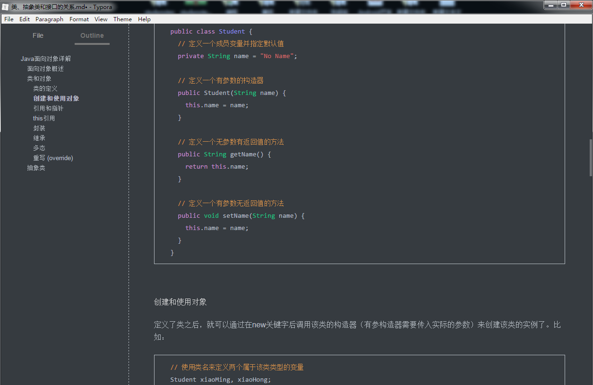

## 常用优秀软件推荐

### 图表软件

思维导图的用途

####  [MindManager]( http://www.mindmanager.cc/)

基本描述：目前在思维导图行列最好用的了，时间长，易用性好，尤其适合微软系统，MAC版本有些残缺，不太好用。

软件介绍：这个软件世界500强中的很多公司都在用，可以毫不怀疑的说，很强大的一个软件，全
球企业类客户百余万，适用于多个平台操作。能够将自己的思想、管理、文件整理全部可视化的
展示出来。迅速提高理解能力，逻辑关联。

#### [XMind](http://www.xmindchina.net/)

基本描述：开源软件，同时支持MAC和PC版本，占用容量很小的一款思维导图软件，并可以兼容
印象笔记，非常方便，逻辑上、模版上没有Mindjet 强大，但是小巧易容。

软件介绍：这是一款绝佳产品，完全有效地兼容微软所有的办公软件和印象笔记。最近的版本开
始兼容了MAC的系统，但是还有点小小的不方便，就是文件导出的时候会出现根据版本（付费和
免费）的不同，导出的文件格式有所差异。和前一款思维导图比起来，XMind的鱼骨图、二维二维
图、逻辑图、树形图、组织结构图等都还不错。

#### [FreeMind](http://freemind.sourceforge.net/wiki/index.php/Download)

基本描述：FreeMind正如其名字，是一款自由软件，用JAVA语言编写，可以用来绘制思维导图，可以用来做笔记，脑图回忆等。

软件介绍：跨平台软件，可以进行扩展操作，快捷键比较丰富，快速进行思维设计。尤其适合团队使用。

#### 三大思维导图软件的对比

#### [Dia](http://dia-installer.de/)

Dia是一款小巧的基于GTK的矢量图形绘制程序，适用于Linux, Unix和Windows，以 GPL 许可发布。

这个10MB的免费软件，代替visio基本没问题。操作上不太方便，但无论如何，它是综合性能最高的免费解决方案。

#### [亿图图示](http://www.edrawsoft.cn/)

亿图图示是一款跨平台的全类型图形图表设计软件。国产，类似Visio，支持Windows，Mac和Linux。使用它可以非常容易地创建有专业水准的流程图、组织结构图、网络图、商业展示、建筑平面图、思维导图、科学插画、时尚设计、UML图、工作流程图、程序结构图、网页设计图、电气工程图、方向地图、数据库图表及更多。亿图采用智能和人性化的绘制方式，包括丰富的图形模板库和特色实例库，最大程度帮助设计者降低工作量，更快捷阐述设计思想，提升创作灵感。

亿图图示7（Windows）破解版下载地址：

### 效率软件

#### [Everything](http://www.voidtools.com/)

秒搜电脑里所有文件（真的是秒搜！真的是秒搜！真的是秒搜）可以搜索文件夹；可以单独搜索.avi视频。。；可以单独搜索.exe执行文件。都是秒搜，自己想吧，有多方便。

#### [FileLocator](https://www.mythicsoft.com/filelocatorpro/)

全文检索可以和Everything配合使用：Everything是搜索文件的名字，而搜索文章里面的内容，就是全文搜索，这个时候就需要用到这款软件了。有两个版本：[FileLocator Lite](https://www.mythicsoft.com/filelocatorlite)（免费，功能缩水）和[FileLocator Pro]()（收费，全功能）

FileLocator**支持50+常用文档格式的全文搜索**。**即便重要文档藏身于压缩文件内**，亦能毫无压力地对其进行全文搜索！软件支持rar/zip/7z 等22种主流的压缩格式。**支持6种搜索规则，包括了纯文本/布尔/正则等**，极大提高了搜索特定文档的灵活性。**自带查看器**可用于快速浏览符合搜索条件的文档，支持**高亮显示**关键词。该软件的收费版还**预设了8种主流文本编辑器**方案（ Vim/EditPlus/NotePad++ 等），可在搜索结束后直接调用。还可**将经常使用的搜索条件保存至 .srf 格式**，方便未来随时双击载入；同时，每次的搜索结果支持导出为txt/CSV/HTML格式，方便处理存档。

#### [Total Commander](http://www.ghisler.com/)

简称TC，原名Windows Commander，功能强大的全能文件管理器。

支持随意自定义的菜单、工具栏、快捷键，给您最大的自由，打造个性 TC。一般的文件操作，如搜索、复制、移动、改名、删除等功能应有尽有，更有文件内容比较、同步文件夹、批量重命名文件、分割合并文件、创建/检查文件校验(MD5/SFV) 等实用功能。内置 ZIP/TAR/GZ/TGZ 格式的压缩/解压功能，ZIP 格式还支持创建加密及自解包功能。此外，不仅可以直接打开(解开) ARJ/CAB/RAR/LZH/ACE/UC2 等压缩包，配合插件或相应的压缩程序，更可创建这些格式的压缩包，就像创建和打开文件夹一样简单。而搜索功能，无论是文件还是内容，同样支持在这些压缩包中进行。

除了支持详细资料、列表、缩略图等资源管理器也有的显示方式外，利用内容插件，支持各式各样的自定义列视图，显示不同文件的内部信息，满足您查看不同文件的需求。多标签界面，让本来的两个窗口，可以扩展到几十个，操作空间更显自由。而贴心的历史和常用文件夹按钮，可以导出/导入的标签和文件列表，让您穿越各个空间更加快捷高效。

通过工具栏和菜单，可以随意调用外部程序和内部命令。多种功能或强大或实用的插件，让 TC 如虎添翼、能原来所不能。批量重命名和文件搜索，利用插件和正则表达式，功能更多更强了。还有可以选择的美化界面，支持 FXP 和 HTTP 代理的 FTP 功能。

各种使用方法太多样，太灵活了，学习成本比较高。

官方下载地址：http://www.ghisler.com/amazons3.php

相关教程：http://www.jiaocheng8.com/ruanjian/totalcommander/

#### [Ditto](http://ditto-cp.sourceforge.net/)

Ditto是 Windows 下一款免费开源的剪贴板增强软件，支持64位操作系统，支持中文，并且提供免安装的便携版。它可以保留大量历史数据，想搜索某条历史记录，在主界面的搜索框中输入关键词即可。此外Ditto还支持合并粘贴、纯文本粘贴、分组、置顶、快速搜索等功能，是一款强大的剪贴板工具，而且免费哦。

软件的界面相当简洁，操作简单易懂，只要在设置功能菜单自定义即可。

[Clover](http://cn.ejie.me/)

要掌握功能强大，操作简单的标签页，只需记住Ctrl+T新开页面，Ctrl+W关闭页面，Ctrl+Tab切换页面，工作效率提高何止一倍！通过插件的形式集成到 Windows Explorer，保留您通常的使用习惯，无需学习新的文件管理操作，马上就可以使用啦。按Ctrl+D添加当前路径，或者直接将文件夹拖入书签栏。再也不用到处寻找要访问的文件夹了，瞬间到达，何等痛快！

最新的Clover 3貌似有广告，这里献上破解的无广告版，下载地址：链接：http://pan.baidu.com/s/1eS5iUJo 密码：uphh

WPS Pro 2016

这个不解释，Pro版的WPS没有广告，带有VBA功能。下载地址：http://pan.baidu.com/s/1qX8BZE8 密码：85fx

### 阅读器

#### [福昕阅读器](https://www.foxitsoftware.cn/downloads/)

福昕阅读器作为一款在全球范围内流行的PDF阅读器，能够快速打开、浏览、审阅、注释、签署及打印任何PDF文件。PDF阅读器——支持快速查看和打印PDF文件/PDF文件包，占用系统资源少。

查看多个PDF文件——支持多标签文档浏览模式，方便用户在不同的PDF文档间实现快速切换浏览。支持三种文档显示模式：阅读模式、逆序阅读模式和文本查看模式；支持多种页面显示模式：全屏显示、单页显示、连续页显示、拆分显示、双联页显示、双联页连续显示、双联页显示模式时单独显示封面、自动滚动显示；支持页面过渡效果设置。支持在PDF文档中快速添加、编辑和删除书签。支持横向和纵向两种布局；支持通过缩放选项或选框缩放、放大镜和仿真放大镜等工具缩放PDF文档。

#### [福昕PDF转Word](https://www.foxitsoftware.cn/downloads/)

福昕PDF转Word能够识别PDF文档中的文字和图像，将PDF文档转换成Word文档，操作便捷，完美输出，高效保真。

[Master PDF Editor](https://code-industry.net/masterpdfeditor/)

Master PDF Editor是非常强大的，pdf文档编辑器，支持Windows、Linux、MacOS。免费版部分功能受限。它提供稳健和丰富的功能集包括PDF和XPS文件，导入/导出PDF页面为 JPG、 TIFF、 PNG 或 BMP 格式，转换成 PDF，反之亦然，XPS 和 128 位加密的全力支持。你可以还添加各种控件，如按钮、 文本字段、 复选框和更多，作为执行预定义的用户操作，例如按下单击悬停时， 滚动的事件处理程序。功能强大的注释工具喜欢粘滞便笺和时间戳，以及增强的编辑功能，在删除线、 下划线。

#### [PDF-XChange Editor](https://www.tracker-software.com/)

PDF-XChange Editor是著名的PDF阅读工具PDF-XChange的编辑器增强版本，专注于PDF电子文档的编辑功能，试用后发现它体积小巧，速度飞快，界面友好，具备丰富的配置和功能选项，而且非常简单易用！可帮助你快速的制作和编写PDF电子文档!

破解版下载地址：链接：http://pan.baidu.com/s/1qXBZQUw 密码：iff5

### 云笔记

#### [为知笔记](http://www.wiz.cn/)

WizNote，被誉为国内最好的个人知识管理、笔记软件。支持保存网页、随手的灵感笔记、重要文档（支持Office Word、Excel、Powerpoint）、照片、便签。Wiz为知笔记可以帮您：快速条理化保存（包括微博、博客）、方便与人分享、多终端随时随地浏览、永久安全云存储。更能让您做到：不同电脑（支持Windows、Linux、MacOS）、平板电脑（iPad等）、智能手机（iPhone、Android）之间云同步，相互之间便利地查看您的个人知识库！

#### [有道云笔记](http://note.youdao.com/)

有道笔记是网易有道全新推出的云笔记软件，旨在以云存储技术帮助用户建立一个可以轻松访问、安全存储的云笔记空间，解决个人资料和信息跨平台跨地点的管理问题。有道云笔记目前支持安卓手机版，桌面版，网页版，手机网页版这几种形式。

#### [印象笔记](https://www.yinxiang.com/)

印象笔记（Evernote）的Logo是一个大象的标志。按Evernote的CEO——PhilLibin先生的原话：在美国有一个说法，“An elephant never forgets.”（大象永远不会忘记事情），根据这个典故，使用大象的形象作为记忆的标志。

### Markdown编辑器

首先Markdown是一门标记语言，不要害怕，你一分钟就能入门，学习成本极低，而一旦熟悉了这种语法规则，会有一劳永逸的效果。如果你想了解更多请自行搜索。但我强烈建议你直接下载一个Markdown编辑器上手实践就行。语法学习强迫症患者可阅读如下链接。

创始人 John Gruber 的 Mardown 语法说明：
[Markdown Syntax Documentation](https://link.zhihu.com/?target=http%3A//daringfireball.net/projects/markdown/syntax)

Markdown 中文语法说明：
[Markdown 中文版语法说明](http://wowubuntu.com/markdown/#list)

#### [MarkdownPad](http://markdownpad.com/) 

用户可以通过键盘快捷键和工具栏按钮来使用或者移除 Markdown 格式。MarkdownPad左右栏的分割方式令用户可以实时看到 HTML 格式的 Markdown 文档。 

#### [Haroopad](http://pad.haroopress.com/user.html) 

Haroopad 是一款覆盖三大主流桌面系统的编辑器，支持 Windows、Mac OS X 和 Linux。 主题样式丰富，语法标亮支持 54 种编程语言。该工具重点推荐 Ubuntu/Linux 用户使用，从此可以告别 gedit 加 Markdown 插件这种工作方式了。

#### [小书匠编辑器](http://soft.xiaoshujiang.com/) 

全平台覆盖并且有web版。

#### [Typora](https://typora.io/)

就只有一个窗口，编辑在该窗口，预览也是在该窗口，当然也可以进入Markdown语法编辑界面。这是我用过的最好的Markdown编辑器了。

