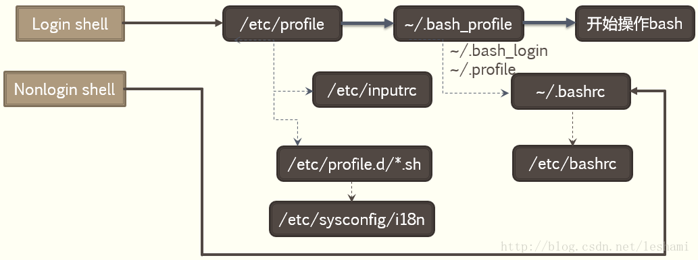
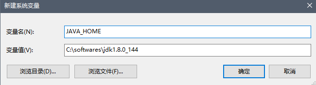
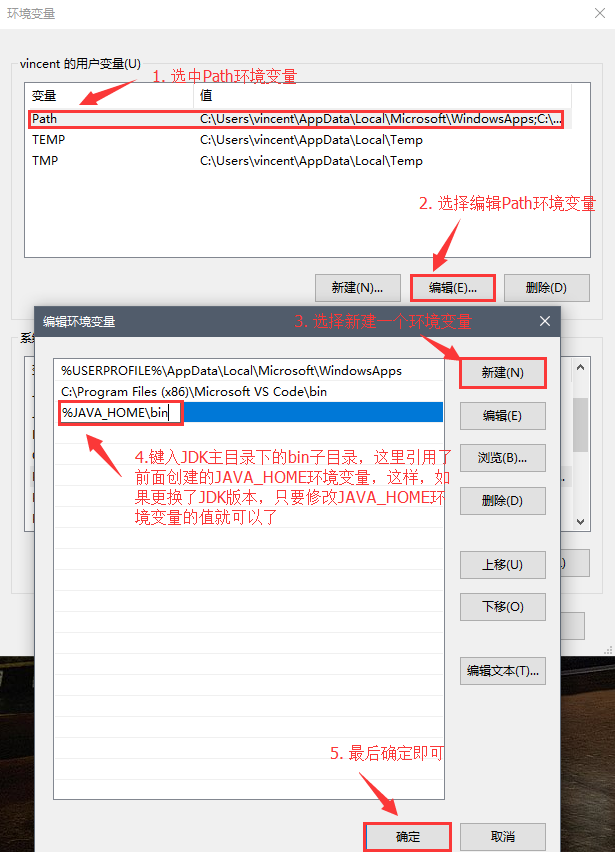

### 环境变量概述

环境变量（Environment Variables）一般是指在操作系统中用来指定操作系统运行环境的一些参数，如：临时文件夹位置和系统文件夹位置等。

环境变量是在操作系统中一个具有特定名字的对象，它包含了一个或者多个应用程序所将使用到的信息。例如 Windows 和 DOS 操作系统中的 `path` 环境变量，当要求系统运行一个程序而没有告诉它程序所在的完整路径时，系统除了在当前目录下面寻找此程序外，还应到 path 中指定的路径去找。如 tc 或 vc++ 中，`set include=path1;path2;` 是告诉编译程序到哪里去找 `.h` 类型的文件；当然不仅仅是指定什么路径，环境变量还有其它的作用的，如`set dircmd=/4` 设置一个环境变量的作用是在使用 `dir` 命令时会把 `/4` 作为缺省的参数添加到你的 `dir` 命令之后，就像你的每个命令都加了 `/4` 参数，它实际上是给命令解释程序 `command` 设置的一个环境变量，并且是给 `dir` 这个内部命令设置的。

很多朋友会在自己的计算机上安装双系统，例如 C 盘安装 Windows 10，D 盘安装 Windows 7。可是某些软件往往只在Windows 10 系统中安装，Windows 7 系统中是无法正常使用的，比较麻烦却有效的方法是再安装一遍。当我们了解了环境变量中的用途后就可以很好解决双系统的软件共用问题。为什么在 Windows 10 中安装了的软件（绿色软件和不兼容软件除外）在 Windows 7 下无法运行呢？原因是安装软件时往往须要向系统目录中复制某些文件，而使用另外一个系统时会由于缺少这些文件而无法运行，而我们可以通过设置环境变量的方法来解决这个问题。

### 环境变量设置
#### Windows 系统

Windows 系统常见环境变量如下：

- %ALLUSERSPROFILE%：局部。返回所有“用户配置文件”的位置。
- %APPDATA%：局部。返回默认情况下应用程序存储数据的位置。
- %CD%：局部。返回当前目录字符串。
- %CMDCMDLINE%：局部。返回用来启动当前的 cmd.exe 的准确命令行。
- %CMDEXTVERSION%：系统。返回当前的“命令处理程序扩展”的版本号。
- %COMPUTERNAME%：系统。返回计算机的名称。
- %COMSPEC%：系统。返回命令行解释器可执行程序的准确路径。
- %DATE%：系统。返回当前日期。使用与 `date /t` 命令相同的格式。由 `cmd.exe` 生成，可参考 `date` 命令的详细信息。
- %ERRORLEVEL%：系统。返回使用过的命令的错误代码。通常用非零值表示错误。
- %HOMEDRIVE%：系统。返回连接到用户主目录的本地工作站驱动器号。基于主目录值的设置。用户主目录是在“本地用户和组”中指定的。
- %HOMEPATH%：系统。返回用户主目录的完整路径。基于主目录值的设置。用户主目录是在“本地用户和组”中指定的。
- %HOMESHARE%：系统。返回用户的共享主目录的网络路径。基于主目录值的设置。用户主目录是在“本地用户和组”中指定的。
- %LOGONSEVER%：局部。返回验证当前登录会话的域控制器的名称。
- %NUMBER\_OF\_PROCESSORS%：系统。指定安装在计算机上的处理器的数目。
- %OS%：系统。返回操作系统的名称。Windows 2000 将操作系统显示为 Windows\_NT。
- %PATH%：系统。指定可执行文件的搜索路径。**由 PATH 环境变量指定的目录下的命令可以在任意目录中直接使用。**
- %PATHEXT%：系统。返回操作系统认为可执行的文件扩展名的列表。
- %PROCESSOR\_ARCHITECTURE%：系统。返回处理器的芯片体系结构。值: x86，IA64。
- %PROCESSOR\_IDENTIFIER%：系统。返回处理器说明。
- %PROCESSOR\_LEVEL%：系统。返回计算机上安装的处理器的型号。
- %PROCESSOR\_REVISION%：系统。返回处理器修订号的系统变量。
- %PROMPT%：局部。返回当前解释程序的命令提示符设置。由 `cmd.exe` 生成。
- %RANDOM%：系统。返回 0 到 32767 之间的任意十进制数字。由 `cmd.exe` 生成。
- %SYSTEMDRIVE%：系统。返回包含 Windows XP 根目录（即系统根目录）的驱动器。
- %SYSTEMROOT%：系统。返回 Windows XP 根目录的位置。
- %TEMP% and %TMP%：系统和用户。返回对当前登录用户可用的应用程序所使用的默认临时目录。有些应用程序需要 TEMP，而其它应用程序则需要 TMP。
- %TIME%：系统。返回当前时间。使用与 `time /t` 命令相同的格式。由 `cmd.exe` 生成。可参考 time 命令的详细信息。
- %USERDOMAIN%：局部。返回包含用户帐户的域的名称。
- %USERNAME%：局部。返回当前登录的用户的名称。
- %USERPROFILE%：局部。返回当前用户的配置文件的位置。
- %WINDIR%：系统。返回操作系统目录的位置。

##### 设置方法

环境变量分为两类：用户变量与系统变量，在注册表中都有对应的项。其中用户变量位于：

```shell
HKEY_CURRENT_USER\Environment
```

系统变量位于：

```shell
HKEY_LOCAL_MACHINE\SYSTEM\ControlSet001\Control\Session Manager\Environment
```

在 Windows 操作系统中可以通过`我的电脑` → `系统属性` →  `高级系统设置` →  `环境变量`，在原有变量的基础上添加英文状态下的分号，然后将路径名输入即可。（切记，不要删除原先的系统变量，只要用分号隔开，然后添加，最后也要加上分号）。然而在此设置的环境变量是在注册表中具有对应的项。在 .net 中提供了一个类来获取系统的环境变量及其值。

Windows 平台以 Win 10 为例：
右键`此电脑`  → `属性`：


`高级系统设置`：


`环境变量`： 


用户变量仅对当前的用户有效，系统变量对所有用户有效。考虑到不影响其他用户的使用，这里选择设置用户变量。`选中Path`（如果没有 Path，则选择`新建` Path）→  `编辑`：


在弹出的对话框中就可以填入环境变量名和环境变量值。

> 注意：Windows 下不区分大小写，因此 windows 与 WINDOWS 都正确；而 Linux 系统是严格区分大小写的。

##### 编辑方法

在 Windows 命令行输入 `set` 命令可以查看 Windows 系统当前所存在的所有的环境变量。从环境变量中我们可以得到很多信息。

例如 PROCESSOR\_IDENTIFIER 显示处理器的架构，USERDOMAIN 显示计算机名，USERNAME 显示计算机用户名，TEMP 显示系统临时文件夹的位置，PROMPT 显示当前提示符的状态灯。


也可以查看单个的环境的变量，例如输入 `set windir` 显示当前的系统文件夹的位置。输入 `set P` 可以查看所有字母以P开头的环境变量的值。也可以使用 `echo  环境变量引用` 来显示，如 `echo  %windir%` 也可以显示当前的系统文件夹的位置。

> 注意：Windows 环境变量在引用的时候需要用 `%` 括起来，以便于和普通的字符区分。


也可以自定义环境变量，例如我们输入 `set aa=%temp%` ，就代表把临时文件夹的值赋值给aa。我们还可以删除环境变量，例如我们输入 `set aa=`  就可以把我们刚才建立的环境变量删除了。


有关 `set` 命令的其他用法请参考 `set` 命令帮助：在命令行输入 `set /?` 回车即可查看 `set` 命令帮助


>注意：不用担心在DOS窗口的修改会影响`我的电脑` →  `属性` →  `高级` →  `环境变量`里的修改，因为 DOS 窗口的环境变量只是 Windows 环境变量的一个副本，副本的改动不会影响正本，所以在 DOS 窗口中以 `set` 命令对环境变量的操作只对当前窗口的应用有效。要想永久加入环境变量，就要用图形界面操作。 但是 `DOS 窗口的环境变量改动会触发正本（图形界面环境变量的修改）的刷新，这可用于使图形界面的环境变量设置立即生效`。

#### Linux 系统

##### 环境变量配置文件

Linux 中环境变量也包括系统级和用户级，系统级的环境变量是每个登录到系统的用户都要读取的系统变量，相关配置文件位于 `/etc` 目录下，而用户级的环境变量则是该用户使用系统时加载的环境变量，仅对当前登录的用户有效，相关配置文件位于用户个人目录下，使用 `ls -a` 可以查看到这些文件。所以管理环境变量的文件也分为系统级和用户级的。

首先理解一下几个概念：

- `login shell`，登录 shell：用户通过终端登录凭借用户名和密码登录控制台（包括通过 ssh 方式）的动作是 `login shell`，也就是说最终会调用 login 命令的操作、需要完整的登陆流程都可称之为 login shell。
- `non-login shell` ，非登陆 shell：用户在图形界面启动一个 terminal，或者执行 `/bin/bash、/usr/bin/bash` 等不需要重复登陆的举动都属于`non-login shell`。
- `interactive shell` ，交互式 shell：交互式模式就是在终端上执行，shell 等待你的输入，并且立即执行你提交的命令。这种模式也是大多数用户非常熟悉的：登录、执行一些命令、退出。当你退出后，shell 也终止了。
- `non-interactive` ，非交互式shell ：shell 也可以运行在非交互式模式，以 shell script （非交互模式）方式执行。在这种模式 下，shell 不与你进行交互，而是读取存放在文件中的命令，并且执行它们。当它读到文件的结尾 EOF，shell 也就终止了。

系统级：

- `/etc/environment`：该文件设置的是整个系统的环境，只要启动系统就会读取该文件，是系统启动时读取的第一个文件，用于为所有进程设置环境变量。该文件并不是一个脚本文件，系统使用此文件时并不是执行此文件中的命令，而是根据 `KEY=VALUE` 模式的代码（VALUE中不能有空格），对 `KEY` 赋值以 `VALUE`，因此文件中如果要定义 `PATH` 环境变量，只需加入一行形如 `PATH=PATH:/xxx/bin`的代码即可；
- `/etc/profile`：在进入操作系统使用的第二个文件，**为系统的每个用户设置环境变量**，这里的环境变量是永久性的。当系统启动后用户首次登录时，该文件被执行，并从 `/etc/profile.d` 目录的配置文件中搜集 shell 的设置。
- `/etc/profile.d/*.sh` ：每当进入一个 login shell 或加载桌面会话时，`/etc/profile.d` 目录中的 `.sh` 脚本都会执行；
- `/etc/bashrc`：是针对所有用户的 bash 初始化文件，在此中设定的环境变量将应用于所有用户的 shell 中，此文件会在用户每次打开 shell 时执行一次。（即每次新开一个终端，都会执行 `/etc/bashrc`）。

用户级：

- `~/.pam_environment` ：当使用图形化界面设置区域和语言时，该文件会被修改。Ubuntu 系统中有该文件，CentOS 系统中没发现有该文件。
- `~/.bash_profile` 、 `~./bash_login` 或 `~/.profile`：每个用户都可使用该文件输入专属于自己的 shell 信息，**当用户登录时，该文件仅仅执行一次**。默认情况下，该文件设置一些环境变量、读取用户的 `~/.bashrc` 文件。（如果 `~/` 目录下没有`.bash_profile` ，则新建立一个）。当一个 `shell` 关闭时，在 `.bash_profile` 中定义的系统变量则会失效。因此，每打开一个新的 `login shell` 时都要运行一次 `source .bash_profile`，而且针对当前用户。该文件中的读取会在`~/.pam_environment` 文件之后，**推荐在这里进行个人环境变量设置**；
- `~/.bashrc`：该文件包含专用于某个用户的 bash shell 的 bash 信息，**当登录时以及每次打开新的 `shell` 时，该该文件都会被读取**。不推荐放到这儿，因为每开一个登录 shell，这个文件会读取一次，效率肯定有影响。
- `~/.bash_logout` ：当每次退出系统（退出 `bash shell`）时执行该文件。

登陆 shell 与非登陆 shell 读取 shell 配置文件的顺序：



其中，实线的的方向是主线流程，虚线的方向则是被调用(或读取)的配置文件 ，执行完 bash 操作后退出 `bash shell` 时会执行`~/.bash_logout` 文件。

对于 `login shell` 读取文件的顺序是：

1.  `/etc/profile`
2.  `~/.bash_profile`
3.  `~/.bash_login`
4.  `~/.profile`

其中，`/etc/profile` 是必须要执行的，后面 3 个按照顺序读取存在的那一个，而后面的就不会再执行。退出交互控制台执行的文件是 `~/.bash_logout` 。

而 `~/.bashrc` 是在 `non-login shell` 启动时执行的，也就意味着在图形界面每开启一次 terminal，就会读取一次该文件。在很多 Red hat 和 Ubuntu 的发行版中，如果 `.bashrc` 存在于 /home 目录中，它将从 `.bash_profile` 或 `.profile` 中运行。

另：`/etc/environment` 是整个系统的环境，而 `/etc/profile` 是所有用户的环境，前者启动系统后就会去读取该文件，后者只有在用户登录的时候才去读取。

了解他们的执行顺序后，就知道环境变量该怎么放了。要想对所有的用户生效，那就需要设置系统级的环境变量。反之，需要修改用户级的文件。建议将 Java 的环境变量都配置于`/etc/profile` （所有用户可用）或  `~/.bash_profile` 、`~/.bash_login` 、`~/.profile` 中（仅当前用户可用，优先存在哪一个文件就配置在哪一个文件中）。

##### 操作环境变量的命令

Linux 下也有查看、设置环境变量的命令。查看或修改环境变量可以使用以下几个命令：

- `export` ：直接使用使用该命令可以打印出当前所有环境变量，使用 `export 变量名` 形式的命令可以打印出某个环境变量的值，使用 `export 变量名=变量值` 可以用来临时（只对当前 shell 有效，shell关闭了，该变量也就失效了）设置某个环境变量的值。其用法与 Windows 下的 set 命令基本类似。有关 export 命令的其他用法请参考 export 命令的帮助说明。
- echo 命令结合 `$` ：使用 `echo $变量名` 形式的命令可以打印出某个环境变量名。Linux 下使用 `$` 来引用某个环境变量。
- `printenv` ：该命令单独使用可以输出本地所有环境变量，也可以使用 `printenv 变量名` 形式的命令打印出某个环境变量的值，就像 `export` 命令打印某个环境变量的值一样。
- `env` ：该命令也可以来显示所有环境变量，但不能用于显示单个的环境变量。该命令也可以用来临时修改某个环境变量的值，这种用户类似于 export 临时修改环境变量的值。
- `set` ：单独使用该命令可以查看为**某个特定进程**设置的所有环境变量，包括局部变量、全局变量
  以及用户定义变量。
- ，使用 `set 变量名=变量值` 形式的命令可以设置某个环境变量的值，如果未指定变量值，则该变量值将被设为 `NULL`。
- `setenv` ：该命令属于 C shell。设置环境变量的语法为 `setenv 变量名 变量值`； 
- `unset` ：使用 `unset 变量名` 形式的命令可以临时清除某个环境变量，再次查看该环境变量将看不到结果。
- `readonly` ：设置只读环境变量，如 `readonly HELLO` 。如果使用了`readonly` 命令的话，变量就不可以被修改或清除了。

> 不同于 Windows 系统，Linux 系统上的环境变量名是区分大小写的，通常用全部大写的字母表示。

> 命令 env、printenv 和 set 之间的差异很细微。set 命令会显示出全局变量、局部变量以及用户定义变量。它还会按照字母顺序对结果进行排序。env 和 printenv 命令同 set 命令的区别在于前两个命令不会对变量排序，也不会输出局部变量和用户定义变量。在这种情况下，env 和 printenv 的输出是重复的。

### 配置环境变量实战

##### Windows 下配置 Java 环境变量

步骤如下：

1. JDK 安装完毕后需要设置 JAVA 环境变量。先将 JDK 主目录添加到 JAVA_HOME 环境变量：



> 看到这里你可能会有这样的疑问：为什么安装到了 C 盘而不是其他盘，难道不怕影响系统性能吗？哥的 C 盘是固态硬盘，安装到其他盘反而会发挥不出固态硬盘的性能（SSD党在这里骄（zhuang）傲（bi）三秒钟，哈哈），为什么不是 `Program files` 默认目录呢？因为系统默认目录可能会有写权限的限制，我就把所有开发相关的软件统一安装到了一个自定义目录 softwares 中了。

2. 然后在将 JDK 的 bin 目录添加到 Path 环境变量中：

选中用户的 Path 环境变量，选择`编辑`按钮，在弹出的对话框中，点击`新建`按钮，将 `%JAVA_HOME%`  目录添加到 Path中：



3. 验证。在命令行中输入 `java --version` 命令，可以看到如下提示说明环境变量设置成功并生效：

   ```shell
   C:\Users\vincent>java -version
   java version "1.8.0_144"
   Java(TM) SE Runtime Environment (build 1.8.0_144-b01)
   Java HotSpot(TM) 64-Bit Server VM (build 25.144-b01, mixed mode)
   ```

> 神马？明明设置了环境变量但是提示找不到 java 命令，那试试签名介绍的如何刷新 Windows 下的环境变量设置吧。

你可能从网上看到过 Java 还需要配置 CLASSPATH 环境变量的，该环境变量主要用来告知 JRE 去哪里寻找所要运行的 .class 文件（可能在一个 jar 包中），这个环境变量通常设置为：

```
.;%JAVA_HOME%\lib\dt.jar;%JAVA_HOME%\lib\tools.jar
```

其中，`.` 表示当前目录，`dt.jar` 和 `tools.jar` 包含编译和运行java程序的 .class 文件。其实从 JDK 1.5 开始，JRE会自动搜索当前目录下的 .class 文件，当使用 Java 的编译和运行工具是，系统会自动加载`dt.jar` 和 `tools.jar` 中包含的 .class 文件。所以，从 JDK 1.5 开始 CLASSPATH 环境变量就不需要设置了，但是，只要设置了就必须设置为上面的值，否则编译或运行 Java 程序就会出错。

##### Linux 下配置 Java 环境变量

1. 首先在[官方网站](http://www.oracle.com/technetwork/java/javase/downloads/jdk8-downloads-2133151.html)上下载 JDK 安装文件，我下载的为：jdk-8u171-linux-x64.rpm，当然也可以下载 .tar.gz 格式的文件，但是这种文件需要手动解压后复制安装文件到目标安装目录（一般为 /usr/java/jdk1.8.0_171 格式的目录）中，这里不再详细介绍；

2. 使用 FTP 工具将 jdk-8u171-linux-x64.rpm 安装文件上传至 Linux 的某个用户目录中（我这里为 /home/tomcat 目录），然后安装 jdk-8u171-linux-x64.rpm：

   ```shell
   [root@localhost tomcat]# yum localinstall jdk-8u171-linux-x64.rpm
   ```

3. 根据上文介绍的几个 Linux 环境变量文件，我们选择 profile 文件写入我们的环境变量；使用 `sudo gedit /etc/profile`  命令打开该文件，并输入以下命令：

```shell
# Oracel Java Environment Variable Configuration Start
export JAVA_HOME=/usr/java/jdk1.8.0_171-amd64
export CLASSPATH=.:$JAVA_HOME/lib/dt.jar:$JAVA_HOME/lib/tools.jar
export PATH=$PATH:$JAVA_HOME/bin
# Oracel Java Environment Variable Configuration End
```

4. 修改完成后，使用 `sudo source /etc/profile` 命令进行更新。如果该命令操作失败，提示权限不足，那么将 `$JAVA_HOME/lib/dt.jar` 和 `$JAVA_HOME/lib/tools.jar` 这两个文件的权限修改为可执行，然后重新执行 `sudo source /etc/profile` 命令：

   ```shell
   [root@localhost jdk1.8.0_171-amd64]# source /etc/profile
   -bash: /usr/java/jdk1.8.0_171-amd64/lib/tools.jar: Permission denied
   [root@localhost tomcat]# cd /usr/java/jdk1.8.0_171-amd64/lib
   [root@localhost lib]# ll
   total 39780
   drwxr-xr-x. 3 root root     4096 May 23 21:03 amd64
   -rw-r--r--. 1 root root  1218653 Mar 29 08:21 ant-javafx.jar
   -rw-r--r--. 1 root root 18229876 Mar 29 08:15 ct.sym
   -rw-r--r--. 1 root root   159870 Mar 29 08:21 dt.jar
   -rw-r--r--. 1 root root    18432 Mar 29 08:15 ir.idl
   -rw-r--r--. 1 root root    35992 Mar 29 08:23 javafx-mx.jar
   -rw-r--r--. 1 root root   404452 Mar 29 08:21 jconsole.jar
   -rwxr-xr-x. 1 root root    10493 Mar 29 08:21 jexec
   drwxr-xr-x. 7 root root     4096 May 23 21:03 missioncontrol
   -rw-r--r--. 1 root root      640 Mar 29 08:15 orb.idl
   -rw-r--r--. 1 root root     4633 Mar 29 08:23 packager.jar
   -rw-r--r--. 1 root root  2381736 Mar 29 08:21 sa-jdi.jar
   -rw-r--r--. 1 root root 18233649 May 23 21:03 tools.jar
   drwxr-xr-x. 6 root root     4096 May 23 21:03 visualvm
   [root@localhost lib]# chmod 751 dt.jar
   [root@localhost lib]# chmod 751 tools.jar
   [root@localhost lib]# ll
   total 39780
   -wxr-xr-x. 3 root root     4096 May 23 21:03 amd64
   -rw-r--r--. 1 root root  1218653 Mar 29 08:21 ant-javafx.jar
   -rw-r--r--. 1 root root 18229876 Mar 29 08:15 ct.sym
   -rwxr-x--x. 1 root root   159870 Mar 29 08:21 dt.jar
   -rw-r--r--. 1 root root    18432 Mar 29 08:15 ir.idl
   -rw-r--r--. 1 root root    35992 Mar 29 08:23 javafx-mx.jar
   -rw-r--r--. 1 root root   404452 Mar 29 08:21 jconsole.jar
   -rwxr-xr-x. 1 root root    10493 Mar 29 08:21 jexec
   drwxr-xr-x. 7 root root     4096 May 23 21:03 missioncontrol
   -rw-r--r--. 1 root root      640 Mar 29 08:15 orb.idl
   -rw-r--r--. 1 root root     4633 Mar 29 08:23 packager.jar
   -rw-r--r--. 1 root root  2381736 Mar 29 08:21 sa-jdi.jar
   -rwxr-x--x. 1 root root 18233649 May 23 21:03 tools.jar
   drwxr-xr-x. 6 root root     4096 May 23 21:03 visualvm
   [root@localhost jdk1.8.0_171-amd64]# source /etc/profile
   ```

5. 有的 Linux 系统中预装了 Open JDK，所以即使上面进行了上面这些步骤，可能系统默认的 JDK 还不是 Oracle JDK，如果要真正使用 Oracle JDK，可以选择卸载 Open JDK：

   ```shell
   [root@localhost ~]# rpm -qa | grep openjdk
   java-1.8.0-openjdk-headless-1.8.0.102-4.b14.el7.x86_64
   java-1.7.0-openjdk-headless-1.7.0.111-2.6.7.8.el7.x86_64
   java-1.8.0-openjdk-1.8.0.102-4.b14.el7.x86_64
   java-1.7.0-openjdk-1.7.0.111-2.6.7.8.el7.x86_64
   [root@localhost ~]# rpm -e --nodeps java-1.8.0-openjdk
   [root@localhost ~]# rpm -e --nodeps java-1.7.0-openjdk
   [root@localhost ~]# rpm -e --nodeps java-1.8.0-openjdk-headless  
   [root@localhost ~]# rpm -e --nodeps java-1.7.0-openjdk-headless
   [root@localhost ~]# rpm -qa | grep openjdk
   [root@localhost ~]# 
   ```

   确定 Open JDK 已经完全卸载了，然后就可以为 Oracle JDK 设置环境变量了。当然，也可以不卸载 Open JDK 而直接安装 Oracle JDK，然后为 Oracle JDK 设置环境变量就行了。

6. 大功告成，使用 `java -version` 命令来查看我们的 java 环境变量，显示如下内容：

   ```shell
   [root@localhost tomcat]# echo $JAVA_HOME
   /usr/java/jdk1.8.0_171-amd64
   [root@localhost tomcat]# java -version
   java version "1.8.0_171"
   Java(TM) SE Runtime Environment (build 1.8.0_171-b11)
   Java HotSpot(TM) 64-Bit Server VM (build 25.171-b11, mixed mode)
   [root@localhost tomcat]# javac -version
   javac 1.8.0_171
   [root@localhost tomcat]# 
   ```


